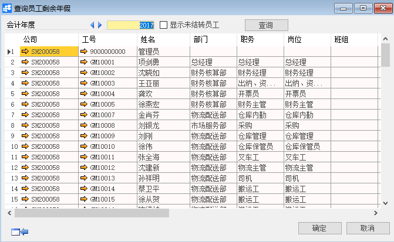

**查询及调整员工剩余年假**

 

**功能解释**

运用此功能是对员工剩余年假时间的查询和修改功能。

**文章主旨**

本文介绍如何通过BAP Business Cloud AI完成员工剩余年假查询、修改操作。

**操作要求**

当前登陆用户拥有操作查询及调整员工剩余年假的权限，权限设置请在帮助文档中搜索查看。

**查询及调整员工剩余年假**

1、 从系统菜单->【人力资源】->【休假管理】->【查询及调整员工剩余年假】，打开定义界面；

2、 编辑选择要进行查询及调整剩余年假的对象员工的筛选条件；

 

3、 点击【确定】进入查询明细界面并选择会计年度；

 

4、 可查看员工的年假使用情况并可对其进行调整；

5、 点击【更改】保存。

**员工剩余年假查询窗口数据**

| **属性** | **活动描述** |
| -------------- | ------------------ |
| 会计年度       | 输入会计年度       |
| 工号从…到…     | 选择工号从…到…     |
| 入职日期从…到… | 输入入职日期从…到… |
| 岗位           | 选择岗位           |
| 职务           | 选择职务           |
| 合同类别       | 选择合同类别       |
| 班组           | 选择班组           |
| 公司代码       | 选择公司代码       |
| 部门           | 选择部门           |

**维护员工剩余年假窗口数据**

| **属性** | **活动描述** |
| -------------- | ------------------ |
| 会计年度       | 显示会计年度       |
| 显示未结转员工 | 勾选显示未结转员工 |
| 公司           | 显示公司           |
| 工号           | 显示工号           |
| 姓名           | 显示姓名           |
| 部门           | 显示部门           |
| 职务           | 显示职务           |
| 岗位           | 显示岗位           |
| 班组           | 显示班组           |
| 累计结余小时   | 显示累计结余小时   |
| 已使用小时     | 显示已使用小时     |
| 剩余           | 显示剩余           |
| 一天折算小时数 | 显示一天折算小时数 |

 
