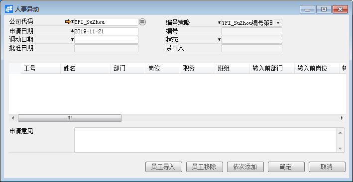

# 人事异动

 

 

## 功能解释

在此模块中，录入员工的人事异动单，将员工调出本部门，调入其他部门。通过此窗口调整员工的部门、岗位、职务、薪资等信息。审批通过后，新的部门会自动更新至员工主数据中，方便企业对员工信息的管理。

 

## 文章主旨

本文介绍如何通过BAP Business Cloud AI完成人事异动，新增、修改及删除操作。

## 操作要求

当前登录用户拥有操作人事异动的权限，权限设置请在帮助文档中搜索查看。

## 新增人事异动

1、 从系统菜单->【人力资源】->【合同管理】->【人事异动】，打开定义界面； 

2、 点击工具栏新空白按钮准备新增人事异动；

3、 选择公司代码；

 

| **扩展操作介绍**|
| ------------------------------------------------------------ |
| 选择公司代码时可以直接在人事异动的“公司代码”栏位中输入名称关键字或编号关键字，再点击电脑键盘的Enter键执行查找。 |

 

4、 点击【员工导入】选择相应的员工；

5、 编辑人事异动的信息；

6、 信息确认无误后点击【添加】或工具栏的保存按钮，保存人事异动。

| **提醒** |
| ------------------------------------------------------------ |
| 系统未配置自动发起审批时，保存订单信息检查无误后需要点击工具栏的发起审批按钮，执行请求审批操作 |

## 修改人事异动

1、 从系统菜单->【人力资源】->【合同管理】->【人事异动】，打开界面；

2、 点击工具栏的浏览按钮，查找要修改的人事异动；

3、 修改人事异动的内容；

4、 点击【更改】或工具栏的保存按钮保存，更改人事异动。

注：已审批通过的人事异动不能进行修改操作。

## 删除人事异动

1、 从系统菜单->【人力资源】->【合同管理】->【人事异动】，打开界面；

2、 点击工具栏的浏览按钮，查找要删除的人事异动；

3、 点击工具栏的按钮，进行删除操作。

注：已审批通过的人事异动不能进行删除操作。

## 属性与活动描述

| **属性**                                                     | **活动描述**           |
| :----------------------------------------------------------- | ---------------------- |
| 公司代码                                                     | 选择公司代码           |
| 申请日期                                                     | 输入人事异动申请日期   |
| 批准日期                                                     | 显示人事异动单批准日期 |
| 录单人                                                       | 单据创建人             |
| 编号策略                                                     | 凭证编号策略           |
| 编号                                                         | 显示凭证编号           |
| 状态                                                         | 单据状态               |
| 工号                                                         | 员工工号               |
| 姓名                                                         | 员工姓名               |
| 部门                                                         | 员工所属部门           |
| 职务                                                         | 员工职务               |
| 班组                                                         | 员工班组               |
| 转入前部门、转入前岗位、转入前职务、原薪资、                 | 异动前的信息           |
| 异动类型                                                     | 异动类型               |
| 转入部门、部门名称、转入岗位、岗位名称、转入职务、职务名称、转为薪资、薪资名称 | 异动后的信息           |
| 申请意见                                                     | 申请意见描述文本       |

 
