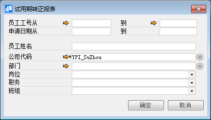

**试用期转正报表**

 

 

**功能解释**

运用此功能可以条件筛选集中查询员工的转正信息。

**文章主旨**

本文介绍如何通过BAP Business Cloud完成试用期转正报表查询操作。

**操作要求**

当前登陆用户拥有操作试用期转正报表的权限，权限设置请在帮助文档中搜索查看。

**查询试用期转正报表**

1、 从系统菜单->【人力资源】->【合同管理】->【试用期转正报表】，打开定义界面；

2、 填写查询关键信息；

3、 点击【确定】进入结果界面。

**试用期转正报表查询窗口数据**

| **属性**      | **活动描述**       |
| ------------- | ------------------ |
| 员工工号从…到 | 员工工号区间       |
| 申请日期从…到 | 单据的申请日期范围 |
| 员工姓名      | 员工姓名           |
| 公司代码      | 选择公司代码       |
| 部门          | 部门               |
| 岗位          | 岗位               |
| 职务          | 职务               |
| 班组          | 班组               |

**试用期转正报表信息**

| **属性**       | **活动描述**         |
| -------------- | -------------------- |
| 试用期转正编号 | 试用期转正单编号     |
| 工号           | 员工工号             |
| 姓名           | 员工姓名             |
| 公司代码       | 公司代码             |
| 部门           | 所属部门             |
| 岗位           | 所属岗位             |
| 申请时间       | 单据的申请日期       |
| 试用期开始时间 | 试用期的开始时间     |
| 试用期结束时间 | 试用期的结束时间     |
| 合同开始时间   | 员工合同开始时间     |
| 合同结束时间   | 员工合同结束时间     |
| 状态值         | 试用期转正单据状态值 |
| 状态           | 试用期转正单据状态   |

 
