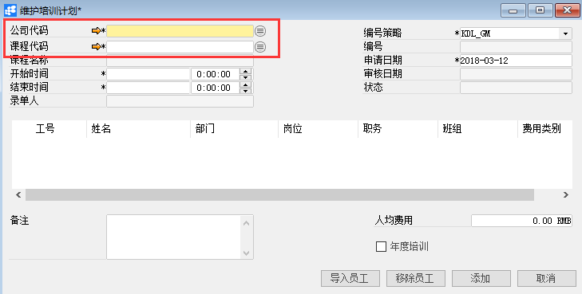
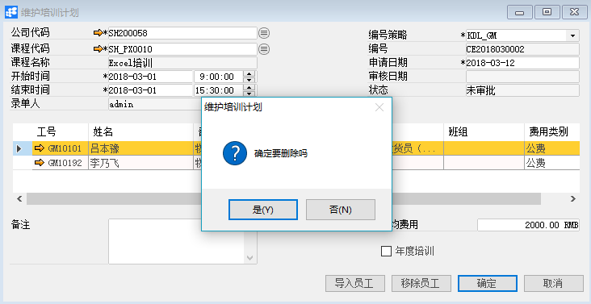

**维护培训计划**

**功能解释**

维护培训计划可以维护员工培训信息和培训费用。

**文章主旨**

本文介绍如何通过BAP Business Cloud AI完成维护培训计划的新增、修改及删除操作。

**操作要求**

当前登陆用户拥有操作维护培训计划业务的权限，权限设置请在帮助文档中搜索查看。

**新增培训计划**

1、 从系统菜单->【人力资源】->【培训管理】->【维护培训计划】，打开定义界面；

2、 点击工具栏新空白按钮准备新增培训计划；

3、 选择公司代码、课程代码等信息；

  

| ****扩展操作介绍                  |
| ------------------------------------------------------------ |
| 选择公司代码时可以直接在维护培训计划的“公司代码”栏位中输入公司名称关键字或编号关键字，再点击电脑键盘的Enter键执行查找。 |

4、 点击【员工导入】按钮选择员工；

 

5、 信息确认无误后点击【添加】或工具栏的保存按钮，保存维护培训计划。

| ****提醒                          |
| ------------------------------------------------------------ |
| 系统未配置自动发起审批时，保存订单信息检查无误后需要点击工具栏的发起审批按钮，执行请求审批操作 |

**修改培训计划**

1、 从系统菜单->【人力资源】->【培训管理】->【维护培训计划】，打开定义界面；

2、 点击工具栏的浏览按钮，查找要修改的培训计划；

3、 修改培训计划的内容；

4、 点击【更改】或工具栏的保存按钮保存，更改培训计划。

注：已审批通过的培训计划不能进行修改。

**删除培训计划**

1、 从系统菜单->【人力资源】->【培训管理】->【维护培训计划】，打开定义界面；

2、 点击工具栏的浏览按钮，查找要删除的培训计划；

3、 点击工具栏的按钮，进行删除操作。

 

**属性与活动描述**

| **属性** | **活动描述**   |
| -------------- | -------------------- |
| 公司代码       | 公司代码             |
| 课程代码       | 培训课程代码         |
| 课程名称       | 培训课程名称         |
| 开始时间       | 培训开始时间         |
| 结束时间       | 培训结束时间         |
| 录单人         | 培训计划录单人       |
| 编号策略       | 培训计划单据编号策略 |
| 编号           | 培训计划编号         |
| 申请日期       | 培训申请日期         |
| 审核日期       | 审批计划单据审核日期 |
| 状态           | 培训计划单状态       |
| 工号           | 员工工号             |
| 姓名           | 员工姓名             |
| 部门           | 部门名称             |
| 岗位           | 岗位名称             |
| 职务           | 职务名称             |
| 班组           | 班组名称             |
| 费用类别       | 培训费用类别         |
| 备注           | 描述文本             |
| 人均费用       | 人均培训费用         |
| 年度培训       | 标识是否为年度培训   |

 
