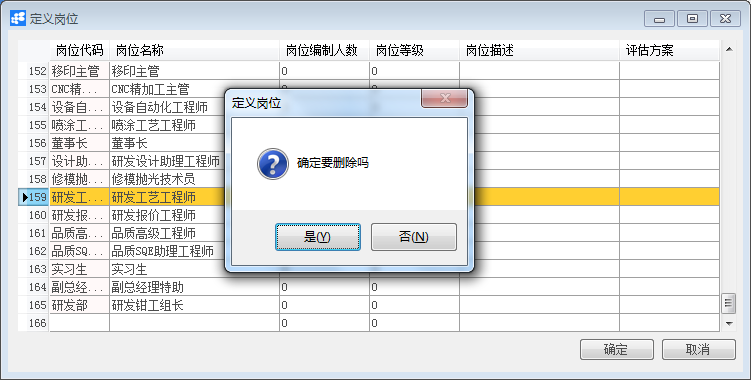

**定义岗位**

 

**功能解释**

定义岗位是指依据企业的制度与规则，定义不同的岗位，可输入岗位编制人数、岗位等级、岗位描述与评估方案。与员工主数据岗位字段对应，绑定员工岗位信息；

**文章主旨**

本文介绍如何通过BAP Business Cloud AI，完成定义岗位，新增、修改及删除操作。

**操作要求**

当前登陆用户拥有操作定义岗位业务的权限，权限设置请在帮助文档中搜索查看。

**新增定义岗位**

1、 从系统菜单->【人力资源】->【定义】->【定义岗位】，打开定义岗位界面；

2、 编辑岗位代码、岗位名称、岗位编制人数等信息；

3、 点击【添加】或工具栏的保存按钮进行保存。

**修改定义岗位**

1、 从系统菜单->【人力资源】->【定义】->【定义岗位】，打开定义岗位界面；

2、 修改定义岗位内容；

3、 点击【更改】或工具栏的保存按钮进行更改岗位内容。

**删除定义岗位**

1、 从系统菜单->【人力资源】->【定义】->【定义岗位】，打开定义岗位界面；

2、 选中要删除的那一行：

3、 点击工具栏的按钮，进行删除操作。

**属性与活动描述**

| **属性**     | **活动描述**     |
| ------------ | ---------------- |
| 岗位代码     | 输入岗位代码     |
| 岗位名称     | 输入岗位名称     |
| 岗位编制人数 | 输入岗位编制人数 |
| 岗位等级     | 输入岗位等级     |
| 岗位描述     | 输入岗位描述     |
| 评估方案     | 选择评估方案     |

 