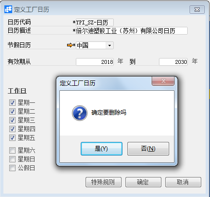

**定义工厂日历**

 

**功能解释**

企业可依据不同工厂的出勤方式定义不同的工厂日历，系统以员工选定的日历为依据，进行考勤结算。BAP的工厂日历包含了出勤日、公假、特殊出勤规则。

**文章主旨**

本文介绍如何通过BAP Business Cloud AI完成定义工厂日历，新增、修改及删除操作。

**操作要求**

当前登陆用户拥有操作定义班次业务的权限，权限设置请在帮助文档中搜索查看。

**新增定义工厂日历**

1、 从【管理】--->【基础定义】--->【会计】--->【生产】--->【定义工厂日历】，打开定义界面；

2、 点击工具栏新空白按钮准备新增班次；

3、 输入日历代码、节假日历、有效期从---到---特殊规则等；

4、 勾选工作日；

5、 确认无误后，点击【添加】或工具栏的保存按钮进行保存。

**修改定义工厂日历**

6、 从【管理】--->【基础定义】--->【会计】--->【生产】--->【定义工厂日历】，打开定义界面；

1、 点击工具栏的浏览按钮，查找要修改的工厂日历；

2、 修改日历内容；

3、 点击【更改】或工具栏的保存按钮保存，更改内容。

**删除定义工厂日历**

1、 从【管理】--->【基础定义】--->【会计】--->【生产】--->【定义工厂日历】，打开定义界面；

2、 点击工具栏的浏览按钮，查找要删除的日历；

3、 点击工具栏的按钮，进行删除操作。

**属性与活动描述**

| **属性**         | **活动描述**                                                 |
| ---------------- | ------------------------------------------------------------ |
| 日历代码         | 输入日历代码                                                 |
| 日历描述         | 输入日历描述                                                 |
| 节假日历         | 选择节假日历                                                 |
| 有效期从---到--- | 输入该日历的有限期年份                                       |
| 工作日           | 勾选工厂的稳定出勤时间                                       |
| 特殊规则         | 在此模块中设定工厂的特殊出勤日期，例如2019年10月12日按照日历为双休日，按照国家假期规则则为出勤日，通过此模块的设定，系统会优先认为该日期为出勤日    |

 

   