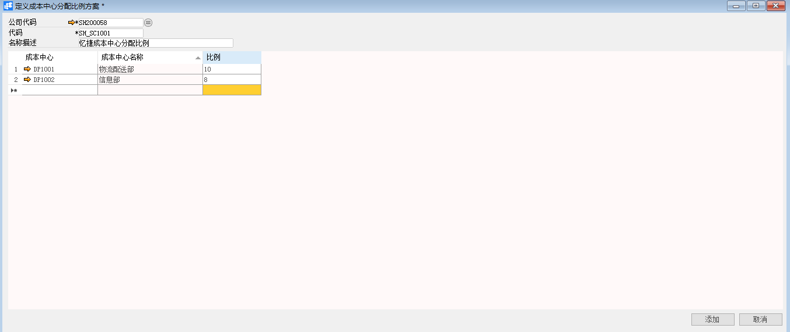

**定义成本中心分配比例方案**

 

**功能解释**

在BAP软件中，成本中心就像公司代码与控制范围，是财务模块中的对象。企业通过定义成本中心分配比例方案并将其分配到员工组，才可进行薪资过账，生成正确的财务凭证，形成业务闭环。

 

**文章主旨**

本文介绍如何通过BAP Business Cloud AI完成定义成本中心分配比例方案，新增、修改及删除操作。

**操作要求**

当前登陆用户拥有操作定义成本中心分配比例方案的权限，权限设置请在帮助文档中搜索查看。

**新增成本中心分配比例方案**

1、 从系统菜单->【人力资源】->【定义】->【定义成本中心分配比例方案】，打开定义界面；

2、 点击工具栏新空白按钮准备新增成本中心分配比例方案；

3、 编辑公司代码、代码及描述信息；

| ****扩展操作介绍 |
| ------------------------------------------------------------ |
| 选择公司代码时可以直接在成本中心分配比例方案的“公司代码”栏位中输入公司名称关键字或编号关键字，再点击电脑键盘的Enter键执行查找。 |

 

4、 编辑成本中心及比例；

5、 确认无误后，点击【添加】或工具栏的保存按钮进行保存。

**修改成本中心分配比例方案**

1、 从系统菜单->【人力资源】->【定义】->【定义成本中心分配比例方案】，打开定义界面；

2、 点击工具栏的浏览按钮，查找要修改的成本中心分配比例方案；

3、 修改成本中心分配比例方案内需要修改的内容；

4、 点击【更改】或工具栏的保存按钮保存，更改内容。

**删除成本中心分配比例方案**

1、 从系统菜单->【人力资源】->【定义】->【定义成本中心分配比例方案】，打开定义界面；

2、 点击工具栏的浏览按钮，查找要删除的成本中心分配比例方案；

3、 点击工具栏的按钮，进行删除操作。

**属性与活动描述**

| **属性**     | **活动描述**     |
| ------------ | ---------------- |
| 公司代码     | 选择公司代码     |
| 代码         | 输入代码         |
| 名称描述     | 输入名称描述     |
| 成本中心     | 选择成本中心     |
| 成本中心名称 | 显示成本中心名称 |
| 比例         | 输入比例         |

 

​    