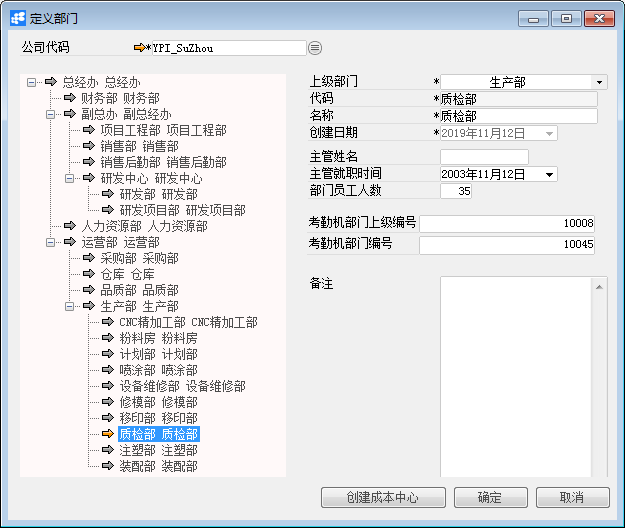

# 定义部门

 

## 功能解释 

企业按照一定的原则设置部门，体现了企业内部各组织职能的分配。企业以组织目标为出发点，以活动分析划分为设置部门的依据。公司的性质不同，会分配出不同的组织部门。一般包括董事会、经理人员以及具体的业务部门。

在BAP软件中的定义部门中，可直接体现出部门的上下级关系，并创建成本中心。也可与考勤机相对应，用于结算考勤。

 

## 文章主旨 

本文介绍如何通过BAP Business Cloud AI，完成定义部门，新增、修改及删除操作。

## 操作要求 

当前登录用户拥有操作定义部门业务的权限，权限设置请在帮助文档中搜索查看。

## 新增定义部门 

1、 从系统菜单->【管理】--->【基础定义】--->【一般】--->【定义部门】，打开定义部门界面；

2、 编辑上级部门、代码、名称等信息；

3、 点击【添加】或工具栏的保存按钮进行保存。

 

## 修改定义部门 

1、 从系统菜单->【管理】--->【基础定义】--->【一般】--->【定义部门】，打开定义部门界面；

2、 修改定义部门内容；

3、 点击【更改】或工具栏的保存按钮进行更改部门内容。

## 删除定义部门 

1、 从系统菜单->【管理】--->【基础定义】--->【一般】--->【定义部门】，打开定义部门界面；

2、 选中要删除的部门：

 

3、 点击工具栏的按钮，进行删除操作。

## 属性与活动描述 

| **属性**     | **活动描述**             |
| ------------------ | ------------------------------ |
| 上级部门           | 输入填写的部门的上级部门       |
| 代码               | 输入部门代码                   |
| 名称               | 输入部门名称                   |
| 创建日期           | 系统自动获取创建部门的当前日期 |
| 主管姓名           | 输入部门主管姓名               |
| 主管入职时间       | 输入部门主管的入职时间         |
| 部门员工人数       | 输入部门的员工人数             |
| 考勤机上级部门编号 | 输入上级部门的考勤机编号       |
| 考勤机部门编号     | 输入部门的考勤机编号           |

 

 
