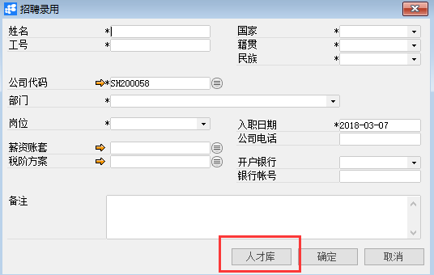
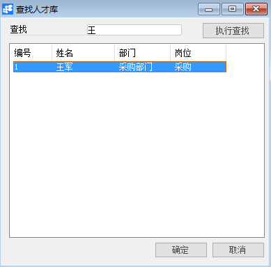

**招聘录用**

**功能解释**

运用此功能可以对招聘人员进行录用操作，录用完成后将生成员工主数据。面试人录用后，将无法进行删除、修改操作，只能进行离职操作。

**文章主旨**

本文介绍如何通过BAP Business Cloud AI完成招聘录用，新增操作。

**操作要求**

当前登陆用户拥有操作招聘录用的权限，权限设置请在帮助文档中搜索查看。

**新增招聘录用**

1、 从系统菜单->【人力资源】->【招聘管理】->【招聘录用】，打开定义界面；	

2、 点击工具栏新空白按钮准备新增招聘录用；

3、 直接编辑录用人信息或点击【人才库】按钮进行选择，然后完善信息；

| **扩展操作介绍** |
| ------------------------------------------------------------ |
| 选择人才库时可以直接在查找栏位中输入名称关键字或编号关键字，再点击电脑键盘的Enter键执行查找。 |

 

 

4、 信息确认无误后点击【添加】或工具栏的保存按钮，保存招聘录用。

**属性与活动描述**

| **属性** | **活动描述** |
| -------------- | ------------------ |
| 姓名           | 被录用人的姓名     |
| 工号           | 录用后的工号       |
| 国家           | 被录用人的国籍     |
| 籍贯           | 被录用人的籍贯     |
| 民族           | 被录用人的民族     |
| 公司代码       | 录用公司           |
| 部门           | 录用部门           |
| 岗位           | 录用岗位           |
| 薪资账套       | 录用后的薪资账套   |
| 税阶方案       | 录用后的税阶方案   |
| 入职日期       | 被录用人的入职日期 |
| 公司电话       | 公司电话           |
| 开户银行       | 工资卡的开户银行   |
| 银行账号       | 工资卡银行账号     |
| 备注           | 备注说明           |

 
