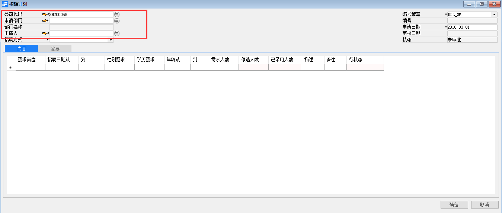
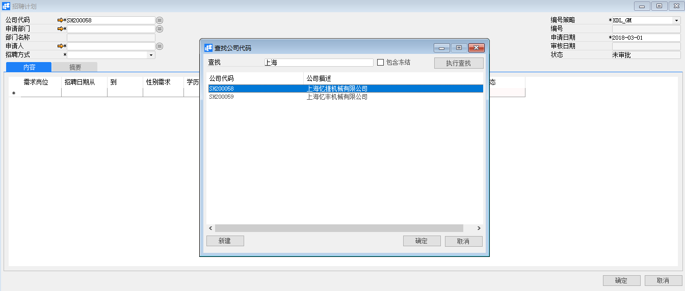

***\*招聘计划\****

 

***\*功能解释\****

运用此功能可以定义HR模块中招聘计划，根据该计划可以管理招聘人数、招聘岗位、招聘费用等信息。

***\*文章主旨\****

本文介绍如何通过BAP Business Cloud AI完成招聘计划，新增、修改及删除操作。

***\*操作要求\****

当前登陆用户拥有操作招聘计划的权限，权限设置请在帮助文档中搜索查看。

***\*新增招聘计划\****

1、 从系统菜单->【人力资源】->【招聘管理】->【招聘计划】，打开定义界面；	

2、 点击工具栏新空白按钮准备新增招聘计划；

3、 选择公司代码、申请部门、申请人；

| ***\*\****扩展操作介绍 |
| ------------------------------------------------------------ |
| 选择公司代码时可以直接在招聘计划的“公司代码”栏位中输入公司名称关键字或编号关键字，再点击电脑键盘的Enter键执行查找。 |

 

4、 编辑招聘信息，如：需求岗位、招聘时间、性别、学历等信息；

5、 确认无误后，点击【添加】或工具栏的保存按钮进行保存。

| ***\*\****提醒 |
| ------------------------------------------------------------ |
| 系统未配置自动发起审批时，保存订单信息检查无误后需要点击工具栏的发起审批按钮，执行请求审批操作 |

 

***\*修改招聘计划\****

1、 从系统菜单->【人力资源】->【招聘管理】->【招聘计划】，打开定义界面；

2、 点击工具栏的浏览按钮，查找要修改的招聘计划；

3、 修改招聘计划内需要修改的内容；

4、 点击【更改】或工具栏的保存按钮保存，更改内容。

注：已审批通过的招聘计划不能进行修改操作。

***\*删除招聘计划\****

1、 从系统菜单->【人力资源】->【招聘管理】->【招聘计划】，打开定义界面；

2、 点击工具栏的浏览按钮，查找要删除的招聘计划；

3、 点击工具栏的按钮，进行删除操作。

注：已审批通过的招聘计划不能进行删除操作

 

***\*属性与活动描述\****

| ***\*属性\**** | ***\*活动描述\****                                           |
| -------------- | ------------------------------------------------------------ |
| 公司代码       | 选择公司代码                                                 |
| 申请部门       | 选择申请招聘的部门                                           |
| 部门名称       | 所选择的部门的名称                                           |
| 申请人         | 选择申请人                                                   |
| 招聘方式       | 选择招聘方式                                                 |
| 编号策略       | 选择编号策略                                                 |
| 编号           | 显示/编号信息。选择编号策略，该编号会自动生成；选择手动，需要在此手工输入编号 |
| 申请日期       | 申请的发起日期                                               |
| 审核日期       | 审核的日期                                                   |
| 状态           | 招聘计划的状态                                               |

***\*内容\****

| ***\*属性\**** | ***\*活动描述\**** |
| -------------- | ------------------ |
| 需求岗位       | 需要招聘的岗位     |
| 招聘日期从     | 招聘起始日期       |
| 到             | 招聘结束日期       |
| 性别需求       | 性别要求           |
| 学历需求       | 学历要求           |
| 年龄从         | 最低年龄           |
| 到             | 最高年龄           |
| 需求人数       | 需要招聘的人数     |
| 候选人数       | 候选的人数         |
| 已录用人数     | 已录用人数         |
| 描述           | 描述               |
| 备注           | 备注               |
| 行状态         | 该行申请的状态     |

***\*摘要\****

| ***\*属性\**** | ***\*活动描述\**** |
| -------------- | ------------------ |
| 备注           | 对该计划的备注说明 |
| 预算费用       | 预算费用           |
| 实际费用       | 实际花费的费用     |
| 创建           | 显示创建人         |

 
