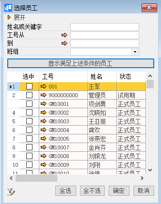
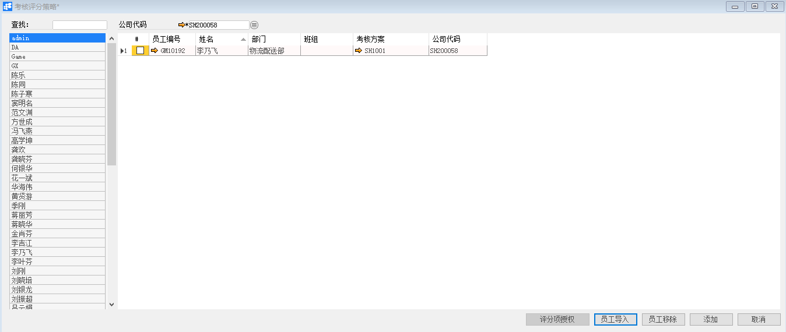

# 考核评分策略 

 

## 功能解释 

运用此功能是为员工分配考核人，不同的考核项目分配给不同的员工进行打分。

## 文章主旨 

本文介绍如何通过BAP Business Cloud AI完成考核评分策略，新增及删除操作。

## 操作要求 

当前登录用户拥有操作考核评分策略的权限，权限设置请在帮助文档中搜索查看。

## 新增考核评分策略 

1、 从系统菜单->【人力资源】->【绩效考核】->【考核评分策略】，打开定义界面；	

2、 查找选择要进行评分的权限用户；

3、 点击【员工导入】选择需要接受上述选择用户评分的员工；

 

4、 点击【添加】保存选择的用户和员工对应关系；

 

5、 选中要进行考核项授权的员工所在行（可多选）；

6、 点击【评分项授权】，将考核项目的打分权限分配给权限用户；

 

7、 点击【更改】保存考核项授权。

## 删除考核评分策略 

1、 从系统菜单->【人力资源】->【绩效考核】->【考核评分策略】，打开界面；

2、 选中要删除的对象员工行；

3、 点击【员工移除】完成。

## 属性与活动描述 

| **属性** | **活动描述** |
| -------------- | ------------------ |
| 公司代码       | 公司代码           |
| 员工编号       | 员工工号           |
| 姓名           | 员工姓名           |
| 部门           | 员工所在部门信息   |
| 班组           | 员工班组信息       |
| 考核方案       | 考核方案信息       |

## 评分项授权 

| **属性** | **活动描述** |
| -------------- | ------------------ |
| 考核方案       | 考核方案           |
| 代码           | 考核项目代码       |
| 描述           | 考核项目描述文本   |
| 权重           | 权重比例           |

 
