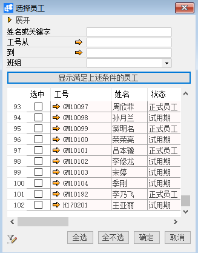
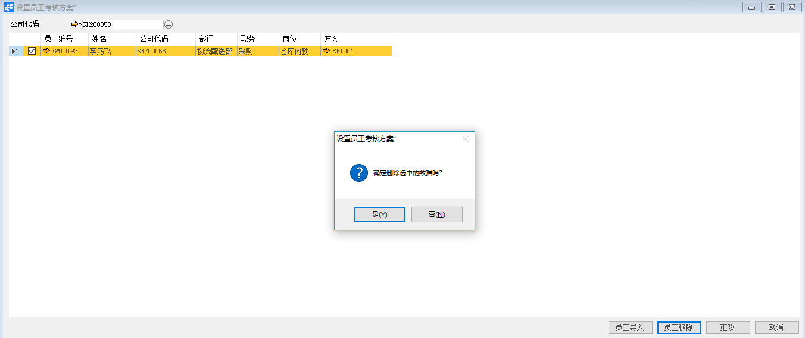

***\*设置员工考核方案\****

 

***\*功能解释\****

运用此功能是将BAP中已经添加的考核方案分配给员工，将员工考核方案分配给员工就表示该员工采用被分配的方案进行绩效考核。

***\*文章主旨\****

本文介绍如何通过BAP Business Cloud AI完成设置员工考核方案，新增、删除操作。

***\*操作要求\****

当前登陆用户拥有操作设置员工考核方案的权限，权限设置请在帮助文档中搜索查看。

***\*新增员工考核方案\****

1、 从系统菜单->【人力资源】->【绩效考核】->【设置员工考核方案】，打开定义界面；

2、 选择要进行设置考核方案的对象员工所属公司；

 

 

 

| ***\*\****扩展操作介绍                  |
| ------------------------------------------------------------ |
| 选择公司代码时可以直接在设置员工考核方案的“公司代码”栏位中输入名称关键字或编号关键字，再点击电脑键盘的Enter键执行查找。 |

 

3、 点击【员工导入】选择要进行设置考核方案的对象员工；

 

4、 编辑选择的对象员工所要分配的考核方案；

 

5、 信息确认无误后点击【更改】或工具栏的保存按钮，保存员工考核方案。

***\*删除员工考核方案\****

1、 从系统菜单->【人力资源】->【绩效考核】->【设置员工考核方案】，打开界面；

2、 选中要删除的对象员工行；

3、 点击【员工移除】完成。

 

***\*属性与活动描述\****

| ***\*属性\**** | ***\*活动描述\**** |
| -------------- | ------------------ |
| 公司代码       | 公司代码           |
| 员工编号       | 员工工号           |
| 姓名           | 员工姓名           |
| 部门           | 员工所在部门信息   |
| 职务           | 员工职务信息       |
| 岗位           | 员工岗位信息       |
| 方案           | 选择考核方案       |

 