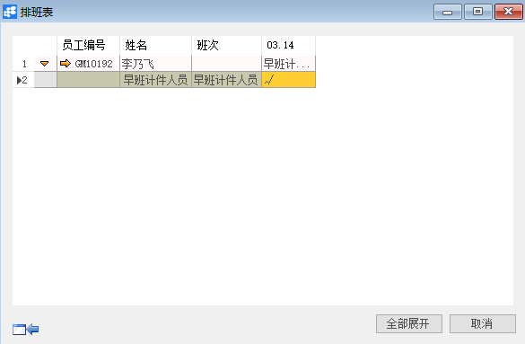

**排班表**

 

**功能解释**

排班表用来查看对员工已经完成的排班情况，并且可以在排班表界面快速取消排班和快速排班。

**文章主旨**

本文介绍如何通过BAP Business Cloud AI完成排班表查询操作。

**操作要求**

当前登陆用户拥有操作排班表的权限，权限设置请在帮助文档中搜索查看。

**查询排班表**

1、 从【菜单窗口】->【人力资源】->【考勤管理】->【排班表】，进入【排班表】条件界面；

2、 编辑选择要查看的排班表筛选条件；

 

3、 点击【确定】进入排班表；

4、 展开员工排班明细，查看员工排班详情。

（要对员工某一天的或多天的排班进行取消，选中要取消的日期并右击鼠标，选中【重新排班】就可取消

（如果需要对取消了排班的日期进行快速排班，依旧选中要进行快速排班的日期并右击鼠标选选择【快速排班】即可）

 

**排班表查询窗口数据**

| **属性**   | **活动描述**       |
| ---------------- | ------------------------ |
| 员工工号从…到    | 员工工号区间             |
| 排班日期从…到    | 排班日期区间             |
| 公司代码         | 公司代码                 |
| 排班方案         | 选择排班方案             |
| 显示全部排班方案 | 勾选是否显示全部排班方案 |
| 部门             | 根据部门查询             |
| 岗位             | 根据岗位查询             |
| 职务             | 根据职务查询             |
| 班组             | 根据班组查询             |
| 班次             | 根据班次查询             |
| 显示方式         | 排班表的显示方式         |
| 在职状态         | 员工状态                 |

**排班表信息**

| **属性** | **活动描述** |
| -------------- | ------------------ |
| 员工编号       | 显示员工编号       |
| 姓名           | 显示姓名           |

 
