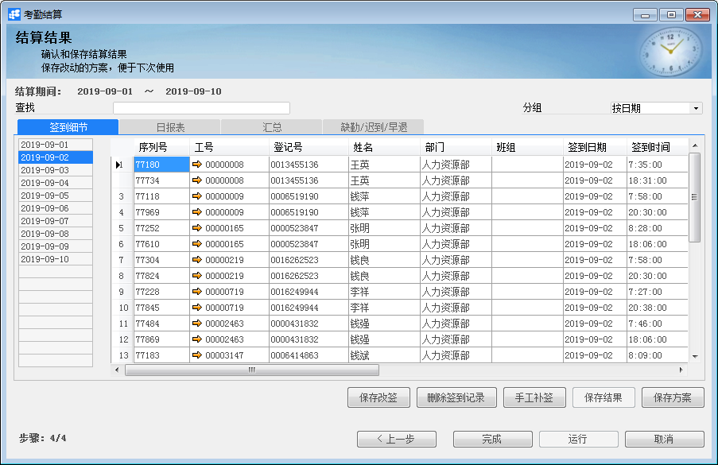
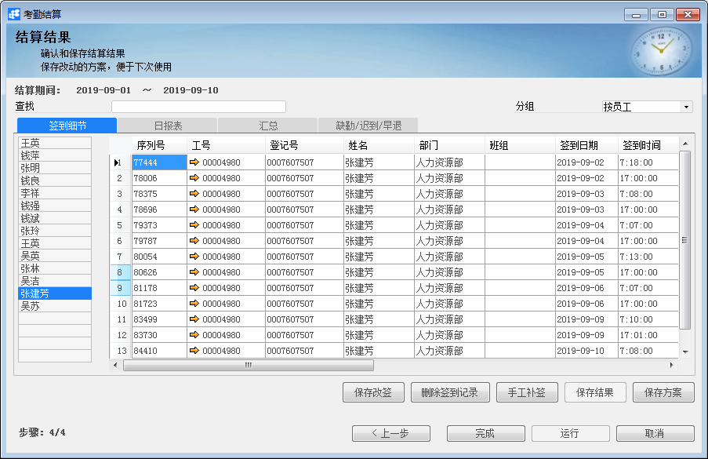
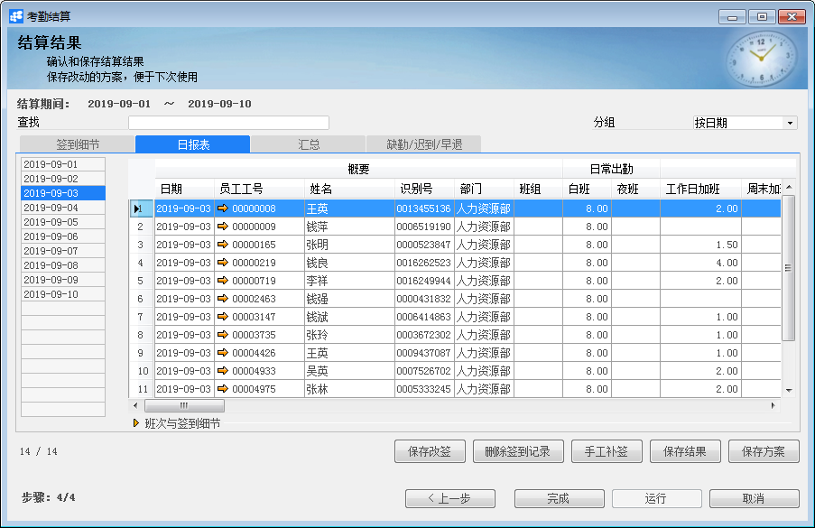
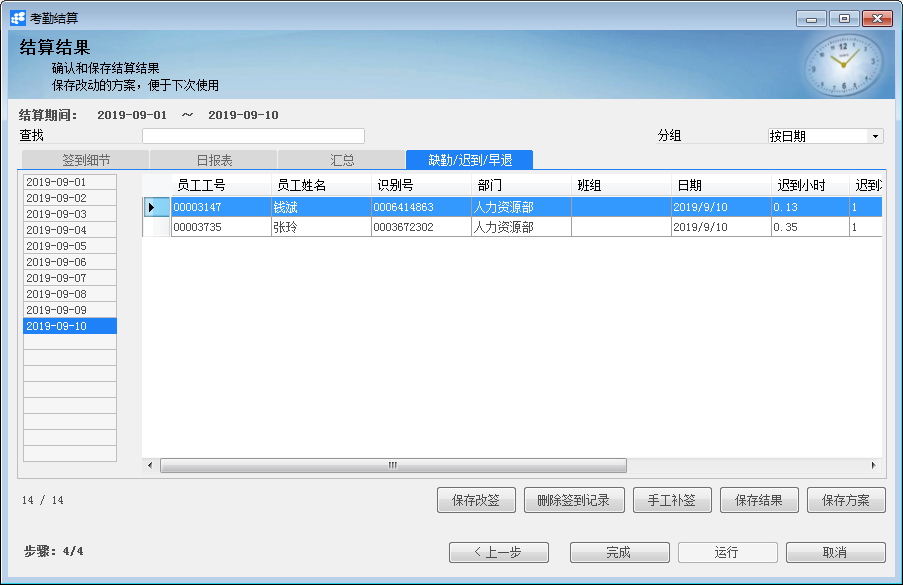

***\*考勤结算\****

 

***\*功能解释\****

考勤结算用来对员工的出勤进行有规则的结算，得出员工一段时期内的考勤数据，为薪资结算提供考勤数据参考。

***\*文章主旨\****

本文介绍如何通过BAP Business Cloud AI完成考勤结算，新增、删除操作。

***\*操作要求\****

当前登陆用户拥有操作考勤结算的权限，权限设置请在帮助文档中搜索查看。

***\*考勤结算\****

1、从【人力资源】-〉【考勤管理】-〉【考勤结算】，打开考勤结算窗口；

2、阅读操作说明，点击【下一步】，选择【创建新方案】或者【选择已存在的方案】，点击【下一步】；

 

3、输入方案名称、结算日期、员工与控制策略。控制策略依据不同企业的不同规章制度设定。点击【运行】；

 

4、在签到细节中，显示所选的员工的打卡信息。右上角可以选择“按日期”或者“按员工”来查阅信息。

 

 

 

5、点击【日报表】，系统便会结算上一步限制范围的相关考勤信息。

 

 

6、点击【汇总】，可以查看在此考勤结算的时间范围内，员工的累积出勤小时、假期等详细信息。

 

7、点击【缺勤/迟到/早退】，可以查看在此考勤结算的时间范围内，员工的异常出勤信息。

 

***\*删除考勤数据向导\****

1、 从【菜单窗口】->【人力资源】->【考勤管理】->【采集考勤数据向导】，进入界面；

2、 选择需要删除的采集考勤数据方案；

3、 点击【删除方案】按钮，进行删除。

***\*属性与活动描述\****

| ***\*属性\****     | ***\*活动描述\****                                           |
| ------------------ | ------------------------------------------------------------ |
| 方案名称           | 考勤数据交换方案的名称                                       |
| 描述               | 对方案的描述                                                 |
| 服务器             | 数据源服务器名称                                             |
| 数据库用户名       | 源数据库用户名                                               |
| 数据库密码         | 源数据库密码                                                 |
| 数据库             | 源数据库                                                     |
| 数据表             | 源数据表                                                     |
| 选择数据源         | 单击后打开数据源服务器选择项                                 |
| 激活               | 是否激活，同时选择激活和自动才能自动采集                     |
| 自动               | 选择自动后需选择考勤采集周期性策略，系统将自动采集数据       |
| 数据表列名（目标） | 目标数据表列名                                               |
| 数据表列名（来源） | 来源数据表列名                                               |
| 保存方案           | 保存方案，供下次打开时选用                                   |
| 采集               | 单击此按钮后，将采集数据                                     |
| 上一步             | 单击后返回上一层界面                                         |
| 完成               | 此按钮在当前见面下为灰色状态                                 |
| 取消               | 单击后取消操作                                               |
| 删除签到记录       | 用户在签到细节界面，选中某个打卡信息，点击此按钮，便可删除此打卡信息。 |
| 保存改签           | 用户在签到细节界面中，可在“改签/改签前”这一列中，输入新的签到日期，点击此按钮，便会覆盖住原先的打卡信息。 |

 