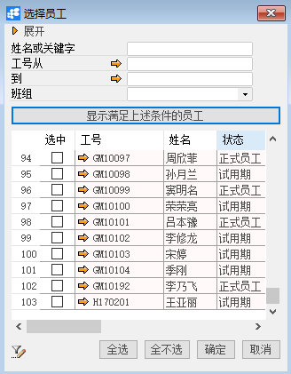

***\*定义员工关联税阶方案\****

***\*功能解释\****

运用此功能是将已经添加在BAP中的税阶方案分配给员工，作为薪资核算的计税依据。

***\*文章主旨\****

本文介绍如何通过BAP Business Cloud AI 完成定义员工关联税阶方案，新增、修改及删除操作。

***\*操作要求\****

当前登陆用户拥有操作定义员工关联税阶方案的权限，权限设置请在帮助文档中搜索查看。

***\*新增员工关联税阶方案\****

1、 从系统菜单->【人力资源】->【薪资管理】->【定义员工关联税阶方案】，打开定义界面；	

2、 选择要分配税阶方案的对象员工所属公司；

3、 点击【员工导入】按钮，查找并选择要进行税阶方案分配的对象员工；

 

4、 编辑员工所对应要分配的税阶方案；

 

5、 点击【更改】保存分配。

***\*修改员工关联税阶方案\****

1、 从系统菜单->【人力资源】->【薪资管理】->【定义员工关联税阶方案】，打开定义界面；

2、 选择要修改税阶方案的对象员工所属公司；

3、 修改税阶方案的内容；

4、 点击【更改】或工具栏的保存按钮保存，更改税阶方案。

***\*删除员工关联税阶方案\****

1、 从系统菜单->【人力资源】->【薪资管理】->【定义员工关联税阶方案】，打开定义界面；

2、 选择要修改税阶方案的对象员工所属公司；

3、 选中要删除的对象员工行；

4、 点击【员工移除】完成。

***\*属\*******\*性与活动描述\****

| ***\*属性\**** | ***\*活动描述\**** |
| -------------- | ------------------ |
| 公司代码       | 公司代码           |
| 员工编号       | 员工工号           |
| 姓名           | 员工姓名           |
| 部门           | 部门名称           |
| 职务           | 职务名称           |
| 岗位           | 岗位名称           |
| 税阶方案       | 税阶方案           |

 