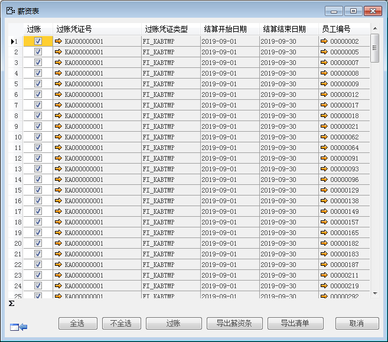

 

# 薪资报表

 

## 功能解释 

在此界面中，查询用户保存的薪资结算结果，核对无误后可进行过账，生成财务凭证，形成业务闭环。

 
## 文章主旨 

本文介绍如何通过BAP Business Cloud AI完成薪资结算的操作。

## 操作要求 

当前登录用户拥有操作薪资结算的权限，权限设置请在帮助文档中搜索查看。

## 薪资结算 

1. 单击【人力资源】-〉【薪资管理】-〉【薪资报表】，打开薪资报表窗口，可输入筛选条件缩小查看范围；

 

2. 选中薪资账套，点击【确定】，选中需要过账的行，点击右下角【过账】

 

3. 选择凭证编号策略，点击【确定】；

 

4. 生成财务凭证，实现成本中心分配，点击超链接进入总账凭证，形成业务闭环，并且可以实现数据的导出；

 

 

 ## 属性与活动描述 

 

| **属性** | **活动描述**       |
| -------------- | ------------------------ |
| 公司代码       | 选择公司代码             |
| 工号从…到…     | 选择工号查询范围条件     |
| 结算日期从…到… | 输入结算日期查询范围条件 |
| 薪资账套       | 员工关联薪资账套         |
| 岗位           | 选择岗位查询条件         |
| 合同类别       | 选择合同类别查询条件     |
| 用工形式       | 选择用工形式作为查询条件 |
| 职务           | 选择职务作为查询条件     |
| 班组           | 选择班组作为查询条件     |
| 部门           | 选择部门作为查询条件     |
| 结算开始日期   | 显示薪资结算开始日期     |
| 结算结束日期   | 显示薪资结算结束日期     |
| 员工编号       | 显示员工编号             |
| 员工姓名       | 显示员工姓名             |

 

 

 

 
