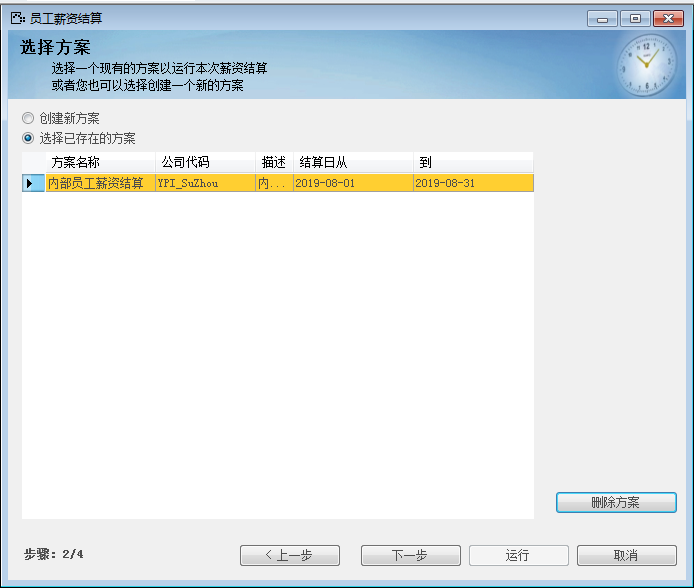

# 薪资结算 

 

## 功能解释 

在此模块中，用户对员工的某一时间段内的薪资进行结算，结算前需确保员工每日考勤无异常，员工的社保基数等具体信息无误，固定薪资项准确无误。

 

## 文章主旨 

本文介绍如何通过BAP Business Cloud AI完成薪资结算的操作。

## 操作要求 

当前登陆用户拥有操作薪资结算的权限，权限设置请在帮助文档中搜索查看。

## 薪资结算 

1、单击【人力资源】-〉【薪资管理】-〉【薪资结算】，打开薪资结算窗口；

2、阅读操作说明，点击【下一步】；

3、在此界面中，可以选择“创建新方案”或“选择已存在的方案”；

 

4、点击“创建新方案”，点击【下一步】；

5、输入公司代码、方案名称、描述、结算期间与结算员工的筛选，也可以在下方选中员工，缩小结算范围；

6、输入公司代码、方案名称、描述、结算期间与结算员工的筛选，也可以在下方选中员工，缩小结算范围；

 ## 属性与活动描述 

| **属性**             | **活动描述**                                     |
| -------------------------- | ------------------------------------------------------ |
| 显示已结算结果             | 将范围内员工时间范围内先前结算过得结果显示出来；       |
| 重新结算                   | 覆盖先前的结算结果，保存此次结算的结果；               |
| 不显示本期结算前离职的员工 | 在结算期间时间范围之前离职的员工薪资，系统将不予结算； |

7、点【运行】，系统进入运算阶段，运算完成后，选中左侧薪资账套，即可浏览员工期间内薪资详情；

 

 ## 属性与活动描述 

 

| **属性** | **活动描述**                     |
| -------------- | -------------------------------------- |
| 隐藏未选中     | 勾选后，将只显示黄色列的员工薪资信息； |
| 显示薪资明细   | 薪资具体明细都显示出来；               |

8、点击【保存结果】，此次结算的结果保存入系统中，可在薪资报表中查看此次结果。

 

 

 

 
