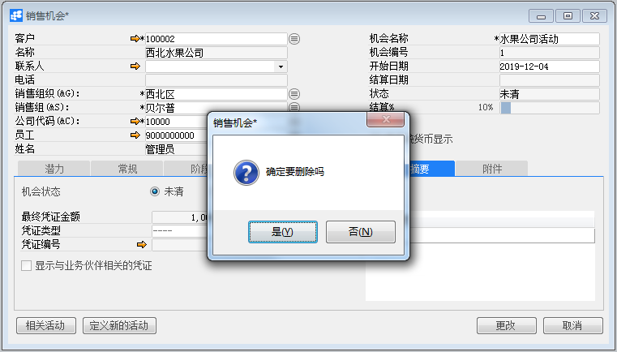

# 销售机会

## 功能解释 

BAP Business Cloud AI销售机会可以根据销售活动的进展情况来跟踪和分析未决的销售机会。

销售机会可以让您预测潜在收益状况并按优先级管理。

销售机会可以链接多个单据、为销售机会指定销售员，及为销售机会的每个阶段指定不同的销售员等功能。

## 文章主旨 

本文介绍如何通过BAP Business Cloud AI完成销售机会的新增，修改及删除操作。

## 操作要求 

当前登录用户须拥有对销售机会创建，修改及删除的操作权限，如何设置该权限请在客户关系权限相关章节中搜索查看。

## 创建销售机会

1、从菜单窗口，【客户关系】->【销售机会】，打开销售机会窗口；

2、选择客户代码，输入销售机会名称；

3、在潜力、常规、阶段、合作伙伴、竞争对手、摘要、附件选项卡中输入销售机会的必要信息；

4、单击“添加”按钮。 

## 更改销售机会

1、从菜单窗口，【客户关系】->【销售机会】，打开销售机会窗口；

2、单击工具栏上浏览按钮，选择要更改的销售机会；

3、对需要更改的销售机会进行更改，置灰的属性不允许修改；

4、单击“更改”按钮，状态栏上显示“更改已保存！”，并且更改按钮已变为确定按钮，则更改成功。

## 删除销售机会

1、 从菜单窗口，【客户关系】->【销售机会】，打开销售机会窗口；

2、单击工具栏浏览按钮，选择要删除的销售机会；

3、单击工具栏‘删除当前记录’按钮；

4、在确认删除选择窗口中单击“是”，完成删除。

##  属性与活动描述

## 销售机会主数据

| 属性           | 活动描述                                                     |
| -------------- | ------------------------------------------------------------ |
| 客户           | 选择客户代码                                                 |
| 名称           | 根据客户代码显示客户名称                                     |
| 联系人         | 根据客户代码显示联系人                                       |
| 电话           | 根据联系人显示联系人电话                                     |
| 销售组织       | 选择对应的销售组织                                           |
| 销售组         | 选择对应的销售组                                             |
| 公司代码       | 选择公司代码                                                 |
| 员工           | 选择该销售机会的负责人                                       |
| 姓名           | 显示员工的姓名                                               |
| 机会名称       | 输入销售机会名称                                             |
| 机会编号       | 创建销售机会成功后，自动生成编号                             |
| 开始日期       | 输入销售机会的开始日期，默认显示系统日期                     |
| 结算日期       | 当销售机会在接要选项卡中定义为赢取或丢失的日期               |
| 状态           | 显示活动的状态                                               |
| 未清活动       | 选择客户状态为未清的活动                                     |
| 结算%          | 显示在阶段选项卡中最后阶段中输入百分比值，表示销售机会的进度 |
| 用系统货币显示 | 所有财务字段用系统货币显示值                                 |

## 潜力选项卡

| 属性         | 活动描述                                                     |
| ------------ | ------------------------------------------------------------ |
| 预测结算时间 | 按天数、周数或月份数输入时间范围，直到预期的销售机会结算为止 |
| 预测结束日期 | 基于预测结算时间与系统时间，显示预测结束时间                 |
| 潜在金额     | 输入销售机会预期的总金额                                     |
| 加权金额     | 潜在金额乘以结算%                                            |
| 毛利%        | 表示最终销售预期的利润百分比                                 |
| 毛利总计     | 潜在金额和毛利总计                                           |
| 利率水平     | 选择利率水平                                                 |
| 描述         | 指客户感兴趣范围，譬如企业5S管理、技术学习                   |
| 主           | 指出在表中所列客户的最重要的兴趣                             |

## 常规选项卡

| 属性               | 活动描述                                                     |
| ------------------ | ------------------------------------------------------------ |
| 业务伙伴渠道代码   | 选择业务伙伴渠道，是公司在某些销售交易通过其提供服务的伙伴   |
| 业务伙伴渠道名称   | 根据业务伙伴渠道代码，显示业务伙伴渠道名称                   |
| 业务伙伴渠道联系人 | 根据业务伙伴渠道代码，显示业务伙伴渠道联系人                 |
| 项目               | 选择项目，销售机会可作为项目的一部分                         |
| 信息源             | 选择初次联系或合作伙伴开始感兴趣的原因，信息源可以是报纸文章、展览、网络 |
| 行业               | 选择与客户相关的行业                                         |
| 备注               | 输入备注信息                                                 |

## 阶段选项卡

| 属性                 | 活动描述                                                     |
| -------------------- | ------------------------------------------------------------ |
| 开始日期             | 在第一个活动时，输入开始日期。每个阶段的开始日期必须等于或晚于： 1、主数据中指定的开始日期 2、先前阶段的结束日期 |
| 结算日期             | 输入每个阶段的预期结束日期                                   |
| 销售员               | 选择每个阶段的相关销售员                                     |
| 阶段                 | 选择阶段，可以定义新的阶段                                   |
| 结算%                | 显示定义为销售阶段的缺省的结算百分比                         |
| 潜在金额             | 显示在潜在选项卡中的潜在金额                                 |
| 加权金额             | 显示潜在金额乘以最后阶段百分比所得的总额                     |
| 凭证类型             | 选择与客户相关的凭证类型                                     |
| 显示当前业务伙伴凭证 | 根据客户过滤凭证单据凭证                                     |
| 凭证编号             | 选择凭证编号                                                 |
| 活动                 | 选择与客户相关的活动                                         |
| 主题                 | 根据活动显示主题信息                                         |
| 员工                 | 选择某个阶段的销售机会负责人                                 |
| 阶段标识             | 显示阶段标识                                                 |

## 合作伙伴选项卡

| 属性     | 活动描述                   |
| -------- | -------------------------- |
| 编号     | 选择合作伙伴               |
| 名称     | 根据合作伙伴编号显示名称   |
| 关系     | 选择合作伙伴与公司间的关系 |
| 相关客户 | 选择相关客户               |
| 备注     | 输入合作伙伴备注           |

## 竞争对手选项卡

| 属性     | 活动描述       |
| -------- | -------------- |
| 名称     | 选择兑争对手   |
| 处理级别 | 选择处理级别   |
| 备注     | 输入竞争备注   |
| 赢取     | 选择是否已赢取 |

## 摘要选项卡

| 属性                     | 活动描述                                                   |
| ------------------------ | ---------------------------------------------------------- |
| 机会状态                 | 相应选择未清，赢得或损失                                   |
| 最终凭证金额             | 显示与最后销信阶段相关凭证的不含税金额                     |
| 凭证类型                 | 链接到销售机会的最后阶段的凭证类型                         |
| 凭证编号                 | 链接到销售要赊的最后阶段的凭证编号                         |
| 显示与业务伙伴相关的凭证 | 将凭证编号清单限制到与客户相关的凭证，否则，所有凭证都可用 |
| 描述                     | 输入关于销售活动成功或失败的解释说明                       |

## 附件选项卡

| 属性     | 活动描述                                       |
| -------- | ---------------------------------------------- |
| 路径     | 显示附加文件的路径名                           |
| 文件名称 | 显示附加文件名称                               |
| 附件日期 | 显示附加文件日期                               |
| 浏览     | 要附加文件，单击“浏览”按扭，选择文件           |
| 移除     | 要删除的附加文件，选择显示文件，单击“移除”按扭 |
| 查看     | 要打开附加文件，选择显示文件，单击“查看”按扭   |
