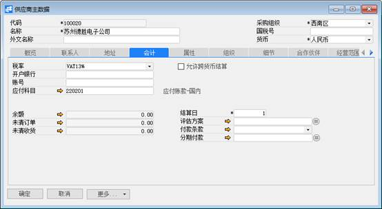
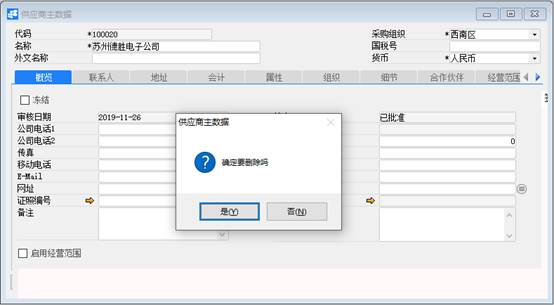

**供应商主数据**

**功能解释**

此功能可以定义采购模块所用的供应商主数据。

**文章主旨**

本文介绍如何通过BAP Business Cloud AI完成供应商主数据的新增、修改及删除操作。

**操作要求**

当前登录用户须拥有对供应商主数据创建、更改或删除的操作权限，如何设置该权限请在采购权限相关章节中搜索查看。

**新增供应商主数据**

1、 从菜单窗口，【采购】->【定义供应商主数据】，打开创建界面；

2、 选择供应商代码，名称，采购组织，货币等信息；

3、 依次编辑概览、联系人、地址、会计、属性、组织、细节、合作伙伴、经营范围、产品注册证等选项卡中的内容；

4、 在联系人选项卡中选中某一创建的联系人，点击“设置默认联系人”来设置供应商的默认联系人；

5、 在地址选项卡中选中某一创建的地址，点击“设置默认地址”来设置供应商的默认地址；

6、 在会计标签页下选择税率、应付科目，填写结算日；

7、 在组织标签页下选择采购组织；

8、 点击【添加】保存，点击【发起审批】发起审批。

**修改供应商主数据**

1、 从菜单窗口，【采购】->【定义供应商主数据】，打开创建界面；

2、 点击工具栏浏览按钮或拖查询找到需更改的供应商主文件；

3、 对需修改的相关项进行更改，置灰的不允许修改；

4、 点击【更改】或工具栏的保存按钮保存，更改供应商主数据。

5、 点击【发起审批】发起审批。

**删除供应商主数据**

从菜单窗口，【采购】->【定义供应商主数据】，打开创建界面；

1、 点击工具栏浏览按钮或拖查询找到需删除的供应商主文件；

2、 点击工具栏的按钮，进行删除操作。

**属性与活动描述**

| **属性** | **活动描述**             |
| -------- | ------------------------ |
| 代码     | 输入供应商代码           |
| 名称     | 输入供应商名称           |
| 外文名称 | 输入供应商的外文名称     |
| 采购组织 | 选择供应商所属的采购组织 |
| 国税号   | 输入供应商的国税号       |
| 货币     | 输入供应商的默认交易货币 |

**概览**

| **属性**           | **活动描述**                                                 |
| ------------------ | ------------------------------------------------------------ |
| 冻结、从、到、备注 | 设置供应商的冻结日期范围，该范围内无法进行该供应商的业务活动 |
| 公司电话1          | 输入供应商的公司电话                                         |
| 公司电话2          | 输入供应商的公司电话                                         |
| 传真               | 输入供应商的传真                                             |
| 移动电话           | 输入供应商的移动电话                                         |
| E-Mail             | 输入供应商的电子邮箱                                         |
| 网址               | 输入供应商的网址                                             |
| 证照编号           | 选择证照编号                                                 |
| 备注               | 输入联系人的备注信息                                         |
| 主要联系人         | 显示供应商的默认联系人                                       |
| 企业规模           | 输入供应商的企业规模                                         |
| 企业法人           | 输入供应商的企业法人                                         |
| 成立日期           | 输入供应商的成立日期                                         |
| 营业执照           | 输入供应商的营业执照                                         |
| 价格组             | 选择价格组                                                   |
| 地址               | 显示供应商的默认地址                                         |

**联系人**

| **属性**       | **活动描述**           |
| -------------- | ---------------------- |
| 姓名           | 输入供应商的联系人姓名 |
| 称谓           | 输入联系人的称谓       |
| 地址           | 输入联系人的地址       |
| 电话1          | 输入联系人的电话       |
| 电话2          | 输入联系人的电话       |
| 移动电话       | 输入联系人的移动电话   |
| 传真           | 输入联系人的传真       |
| E-Mail         | 输入联系人的电子邮箱   |
| 备注           | 输入联系人的备注信息   |
| 设为默认联系人 | 设置选定人为默认联系人 |

**地址**

| **属性**     | **活动描述**           |
| ------------ | ---------------------- |
| 名称         | 输入地址名称           |
| 邮政编码     | 输入邮政编码           |
| 街道         | 输入地址的街道信息     |
| 地区         | 输入地址的地区         |
| 城市         | 输入地址的城市         |
| 省           | 输入地址的省份         |
| 国家         | 输入地址的国家         |
| 国税号       | 输入国税号             |
| 备注         | 输入地址的备注信息     |
| 开票到       | 选择地址类型为开票地址 |
| 发运到       | 选择地址类型为发运地址 |
| 设为默认地址 | 设置选定地址为默认地址 |

**会计**

| **属性** | **活动描述**             |
| -------- | ------------------------ |
| 税率     | 选择供应商的默认税率     |
| 开户银行 | 输入开户银行             |
| 结算日   | 输入供应商的默认结算日   |
| 账号     | 输入供应商的银行账号信息 |
| 应付科目 | 选择供应商的缺省往来科目 |

**属性**

| **属性** | **活动描述**                             |
| -------- | ---------------------------------------- |
| 属性名称 | 显示供应商属性列表，选择供应商具有的属性 |
| 全选     | 点击全选属性                             |
| 撤销全选 | 点击属性全部不选择                       |

**组织**

| **属性** | **活动描述**                                   |
| -------- | ---------------------------------------------- |
| 公司代码 | 选择供应商所属的组织，应用于集团内部供应商设置 |
| 工厂     | 选择工厂                                       |
| 采购组织 | 勾选采购组织                                   |

**细节**

| **属性**   | **活动描述**                         |
| ---------- | ------------------------------------ |
| 从磁盘选择 | 点击从磁盘选择供应商的图片或其他信息 |
| 移除       | 点击移除供应商的信息                 |

**合作伙伴**

| **属性**     | **活动描述**     |
| ------------ | ---------------- |
| 合作伙伴类别 | 输入合作伙伴类别 |
| 供应商       | 输入供应商的代码 |
| 供应商描述   | 显示供应商的名称 |
| 允许不输入   | 设置输入权限     |
| 允许修改     | 设置修改权限     |

 
