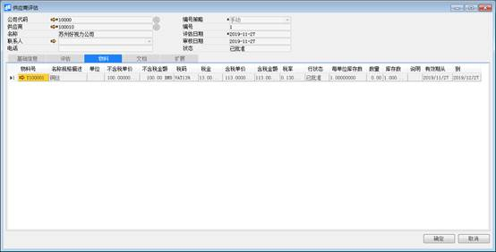

**供应商评估**

**功能解释**

此功能可以定义采购模块所用的供应商评估。

**文章主旨**

本文介绍如何通过BAP Business Cloud AI完成供应商评估的新增、修改及删除操作。

**操作要求**

当前登录用户须拥有对供应商评估创建、更改或删除的操作权限，如何设置该权限请在采购权限相关章节中搜索查看。

**新增供应商评估**

1、 从菜单窗口，【采购】->【定义供应商评估】，打开创建界面；

2、 选择供应商编号；

3、 在基础信息标签页下，选择等级，选择评估结果，输入评估意见；

4、 在评估标签页下，选择评估方案；

5、 在物料标签页下，输入物料号，不含税单价，税码，输入有效期从，到；

6、 在文档标签页下，点击导入，选择导入文件，选择归档方式，选择归档目录；

7、 点击【添加】按钮确定，点击【发起审批】发起审批。

**修改供应商评估**

1、 从菜单窗口，【采购】->【定义供应商评估】，打开创建界面；

2、 通过查找按钮或者托查询，找到需要修改且未发起审批的供应商评估记录；

3、 修改供应商评估的内容；

4、 点击【更改】或工具栏的保存按钮保存，更改供应商属性；

5、 点击【发起审批】发起审批。

**删除供应商评估**

1、 从菜单窗口，【采购】->【定义供应商评估】，打开创建界面；

2、 通过查找按钮或者托查询，找到需要删除且未发起审批的供应商评估记录；

3、 点击工具栏的按钮，进行删除操作。

**属性与活动描述**

| **属性** | **活动描述**   |
| -------- | -------------- |
| 供应商   | 输入供应商代码 |

**基础信息**

| **属性** | **活动描述** |
| -------- | ------------ |
| 等级     | 输入等级     |
| 评估结果 | 输入评估结果 |
| 不良记录 | 输入不良记录 |
| 评估意见 | 输入评估意见 |

**评估**

| **属性** | **活动描述**           |
| -------- | ---------------------- |
| 评估方案 | 选择评估方案           |
| 代码     | 显示评估方案的代码     |
| 描述     | 显示评估方案的描述     |
| 缺省分值 | 显示评估方案的缺省分值 |
| 权重     | 显示评估方案的权重     |
| 公式     | 输入评估公式           |

**物料**

| **属性**     | **活动描述**             |
| ------------ | ------------------------ |
| 物料         | 输入供应商代码           |
| 名称规格描述 | 显示该物料的名称规格描述 |
| 单位         | 显示该物料的单位         |
| 不含税单价   | 输入该物料的不含税单价   |
| 不含税金额   | 显示该物料的不含税金额   |
| 税码         | 选择该物料的税码         |
| 税金         | 显示该物料的税金         |
| 含税单价     | 显示该物料的含税单价     |
| 含税金额     | 显示该物料的含税金额     |
| 税率         | 显示税码的税率           |
| 行状态       | 显示该单据的审批状态     |
| 每单位库存数 | 显示每单位库存数         |
| 数量         | 显示数量                 |
| 库存数       | 显示该物料的库存数       |
| 说明         | 输入该物料的说明         |
| 有效期从     | 显示该物料的有效开始日期 |
| 到           | 显示该物料的有效结束日期 |

**文档**

| **属性** | **活动描述**               |
| -------- | -------------------------- |
| 文件名   | 显示上传文件的文件名       |
| 描述     | 显示上传文件的文件名       |
| 文件类别 | 显示上传文件的文件类别     |
| 归档方式 | 选择上传文件的归档方式     |
| 路径     | 显示上传文件的路径         |
| 归档目录 | 显示该文件的归档目录       |
| 目录描述 | 显示该文件的归档目录的描述 |
| 归档路径 | 显示该文件的归档路径       |
| 备注     | 输入该上传文件的备注信息   |
| 上传进度 | 显示该文件的上传进度       |

 

 

 

 

 

 
