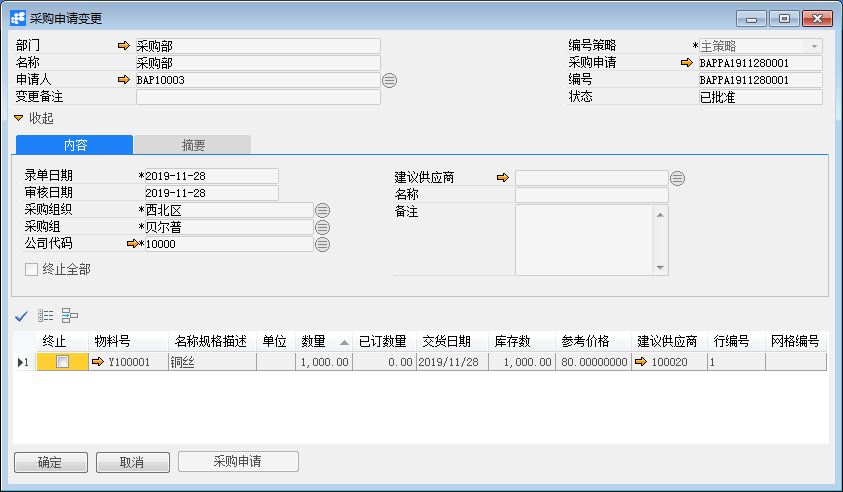

**采购申请变更**

**功能解释**

此功能可以定义采购模块所用的采购申请变更。

**文章主旨**

本文介绍如何通过BAP Business Cloud AI完成采购申请变更的新增，修改及删除操作。

**操作要求**

当前登录用户须拥有对采购申请变更创建、更改或删除的操作权限，如何设置该权限请在采购权限相关章节中搜索查看。

#### 创建采购申请变更单

1、打开主菜单中选择采购->采购申请变更；

3、点击“采购申请”按钮，在采购申请列表中选择采购申请单；

4、点击“确定”按钮，详细信息将出现在标题和内容选项卡中；

5、修改标题和内容选项卡中的信息；

6、单击“添加”按钮。

注意：

1、内容选项卡中，选择终止可终止该物料的采购申请；选择全部终止可终止当前凭证中所有物料的采购申请。

2、摘要选项卡可查询采购申请变更的版本。

#### 更改采购申请变更单

1、打开主菜单中选择采购->采购申请变更；

2、点击工具栏浏览按钮或拖查询找到需更改的采购申请变更单；

3、对需修改的相关项进行更改，置灰的不允许修改；

4、单击“更改”按钮。

#### 删除采购申请变更单

1、打开主菜单中选择采购->采购申请变更；

2、点击工具栏‘浏览’按钮或拖查询找到需删除且未发起审批的采购申请变更单；

3、点击工具栏‘删除当前记录’按钮；

4、在确认删除选择窗口中点击“是”，完成删除。

**属性与活动描述**

| 属性     | 活动描述                         |
| -------- | -------------------------------- |
| 公司代码 | 选择公司代码                     |
| 部门     | 选择申请部门                     |
| 名称     | 显示部门名称                     |
| 申请人   | 选择申请人                       |
| 变更备注 | 输入变更备注信息                 |
| 编号策略 | 选择单据的编号策略               |
| 采购申请 | 显示采购申请单号                 |
| 编号     | 显示单据编号                     |
| 录单日期 | 输入录单日期                     |
| 审核日期 | 显示审核日期                     |
| 状态     | 显示单据状态                     |
| 采购组织 | 显示默认的采购组织               |
| 终止全部 | 终止当前凭证中所有物料的采购申请 |
| 备注     | 输入备注信息                     |
| 采购申请 | 点击选择采购申请                 |

#### 内容

| 属性         | 活动描述                       |
| ------------ | ------------------------------ |
| 终止         | 选择终止当前物料的采购申请     |
| 物料号       | 显示物料号                     |
| 名称规格描述 | 显示物料描述                   |
| 数量         | 输入物料的申请数量             |
| 已订数量     | 显示采购申请已经转成订单的数量 |
| 交货日期     | 输入申请的物料交货日期         |
| 行编号       | 显示采购申请变更的行编号       |
| 网格编号     | 显示网格编号                   |
| 单位         | 显示物料单位                   |
| 库存数       | 显示物料在仓库的库存数         |
| 建议供应商   | 选择采购申请的建议供应商       |
| 参考价格     | 输入采购参考价格               |
| 录单人       | 显示单据创建人                 |
| 版本         | 显示采购变更版本               |

 

 
