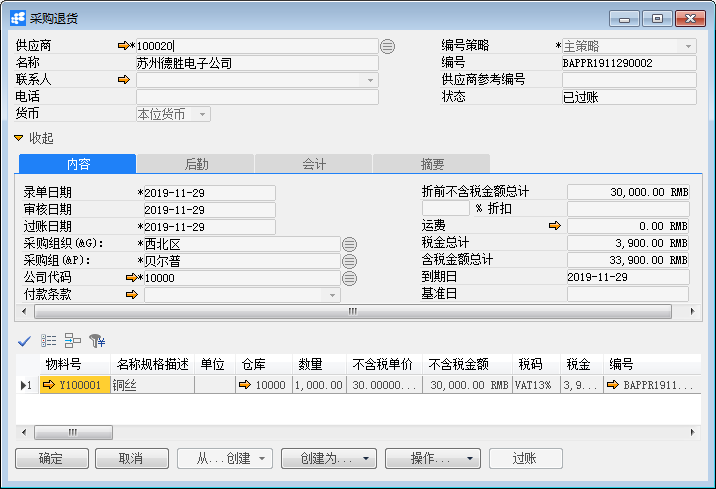

# 采购退货

## 功能解释 

采购退货单用来将已交付的货物退回给供应商。

如果尚未为采购收货创建应付发票，则可以基于该采购收货进行退货。

如果已为该交易创建应付发票，则可以使用应付贷项凭证功能从采购退货进行冲销。

## 文章主旨 

本文介绍如何通过BAP Business Cloud AI完成采购退货的新增，修改及删除操作。

## 操作要求 

当前登录用户须拥有对采购退货创建、更改或删除的操作权限，如何设置该权限请在采购权限相关章节中搜索查看。

## 创建采购退货单（无来源）

1、打开系统主菜单中选择采购->采购退货；

2、选择公司代码，供应商等信息；

3、在内容选项卡中选择物料，退货数量等详细信息；

4、单击“添加”按钮，点击"发起审批"按钮，点击”过账“。

## 基于采购收货单创建采购退货单

1、打开主菜单中选择采购->采购退货；

2、选择公司代码，供应商等信息；

3、点击“采购收货”按钮，选择对应的收货单退货，点击“确定”；

4、在内容选项卡中确认或更改物料，退货数量等详细信息；

5、单击“添加”按钮，点击"发起审批"按钮，点击”过账“。

## 更改采购退货单

1、打开主菜单中选择采购->采购退货；

2、点击工具栏浏览按钮或拖查询找到需更改且未发起审批的的采购退货单；

3、对需修改的相关项进行更改，置灰的不允许修改；

4、单击“更改”按钮。

## 删除采购退货单

1、打开系统主菜单中选择采购->采购退货；

2、点击工具栏浏览按钮或拖查询找到需删除且未发起审批的采购退货单；

3、点击工具栏‘删除当前记录’按钮；

4、在确认删除选择窗口中点击“是”，完成删除。

## 退货单过账

1、打开系统主菜单中选择采购->采购退货；

2、点击工具栏浏览按钮或拖查询找到需过账的采购退货单；

3、单击“过账”按钮，在弹出的确认窗口中选择“确定”。

## 属性与活动描述 

| 属性               | 活动描述                           |
| ------------------ | ---------------------------------- |
| 公司代码           | 选择公司代码                       |
| 供应商             | 选择供应商代码                     |
| 名称               | 显示供应商名称                     |
| 联系人             | 显示供应商默认联系人               |
| 电话               | 显示联系人的电话                   |
| 供应商参考编号     | 输入供应商参考编号                 |
| 货币               | 选择订单使用的货币                 |
| 编号策略           | 选择单据的编号策略                 |
| 编号               | 显示单据编号                       |
| 录单日期           | 输入录单日期                       |
| 审核日期           | 显示审核日期                       |
| 过账日期           | 输入过账日期                       |
| 状态               | 显示单据状态                       |
| 采购组织           | 显示默认的采购组织                 |
| 采购组             | 选择采购组                         |
| 付款条款           | 选择采购订单的付款条款             |
| 到期日             | 显示基于付款条款的到期日           |
| 基准日             | 显示基准日                         |
| 折前不含税金额总计 | 折前不含税金额总计                 |
| 折扣%              | 输入单据折扣                       |
| 运费               | 输入单据的运费，点击超链接输入明细 |
| 税金总计           | 显示单据的税金总计                 |
| 含税金额总计       | 显示单据的含税金额总计             |
| 采购收货           | 点击选择采购收货单                 |
| 过账               | 点击将收货单过账                   |

## 内容

| 属性         | 活动描述                               |
| ------------ | -------------------------------------- |
| 物料号       | 显示物料号                             |
| 名称规格描述 | 显示物料描述                           |
| 单位         | 显示物料的采购单位                     |
| 特殊库存     | 输入特殊库存，是物料维度之一           |
| 特殊库存标识 | 输入特殊库存标识，是物料维度之一       |
| 不含税单价   | 输入不含税单价                         |
| 不含税金额   | 显示不含税金额                         |
| 仓库         | 输入物料的退货仓库                     |
| 数量         | 输入物料的退货数量                     |
| 成本分割码   | 输入物料的成本分割码                   |
| 税码         | 选择税码                               |
| 含税单价     | 输入物料的含税单价                     |
| 含税金额     | 显示物料的含税总额                     |
| 交货日期     | 输入物料的退货日期                     |
| 来源         | 显示退货单的来源单号，可超链接查看明细 |
| 明细号       | 显示退货单的明细号                     |
| 生产订单号   | 显示生产订单编号                       |
| 工序号       | 显示工序号                             |
| 项目         | 选择或显示关联项目                     |
| 每库存数量   | 显示物料的每库存数量                   |
| 库存数       | 显示物料的库存数                       |
| 是否分配运费 | 显示是否分配运费                       |
| 运费         | 显示运费金额                           |
| 检验批       | 显示物料的检验批                       |
| 使用决策     | 输入物料质检的使用决策                 |
| 成本中心     | 成本对象之一，输入成本中心编号         |
| 内部订单     | 成本对象之一，输入内部订单编号         |
| 生产订单     | 成本对象之一，输入生产订单编号         |
| 销售订单     | 暂无配置                               |
| 销售订单行   | 暂无配置                               |
| WBS          | 成本对象之一，输入项目结构中的WBS      |
| 网络         | 成本对象之一，输入项目结构中的网络     |
| 维修订单     | 成本对象之一，输入维修订单编号         |

## 后勤

| 属性     | 活动描述     |
| -------- | ------------ |
| 发运至   | 选择发运地址 |
| 开票至   | 选择开票地址 |
| 运输方式 | 选择运输方式 |
| 备注     | 输入备注信息 |

## 会计

| 属性     | 活动描述                                           |
| -------- | -------------------------------------------------- |
| 凭证号   | 显示凭证过账后自动生成的日记账分录，可链接查看明细 |
| 控制     | 凭证，可链接查看明细                               |
| 凭证备注 | 显示凭证备注                                       |
| 记账方式 | 显示记账方式                                       |

## 摘要

| 属性   | 活动描述         |
| ------ | ---------------- |
| 录单人 | 显示单据的创建人 |

