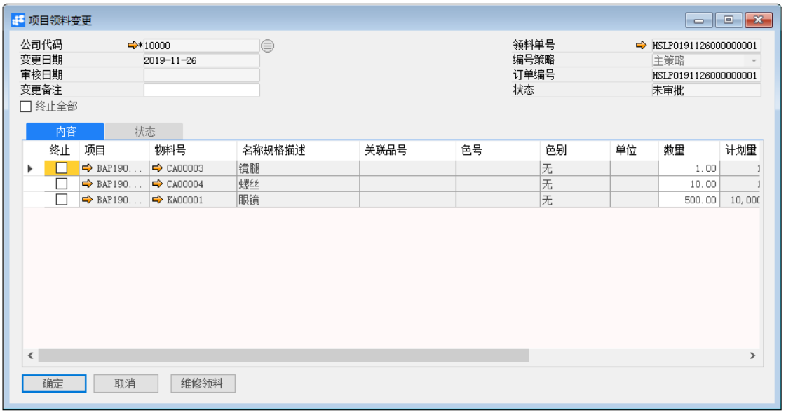

# 项目领料单变更单

发布日期：2019年11月26日

## 功能解释

运用此功能可以对已定义的项目定义领料单变更单，已批准的项目领料单不能再编辑，而这时的项目领料变更单能实现更改功能，并且已批准后的项目领料变更单会修改项目领料单原本数据。

## 文章主旨

本文介绍如何通过BAP Business Cloud AI完成项目领料单变更单的新建、修改和删除操作。

## 操作要求

当前登录用户须拥有对项目领料单变更单创建或更改的操作权限，如何设置该权限请在定义用户权限相关章节中搜索查看。

## 新建项目领料单变更单

1、 单击菜单模块【项目】->【物料转移】->【项目领料单变更单】，打开项目领料单变更单窗口；

2、 选择公司代码，单击[维修领料]按扭选择已审批的领料单；

3、 修改领用数量，点击【添加】按钮；

4、 点击按钮发起审批。

## 修改项目领料单变更单

1、 单击菜单模块【项目】->【物料转移】->【项目领料单变更单】，打开项目领料单变更单窗口；

2、 点击按钮，选择需要修改的项目领料单变更单（需要修改的项目领料单变更单的状态必须为未审批或已驳回）；

3、 修改项目领料单变更单内容。点击【更改】按钮保存。

4、 点击按钮发起审批。

## 删除项目领料单变更单

1、 单击菜单模块【项目】->【物料转移】->【项目领料单变更单】，打开项目垫资申请窗口；

2、 单击工具栏按钮，选择需要删除的项目领料单变更单（需要修改的项目领料单变更单的状态必须为未审批或已驳回）；

3、 点击工具栏按钮，删除项目领料单变更单；

## 属性与活动描述

| **属性** | **活动描述**                                 |
| -------- | -------------------------------------------- |
| 公司代码 | 选择显示公司代码                             |
| 领料单号 | 自动显示所需变更的领料单的单号               |
| 状态     | 显示该单据当前的审核状态                     |
| 编号策略 | 选择显示单据的编号策略                       |
| 编号     | 根据单据的编号策略自动生成项目领料变更单编号 |
| 变更日期 | 自动显示单据的变更日期                       |
| 审核日期 | 自动显示单据的审核日期                       |
| 变更备注 | 输入项目领料变更备注信息                     |
| 终止全部 | 终止所有物料，都不需要领用                   |

## 内容

| **属性**     | **活动描述**                         |
| ------------ | ------------------------------------ |
| 终止         | 勾选标识终止该行物料，不再领用       |
| 项目         | 显示所领用物料所属的项目代码         |
| 物料号       | 根据项目领料单显示物料号             |
| 名称规格描述 | 根据物料号自动显示物料名称           |
| 关联品号     | 根据物料号是自动显示该物料的关联品号 |
| 色号         | 根据物料号自动显示色号               |
| 色别         | 根据物料号自动显示色别               |
| 单位         | 根据物料号自动显示物料单位           |
| 数量         | 输入物料的领用数量                   |
| 计划量       | 根据项目显示物料计划量               |
| 已领用量     | 根据项目显示物料已领用量             |
| 订单已领数   | 根据项目显示物料订单已领数           |
| 备注         | 根据项目领料单显示备注，可修改       |

 
