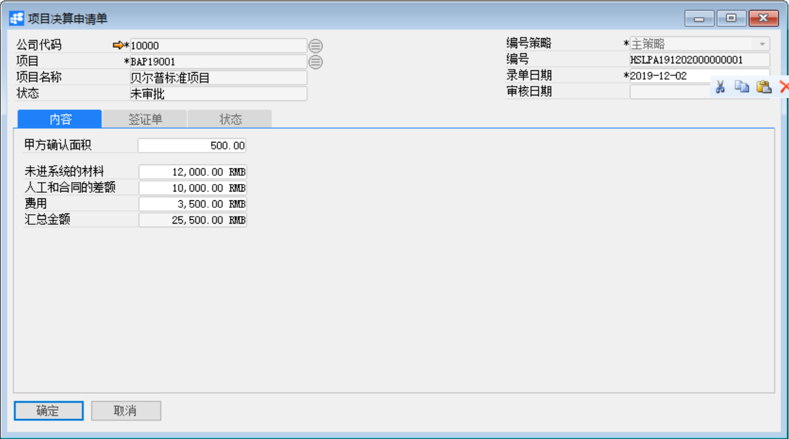

# 项目决算申请单

发布日期：2019年11月26日

## 功能解释

运用此功能可以对已定义的项目做项目决算申请。项目决算申请以项目为基准，一个项目只能一个项目决算申请；项目决算申请主要是确认甲方面积、未进系统的材料、人工和合同的差及费用金额信息。

## 文章主旨

本文介绍如何通过BAP Business Cloud AI完成项目决算申请单的创建、修改和删除操作。

## 操作要求

当前登录用户须拥有对项目决算申请单创建或更改的操作权限，如何设置该权限请在定义用户权限相关章节中搜索查看。

## 新建项目决算申请单

1、 单击菜单模块【项目】->【项目管理】->【项目决算申请单】，打开项目决算申请单窗口；

2、 选择公司代码和项目等信息；

3、 输入甲方确认面积、未进系统的材料、人工和合同的差及费用金额信息；

3、点击【添加】按钮，然后点击按钮发起审批。

## 修改项目决算申请单

1、 单击菜单模块【项目】->【项目管理】->【项目决算申请单】，打开项目决算申请单窗口；

2、 点击按钮，选择需要修改的项目决算申请单（需要修改的项目决算申请单的状态必须为未审批或已驳回）；

3、 修改项目决算申请单内容。点击【更改】按钮保存。

4、 点击按钮发起审批。

## 删除项目决算申请单

1、 单击菜单模块【项目】->【项目管理】->【项目决算申请单】，打开项目决算申请单窗口；

2、 单击工具栏按钮，选择需要删除的项目决算申请单（需要修改的项目决算申请单的状态必须为未审批或已驳回）；

3、 点击工具栏按钮，删除项目决算申请单；

## 属性与活动描述

| **属性** | **活动描述**                           |
| -------- | -------------------------------------- |
| 公司代码 | 选择显示项目所属公司代码               |
| 项目     | 选择显示项目代码                       |
| 项目名称 | 根据项目代码自动显示项目名称           |
| 状态     | 显示该项目决算申请单据当前的审核类状态 |
| 编号策略 | 选择项目决算申请单的编号策略           |
| 编号     | 根据编号策略自动生成项目决算申请单编号 |
| 录单日期 | 输入或自动生成录单日期                 |
| 审核日期 | 显示项目决算申请单审核日期             |

## 内容

| **属性**         | **活动描述**                                                 |
| ---------------- | ------------------------------------------------------------ |
| 甲方确认面积     | 输入甲方确认面积                                             |
| 未进材料合同的差 | 输入未进系统材料金额                                         |
| 人工和合的差     | 输入人工合同的差金额                                         |
| 费用             | 输入费用金额                                                 |
| 汇总金额         | 显示汇总金额（汇总金额=未进系统材料金额+人工合同的差金额+费用金额） |

## 签证单

| **属性**     | **活动描述**                           |
| ------------ | -------------------------------------- |
| 编号         | 根据项目自动显示该项目的项目签证单号   |
| 内部联系单号 | 根据项目签证单号自动显示内部联系单号   |
| 录单日期     | 根据项目签证单号自动显示录单日期       |
| 金额索赔     | 根据项目签证单号自动显示索赔金额       |
| 认可金额     | 根据项目签证单号自动显示认可金额       |
| 工期索赔     | 根据项目签证单号自动显示索赔工期天数   |
| 认可工期     | 根据项目签证单号自动显示认可工期       |
| 费用索赔     | 根据项目签证单号自动显示索赔费用金额   |
| 内容         | 根据项目签证单号自动显示签证单内容     |
| 备注         | 根据项目签证单号自动显示签证单备注信息 |
