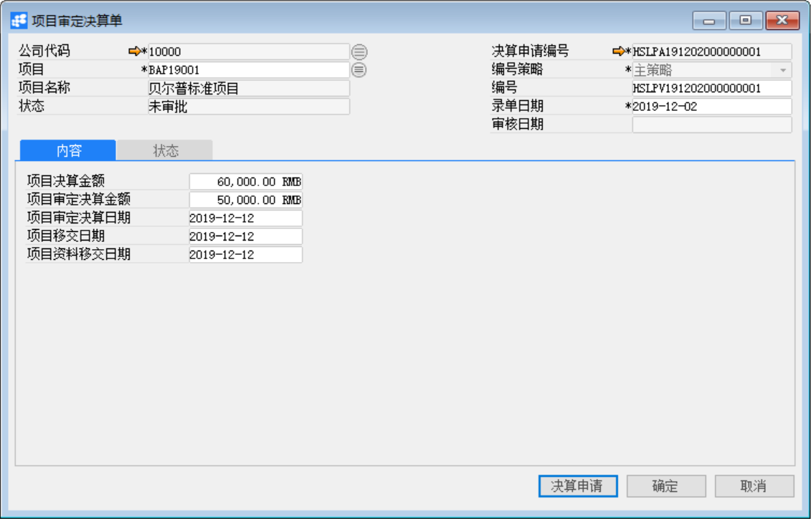

# 项目审定决算单

发布日期：2019年11月26日

## 功能解释

运用此功能可以对已定义的项目做项目决算。项目审定决算单主要是审定项目决算的金额及日期，确定项目最终的金额和日期。

## 文章主旨

本文介绍如何通过BAP Business Cloud AI完成项目审定决算单的创建、修改和删除操作。

## 操作要求

当前登录用户须拥有对项目审定决算单创建或更改的操作权限，如何设置该权限请在定义用户权限相关章节中搜索查看。

## 新建项目审定决算单

1、 单击菜单模块【项目】->【项目管理】->【项目审定决算单】，打开项目审定决算单窗口；

2、 选择公司代码和项目等信息；

3、点击【决算申请】按钮，打开项目决算申请单查询界面，点击【查询】按钮，选择项目的决算申请，点击【确定】按钮；

4、 输入项目审定决算金额，项目审定决算日期，项目移交日期和项目资料移交日期；

5、点击【添加】按钮，然后点击按钮发起审批。

## 修改项目审定决算单

1、 单击菜单模块【项目】->【项目管理】->【项目审定决算单】，打开项目审定决算单窗口；

2、 点击按钮，选择需要修改的项目审定决算单（需要修改的项目审定决算单的状态必须为未审批或已驳回）；

3、 修改项目审定决算单内容。点击【更改】按钮保存。

4、 点击按钮发起审批。

## 删除项目审定决算单

1、 单击菜单模块【项目】->【项目管理】->【项目审定决算单】，打开项目审定决算单窗口；

2、 单击工具栏按钮，选择需要删除的项目审定决算单（需要修改的项目审定决算单的状态必须为未审批或已驳回）；

3、 点击工具栏按钮，删除项目审定决算单；

## 属性与活动描述

| **属性** | **活动描述**                           |
| -------- | -------------------------------------- |
| 公司代码 | 选择显示项目所属公司代码               |
| 项目     | 选择显示项目代码                       |
| 项目名称 | 根据项目代码自动显示项目名称           |
| 状态     | 显示该项目审定决算单据当前的审核类状态 |
| 编号策略 | 选择项目审定决算单的编号策略           |
| 编号     | 根据编号策略自动生成项目审定决算单编号 |
| 录单日期 | 输入或自动生成录单日期                 |
| 审核日期 | 显示项目审定决算单审核日期             |

## 内容

| **属性**         | **活动描述**                         |
| ---------------- | ------------------------------------ |
| 项目决算金额     | 根据项目决算申请自动带出项目决算金额 |
| 项目审定决算金额 | 手动输入项目审定决算金额             |
| 项目审定决算日期 | 手动输入项目审定的决算日期           |
| 项目移交日期     | 手动输入项目的移交日期               |
| 项目资料移交日期 | 手动输入项目资料的移交日期           |

