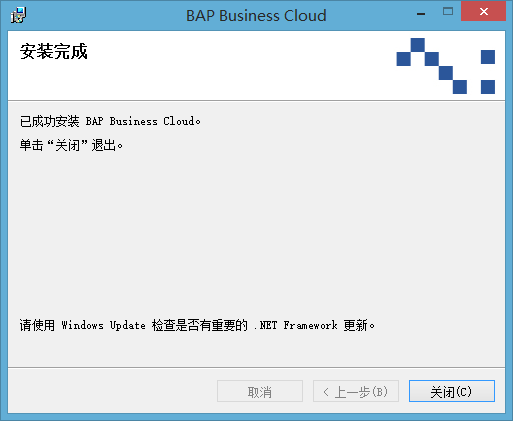
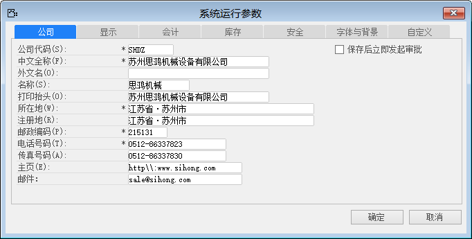

项目实施阶段是在经历了项目业务调研以及蓝图确认后，基于业务蓝图的范围以及需求完成客户需求的系统实现、实施方对于系统配置的内部测试以及培训工作。

项目实施阶段工作完成的质量直接关系到上线质量，所以在进行项目实施阶段的工作时务必仔细，尽量将细节做到最好。为上线提供一个强有力的支撑。

## 3.1  软件安装

软件安装包含了BAP Business Cloud客户端、BAP Business Cloud消息服务器、BAP Business Cloud数据库管理器、BAP Business Cloud服务管理器的安装。

### BAP Business Cloud客户端安装

BAP Business Cloud客户端安装的步骤如下：

步骤1：双击【BAP Buiness Cloud 安装.msi】，运行安装程序；

步骤2：阅读BAP Business Cloud安装向导，点击【下一步】进入【选择安装文件夹】界面；

步骤3：选择完成安装路径和策略后，点击【下一步】进入【确认安装】界面；

步骤4：点击【下一步】开始进行BAP Business Cloud安装；

步骤5：完成完成后，点击【关闭】退出安装程序界面，如图3-1所示：

 

图3-1

### BAP Business Cloud消息服务器安装

BAP Business Cloud消息服务器安装的步骤如下：

步骤1：双击【BAP Buiness Cloud消息服务器.msi】，运行安装程序；

步骤2：阅读BAP Business Cloud消息服务器安装向导，点击【下一步】进入【选择安装文件夹】界面；

步骤3：选择完成安装路径和策略后，点击【下一步】进入【确认安装】界面；

步骤4：点击【下一步】开始进行BAP Business Cloud消息服务器安装；

步骤5：点击【关闭】退出安装程序。

### BAP Business Cloud数据库管理器安装

BAP Business Cloud数据库管理器是用于BAP运行的系统数据库安装和企业应用范围数据库快速创建和对应用范围数据库快速访问的管理工具。

BAP Business Cloud数据库管理器安装的步骤如下：

步骤1：双击【BAP Buiness Cloud数据库管理器.msi】，运行安装程序；

步骤2：阅读BAP Business Cloud数据库管理器安装向导，点击【下一步】进入【选择安装文件夹】界面；

步骤3：选择完成安装路径和策略后，点击【下一步】进入【确认安装】界面；

步骤4：点击【下一步】开始进行BAP Business Cloud数据库管理器安装；

步骤5：点击【关闭】退出安装程序。

### BAP Business Cloud服务管理器安装

BAP Business Cloud服务管理器是实现互联网连接的载体，通过BAP Business Cloud服务管理器的安装可通过Internet接入访问BAP应用范围。

BAP Business Cloud服务管理器安装的步骤如下：

步骤1：双击【BAP Buiness Cloud服务管理器.msi】，运行安装程序；

步骤2：阅读BAP Business Cloud服务管理器安装向导，点击【下一步】进入【选择安装文件夹】界面；

步骤3：选择完成安装路径和策略后，点击【下一步】进入【确认安装】界面；

步骤4：点击【下一步】开始进行BAP Business Cloud服务管理器安装；

步骤5：点击【关闭】退出安装程序。

### BAP Business Cloud消息服务管理器安装

BAP Business Cloud中发出的警报、邮件和短信都是通过BAP Business Cloud消息服务管理器来完成的。

BAP Business Cloud消息服务管理器安装的步骤如下：

步骤1：双击【BAP Buiness Cloud消息服务管理器.msi】，运行安装程序；

步骤2：阅读BAP Business Cloud服务管理器安装向导，点击【下一步】进入【选择安装文件夹】界面；

步骤3：选择完成安装路径和策略后，点击【下一步】进入【确认安装】界面；

步骤4：点击【下一步】开始进行BAP Business Cloud消息服务管理器安装；

步骤5：点击【关闭】退出安装程序。

## 3.2  系统初始化

系统初始化是完成对BAP Business Cloud运行环境所需参数的设置，包含：系统运行参数、基础运行数据以及基础数据的导入。

### 3.2.1 系统运行参数

系统运行参数是系统能够运行的最基础的设置，包含了企业的主体信息、会计信息、库存信息等基本参数的设定。

进行系统运行参数设定的步骤如下：

步骤1：从【系统菜单】->【管理】->【系统初始化】->【系统运行参数】，打开【系统运行参数】界面；

步骤2：依据企业实际的信息编辑填写系统运行参数内容，包含：公司、显示、会计、库存、安全、字体

       与背景等信息，如图3-2所示：

所有字段后带有*标识的都为必填字段。

步骤3：点击【添加】保存。

- 系统运行参数一经保存，不允许进行删除，只能对其进行修改。

配置路径：【系统菜单】->【管理】->【系统初始化】->【系统运行参数】

 

图3- 2

## 3.3  系统配置文档

系统配置文档是在依据业务蓝图配置BAP系统时，将所有的配置明细进行记录，作为系统实现阶段的交付物交付客户。

对客户而言系统配置文档是了解系统中所有配置数据的来源以及如何进行配置的说明书，对客户进行后期系统维护起到一定的帮助作用。

完成系统配置后，需要打印交由客户方项目经理进行签字确认，签字确认后方可生效。如果要对已经完成并且已经确认过的配置提出变更需求时，需要在系统配置文档中，注明变更项目、变更时间以及变更人。

在编制系统配置文档时，一定要将以下内容写明白：

- 配置项目

- 配置项目路径

- 配置项目内容明细

## 3.4  系统基础配置

系统基础运行数据是支撑系统以及系统模块能够正常运行的最小单元，我们可分组进行，包括：组织结构基础数据、会计基础数据以及模块支撑数据。

### 3.4.1 组织结构数据

组织结构数据是反应了一个企业的组织结构，主要包含以下数据：

1、 公司/工厂

BAP Business Cloud支持集团化多组织企业管理模式，BAP中可以定义一个集团下多个公司主体以及多个工厂主体。

每个公司都能单独开展自己的业务，并且BAP Business Cloud支持集团内部企业的交易。

公司代码是依照外部会计要求的会计实体（一般）而设置的最小组织单元，有其自身完整的科目和账套。所有的业务交易过账之后都将在该层次上得以反映和记录，以出具法定的财务报表，如资产负债表，现金流量表和利润表等。

工厂是作为物料和用户的权限管理的一个维度，也是生产计划模块运行的重要数据单元。

公司配置路径：【系统菜单】->【管理】->【系统初始化】->【定义公司代码】

工厂配置路径：【系统菜单】->【管理】->【基础定义】->【生产】->【定义工厂】

2、 部门

公司的部门是指组织为完成规定的任务而设置的有权管辖一个或多个特殊定领域事物的机构，BAP中的部门与成本中心先关联，部门用于HR员工主数据、后勤模块以及工作流等。

配置路径：【系统菜单】->【管理】->【基础定义】->【一般】->【定义部门】

3、 成本中心

成本中心是对成本和费用承担控制、考核责任的中心，是对费用进行归集、分配，对成本加以控制、考核的责任单位。

成本中心配置时必须与部门进行关联。

销售组织配置路径：【系统菜单】->【管理】->【管理会计】->【定义】->【成本中心】

4、 销售组织/销售组

销售组织是依据企业运行销售区域或产品类别的区分，设定不同的客户销售组织。

销售组织是客户划分的一个维度，也是用户销售模块权限的控制维度之一。

销售组就是企业内按照一定的规则将人员通过周密的规划和充分协调来围绕目标客户开展销售工作而设定划分的团队，也是作为BAP用户销售模块权限维度之一。

销售组织配置路径：【系统菜单】->【管理】->【基础定义】->【销售】->【销售组织】

销售组配置路径：【系统菜单】->【管理】->【基础定义】->【销售】->【销售组】

5、 采购组织/采购组

采购组织是依据采购物料或供应商属性对供应商进行组织划分，采购组织是供应商管理的一个维度也是用户采购模块权限维度之一。

采购组是企业为划分采购职责按照一定的规则建立采购团队，也是用户采购模块权限维度之一。

采购组织配置路径：【系统菜单】->【管理】->【基础定义】->【采购】->【采购组织】

采购组配置路径：【系统菜单】->【管理】->【基础定义】->【采购】->【采购组】

### 3.4.2 会计基础数据

会计基础数据是支撑财务模块运行的最基本单元，主要包含以下数据：

（一） 科目表

BAP在创建系统数据库时，会自动创建一套通用总账科目表，如果系统科目表满足企业需求则无需进行再次导入科目表，当发现有缺少科目时，手动添加即可，发现科目名称与企业的编制规则有出入时，修改科目名称即可。

如果BAP的系统科目表与企业实际科目帐套匹配度低，那么可通过导入科目表的方式，将收集到的会计科目导入至BAP中。

配置路径：【系统菜单】->【总账】->【科目表】

（二） 会计账目表

会计账目表是由若干个科目组成的一个合集，为了便于不同公司的总账科目使用权限控制。

如果企业拥有会计账目表的权限，那么就等于企业拥有该会计账目表下所有总账科目的使用权限，反之则不具有总账科目的使用权限。

一个会计账目表可以分配给多个公司，但是一个公司只能对应一个会计账目表。

配置路径：【系统菜单】->【系统初始化】->【定义会计账目表】

（三） 会计年度

会计年度变式用来确定BAP Business Cloud系统中每个公司的会计记账年度期间的变式。

配置路径：【系统菜单】->【系统初始化】->【定义会计年度变式】

（四） 期间

会计期间是指将企业的经营活动划分为若干个相等的区间，在连续反映的基础上，分期进行会计核算和编制会计报表,定期反映企业某一期间的经营活动和成果。

配置路径：【系统菜单】->【系统初始化】->【期间】

（五） 税率

税率是指征收税费的比例或额度。

通过BAP定义税率功能可对企业管理过程中涉及的税率基于税率类型明细进行管理，定义准确的税率是准确核算往来的基础条件之一。

完成税率的配置前提需要维护税率类型以及税率类型明细。

税率类型配置路径：【系统菜单】->【管理】->【基础定义】->【会计】->【定义税率类型】

税率类型明细配置路径：【系统菜单】->【管理】->【基础定义】->【会计】->【定义税率类型明细】

配置路径：【系统菜单】->【管理】->【基础定义】->【会计】->【定义税率】

（六） 收付款方式

收付款方式是企业根据实际业务需求制定的往来核算的货款支付或收取方式。

配置路径：【系统菜单】->【管理】->【基础定义】->【会计】->【定义收付款方式】

（七） 收付款条款

付款条款是合作伙伴之间关于货款支付时间、方式的约定。

配置路径：【系统菜单】->【管理】->【基础定义】->【会计】->【定义付款条款】

（八） 成本要素

成本要素是按成本中费用的经济用途或费用的经济性质所作的一种分类。用以分析在各个时期各种生产费用支出的多少。

进行成本要素编辑时，可以默认导入总账科目表中被设定为【成本要素】标识的科目。

配置初级成本要素时，必须选择系统中的损益类或成本类总账科目。

配置路径：【系统菜单】->【管理会计】->【定义】->【成本要素】

### 3.4.3 模块支撑数据

模块支撑数据是为各个业务功能模块运行的最基本的单元，主要包含：

（一） 物料主数据

物料主数据是进行业务的最基本的单元，没有物料主数据无法开展系统业务。

配置定义物料主数据时需要明确物料号/物料名称编码规则、物料属性、物料组、成本核算方式、组织工厂信息等一系列重要信息。

配置路径：【系统菜单】->【库存】->【物料主数据】

（二） 物料组

物料组是为了用于采用物料组总账科目设置的物料而设立的，不仅仅起到区分物料类别，也集成了物料在进行库存转移等涉及到财务模块业务的日记账分录的借贷方科目配置。

在进行物料组科目配置时，需要客户方财务主管进行确认，必须是以书面或邮件形式确认后，才可导入至生产机（正式库），否则配置不能生效。

配置路径：【系统菜单】->【库存】->【定义】->【定义物料组】

（三） 仓库

仓库是用于物料的出入库管理以及承载记录物料库存的载体。也是对采用仓库作为总账科目设置的物料的财务集成科目进行配置的载体。

在进行仓库配置时如果仓库属于特殊功能的仓库，需要明确其属性。

配置路径：【系统菜单】->【库存】->【定义】->【定义仓库】

（四） 客户主数据

客户主数据是对企业拥有的客户资源进行维护，也是销售业务进行的最基本的单元之一。

配置客户主数据需要注意以下几点：

- 默认销售组织；

- 默认交易货币；

- 应收账款科目；

- 是否集团内部客户。

配置路径：【系统菜单】->【销售】->【客户主数据】

（五） 销售订单类型

销售订单类型是为了对企业接收到的客户销售订单进行类别的划分，以便进行数据统计和分析。

销售订单类型配置时需要分配至用户，分配给用户的前提是用户拥有销售组织权限。

配置路径：【系统菜单】->【管理】->【基础定义】->【销售】->【销售订单类型】

（六） 供应商主数据

供应商主数据是对企业所对外交易的合格供应商资料进行统一管理，也是采购业务进行的最基本的单元之一。

配置供应商主数据需要注意以下几点：

- 默认采购组织；

- 默认交易货币；

- 应付账款科目；

- 是否集团内部供应商。

配置路径：【系统菜单】->【采购】->【供应商主数据】

（七） 员工主数据

员工主数据是对企业所有雇员的资料信息进行统一管理，为人力资源模块以及其他业务模块运行提供员工信息数据支撑。

配置路径：【系统菜单】->【人力资源】->【员工主数据】

（八） 工作中心

工作中心指的是直接改变物料形态或性质的生产作业单元。工作中心是一种资源，它的资源可以是人，也可以是机器。一个工作中心是由一个或多个直接生产人员，一台或几台功能相同的机器设备，也可以把整个车间当做一个工作中心，车间内设置不同的机器类型。

配置路径：【系统菜单】->【生产作业】->【定义】->【定义工作中心】

（九） 共享能力

BAP Business Cloud中共享能力是反应企业人工和机器的工作能力的基础数据，为工作中心的能力提供数据支撑。

配置路径：【系统菜单】->【生产作业】->【定义】->【定义共享能力】

