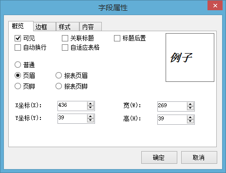
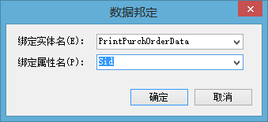
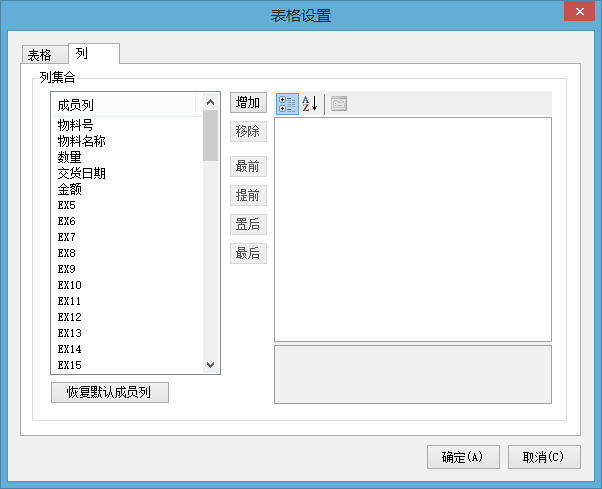
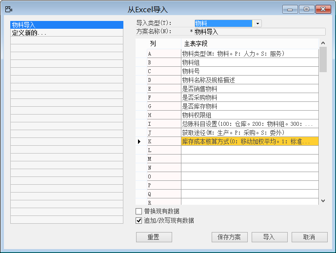
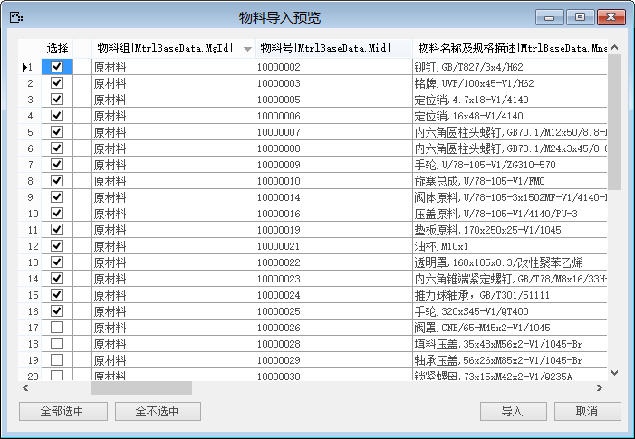

## 3.5  需求变更单

在根据业务蓝图进行系统配置过程中，双方涉及到的任何关于业务需求的变更，为了避免责任方因为需求变更导致项目实施进度延迟的推诿事情发生，都需要进行填写《需求变更单》。

在填写《需求变更单》时，必须注明以及完成几点内容，变更单才能生效：

- 需求变更提出人以及日期；

- 变更内容以及原因；

- 项目进度延迟评估；

- 必须交由客户方项目经理以及实施方项目经理签字确认。

|  需求变更申请单（DIP2-C008） |      |
| ----------------------------- | ---- |
|                               |      |

## 3.6  打印格式设计

在BAP中对单据的打印格式进行设计，以满足客户的单据打印需求。

BAP拥有独立的打印设计编辑器，在设计时不仅仅可以依据BAP自带的打印数据源进行单据打印模板的设计，还可以通过自定义查询报表获取打印数据源，再进行打印模板的设计，此种方法请参考《BAP Business Cloud高级实施教程》。

例如：设计采购订单的打印模板，步骤如下：

步骤1：从【菜单窗口】->【采购】->【采购申请】，打开【采购申请】界面；

步骤2：点击工具栏的按钮，进入模板设计界面；

步骤3：设计页面格式，选择纸张大小，步骤如下：

从模板设计界面，【菜单栏】->【样式】->【页面设置】，打开【页面设计】界面；

点击选择纸张大小，确定纸张方向以及页边距；

编辑纸张的页面背景、选择默认打印机设备；

点击【确定】，完成页面设计。

步骤4：设置页眉页脚，步骤如下：

1、 从【菜单栏】，【插入】->【标题】，添加一个标题栏；

2、 右击该标题文本框，选择字段属性，进入字段属性界面；

3、 选择该标题为【页眉】，点击【确定】退出，如图3-3所示；

4、 在标题文本框输入页眉内容，调整标题文本框大小及位置。

 

图3- 3

步骤5：添加标题文本，绑定字段文本，添加部门文本并绑定字段，步骤如下：

1、 从【菜单栏】，【插入】->【标题文本】，添加一个标题文本框，调整文本框位置、体以及对齐方式；

2、 编辑标题文本内容；

3、 绑定字段文本，从【菜单栏】，【插入】->【字段文本】，添加一个字段文本框；

4、 将字段文本框对齐至标题文本框后，右击字段文本框，选择‘数据绑定’；

5、 选择绑定实体名和绑定属性，如图3-4；

6、 点击【确定】绑定成功。

7、 调整字段文本内容对齐方式，字体；

 

图3- 4

步骤6：插入表格，编辑表格内容及格式，步骤如下：

1、 从【菜单栏】，【插入】->【表格】，插入一张空白表格；

2、 调整表格位置，右击表格，选择‘表格设置’，进入表格设置；

3、 设置表格格式，选择表格数据来源表以及进行显示设置；

4、 在【列】选项卡下进行显示列的编辑,如图3-5增加物料号和物料名称及描述两列，步骤如下：

（1） 点击【增加】，新增一列；

点击【恢复默认成员列】自动显示所选择数据源表的所有字段数据。

（2） 编辑列名称，字体,大小，文本位置以及选择该列可见；

（3） 对照右边‘字段资源管理器’输入绑定的属性名称；

（4） 【确定】列增加完成。

步骤7：点击模板设计界面工具栏的保存按钮，保存打印模板。

 

图3- 5

## 3.7  数据转换模板

对于业务模块数据，除了通过手工录入外，还可以进行批量导入。特别是在进行系统实现阶段，利用BAP Business Cloud的数据导入功能，根据数据导入模板将数据导入至BAP中。

进行数据批量导入需要依赖于数据转换模板，根据不同客户对不同数据的明细字段要求结合BAP Business Cloud数据库结构，建立EXCEL数据转换模板，目前BAP Business Cloud支持格式后缀为.xls的EXCEL模板。

数据转换模板包含：总账科目、物料主数据、客户主数据、供应商主数据、员工主数据、BOM主数据以及期初动态财务数据模板：总账科目余额、业务伙伴余额、物料期初余额、固定资产等。

无论是先建立数据转换模板，还是先在BAP中建立数据导入方案，都需要使EXCEL数据转换模板中的列项与BAP数据导入方案中的列项完全匹配。如图3-6所示为BAP Business Cloud中设置的物料导入方案：

替换现有数据：选中此功能，会将已经存在于系统的物料全部替换；

追加/改写现有数据：选中此功能，只会进行差异导入。

|  数据转换模板（DIP2-C003） |      |
| --------------------------- | ---- |
|                             |      |

 

 

 

图3- 6

## 3.8  数据转换计划

依据企业数据收集需求，完成数据转换模板的设置后，，为了避免因数据收集的困难导致项目进度的延期，需要对数据收集进行计划并组织数据转换项目会议。

数据转换项目会议旨在告知数据收集的重要性以及对数据转换模板的字段内容进行解释，告知客户方如何采集对应模板字段的内容，避免在数据收集过程中由于客户方不明白模板字段含义而影响数据的有效性。

数据转换计划需要明确指出以下几点：

- 落实责任部门以及责任人；

- 落实要求完成日期；

- 数据收集质量要求；

- 计划确认回复（邮件或书面签字）。

|  数据转换计划（DIP2-C004） |      |
| --------------------------- | ---- |
|                             |      |

## 3.9  静态数据导入

静态数据导入是将按照数据转换模板收集到的静态数据依据BAP中建立的数据导入方案导入至BAP中。

在进行静态数据导入之前需要和静态数据收集责任人进行确认（邮件或书面签字），由收集责任人确认后方可进行导入。

静态数据是指除了期初财务数据意外的不处于一直变化中的数据，比如：物料主数据、客户主数据、供应商主数据等，这些数据只会在收集到的基础上增加，已经收集到的数据不会发生重大变化。

在进行静态数据导入时，当数据量比较大，为了提高导入效率，可以采取分批进行导入，如图3-7所示为分批导入物料主数据：

 

图3- 7

静态数据导入完成后，需要对静态数据导入结果进行检查，导入的数据是否与收集到的数据一致，有无数据量的出入，并对导入的静态数据进行测试能否满足业务使用需求状态。

## 3.10  集成测试

集成测试是按照未来业务蓝图的需求，对系统配置进行全面测试，包含：业务流程、工作流、客户化扩展需求、用户权限等。

在进行集成测试时，需要结合企业内部的经营运行流程进行个模块的集成测试，而不是对单个模块的功能逐一测试。

一般来说公司业务的进行是以销售订单触发的，再由销售订单触发对应的计划活动、生产活动、采购活动以及财务活动等。也就是说要以企业历史数据作为测试数据支撑以及业务蓝图作为流程主导，在BAP中完整的走完所有相关业务流程。

只有集成测试全部通过，才能说明进行的系统配置是符合业务蓝图需求的。

## 3.11  乙方集成测试报告

在进行集成测试的同时，每进行一次业务操作，都要详细的记录以下信息：

- 测试项目；

- 测试条件/数据；

- 测试步骤/过程；

- 预期结果；

- 实际测试结果；

- 问题描述/解决方案。

集成测试报告是作为集成测试阶段的交付物，需要提交至客户方。

|  乙方集成测试报告（DIP2-C011） |      |
| ------------------------------- | ---- |
|                                 |      |

## 3.12  对关键用户的培训签到表

在项目实施中间，客户方关键用户对实施的最终质量有着重要关联，所以对关键用户的培训必须做，而且必须做好。在进行关键用户培训时，需要列出培训提纲做成演示文稿以及培训时进行视频录制，并且作为培训阶段的交付物提交至客户。

结合项目章程和奖惩制度，使关键用户自觉参与到培训中，为了给关键用户的培训做约束，所以要设计出用户培训签到表，签到表中不仅仅只包含签字栏，应该包含以下信息：

- 培训项目；

- 培训时长/地点；

- 主讲人/培训对象；

- 签到人、部门、职务、签到时间；

- 培训意见反馈。

关键用户培训签到表，在培训结束后应扫描形成电子文档，发送客户方。告知客户方培训出勤情况和培训意见反馈。为更好的保证和提高培训效果而服务。

|  项目签到表（DIP2-A004） |      |
| ------------------------- | ---- |
|                           |      |

## 3.13  对关键用户的考试计划

当关键用户完成培训后，需要对关键用户的培训成果进行检验，只有通过考试的形式才能很清晰的了解关键用户是否已经掌握了培训内容。

在编制关键用户考试计划时应该遵循以培训的前后顺序进行，与客户方项目经理一起商讨制定考试计划，以免计划时间与实际内部安排冲突。要很好把握考试时间距离培训时间的间隔，不宜过长也不宜果断，要留有时间给关键用户进行培训内容的回顾以及练习。

在编制考试计划时，需要明确以下信息：

- 考试项目；

- 考试要求；

- 考试对象；

- 考试时间/时长；

- 考试结果评定标准。

|  对关键用户的考试计划（DIP2-D001） |      |
| ----------------------------------- | ---- |
|                                     |      |

## 3.14  对关键用户的考试试题

考试试题需要按照培训内容来出具，在进行培训计划完成和培训课件准备后，就可以开始进行考试试题的编辑工作，关键用户的考试试题以实际操作为主。

根据不同关键用户所对应的模块结合BAP以及培训内容出具考试试题。编辑考试试题可分为两部分：

第一部分：通用操作

此部分为所有用户都需要掌握的操作，包含最终用户。一次性编辑该部分试题后，避免每次出具关键用户模块试题时都要编辑一次通用操作试题。

第二部分：模块试题

模块试题是依据关键用户所负责的模块结合BAP模块功能而编辑的试题，不同的模块关键用户需要出具不同的模块试题。

只有关键用户通过培训试题测试，接下来才能保质保量的完成对最终用户的培训工作，为上线工作打下良好的基础。

|  对关键用户的考试试题（DIP2-D002） |      |
| ----------------------------------- | ---- |
|                                     |      |

## 3.15  对最终用户的培训讲义

完成对关键用户的培训、测试后，上线前还需要对最终操作用户进行系统的操作培训。

在对最终用户的培训之前，需要准备培训课件，并且针对不同部门的操作业务制定不同的课件，在编辑培训讲义（演示文稿）时，应注意以下几点：

- 要有层次；

- 符合BAP系统的业务逻辑性；

- 课件内容全面（包含部门用户所有操作点）。

|  对最终用户的培训讲义（DIP2-D003） |      |
| ----------------------------------- | ---- |
|                                     |      |

## 3.16  最终用户操作手册模板

操作手册对于任何一个企业都是必要的，原则上操作手册是需要由客户方关键用户依照实施方提供的操作手册模板进行编辑完成的。实施方只对编写操作手册的工作提供模板和支持工作。

提供给客户方关键用户的最终操作手册模板，应包含以下文档：

- 操作手册编写要求；

- 操作手册使用说明；

- 操作手册正文模板。

最终用户操作手册作为系统的内部教育传承一定要保证其正确性，所以关键用户完成的所有最终用户操作手册，都必须交由实施方进行校验，只有实施方确认后的最终用户操作手册才是有效的，以保证操作手册的准确性，避免由于关键用户操作的错误从而导致阅读操作手册用户的操作错误。

|  最终用户操作手册模板（DIP2-D004） |      |
| ----------------------------------- | ---- |
|                                     |      |

## 3.17  项目阶段性实施质量检查单

作为项目实施阶段的工作总结的标志，通过阶段性实施质量检查表来体现。

报告由乙方填制，乙方的项目经理签发。然后提交给甲方的项目经理签核。

要求这个报告编制完成后，组织项目组召开会议，在会议上作为一个阶段性总结向项目小组汇报。然后修正后提交甲方项目经理签核，推进就容易多了。

主要的内容侧重在工作推进的内容，计划的执行情况，重要的变更及调整等。

|  项目阶段性实施质量检查表（DIP2-A016） |      |
| --------------------------------------- | ---- |
|                                         |      |