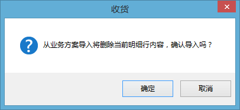
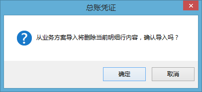
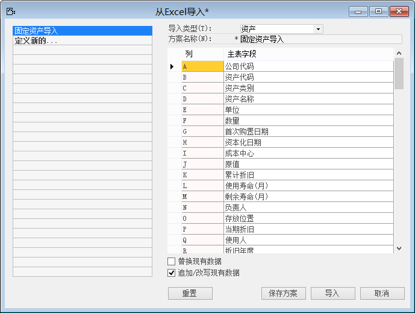

在进行项目实施阶段了全部工作后，就进入到了项目上线阶段，项目上线阶段分为上线准备、项目切换上线以及上线报告三部分。只有完成这三部分才标志着系统切换上线工作的完成。

## 4.1 上线准备

项目进行上正式切换之前需要为项目上线做一些必要的准备工作，比如最终用户培训、最终用户考试、动态数据收集清单等。只有完成上线前的准备工作才能成功的完成系统切换工作。

### 4.1.1 最终用户培训签到表

完成对关键用户的培训、考核后，就需要对作为系统最终使用用户进行培训。

在进行最终用户培训时，需要列出培训提纲做成演示文稿以及培训时进行视频录制，并且作为培训阶段的交付物提交至客户。

结合项目章程和奖惩制度，使最终用户自觉参与到培训中，为了给最终用户的培训做约束，所以要设计出用户培训签到表，签到表中不仅仅只包含签字栏，应该包含以下信息：

- 培训项目；

- 培训时长/地点；

- 主讲人/培训对象；

- 签到人、部门、职务、签到时间；

- 培训意见反馈。

最终用户培训签到表，在培训结束后应扫描形成电子文档，发送客户方。告知客户方培训出勤情况和培训意见反馈。为更好的保证和提高培训效果而服务，保证上线前的培训准备工作能够顺利有效的完成。

|  项目签到表（DIP2-A004） |      |
| ------------------------- | ---- |
|                           |      |

### 4.1.2 对最终用户的考试计划

当最终用户完成培训后，需要对最终用户的培训成果进行检验，只有通过考试的形式才能很清晰的了解最终用户是否已经掌握了培训内容，给项目上线条件提供评估参考。

在编制最终用户考试计划时应该遵循以培训的前后顺序进行，与客户方项目经理一起商讨制定考试计划，以免计划时间与实际内部安排冲突。要很好把握考试时间距离培训时间的间隔，不宜过长也不宜果断，要留有时间给最终用户进行培训内容的回顾以及练习。

在编制考试计划时，需要明确以下信息：

- 考试项目；

- 考试要求；

- 考试对象；

- 考试时间/时长；

- 考试结果评定标准。

|  对最终用户的考试计划（DIP2-D005） |      |
| ----------------------------------- | ---- |
|                                     |      |

### 4.1.3 最终用户考试试题

考试试题需要按照培训内容来出具，在进行培训计划完成和培训课件准备后，就可以开始进行考试试题的编辑工作，最终用户的考试试题以实际操作为主。

根据不同部门的最终用户所对应的模块结合BAP以及培训内容出具考试试题。编辑考试试题可分为两部分：

第一部分：通用操作

通用操作部分试题已经在关键用户试题准备阶段完成，所以只需要调用即可。

第二部分：模块试题

模块试题是依据最终用户所负责的模块结合BAP模块功能而编辑的试题，不同的模块最终用户需要出具不同的模块试题。

目的是最终用户通过培训试题测试，为上线工作打下良好的基础。

|  对最终用户的考试试题（DIP2-D006） |      |
| ----------------------------------- | ---- |
|                                     |      |

### 4.1.4 静态数据导入确认

静态数据已经在项目实施阶段导入，为了避免系统切换的数据错误，需要对导入至BAP系统中的静态数据再次进行确认。

为了避免上线后数据行错误的责任方不明确而无法追查责任人，需要将导入至BAP系统中的静态数据全部导出至本地，并交由对应的关键用户进行确认（邮件或打印签字），只有对应的关键用户确认后方可承认导入的静态数据是有效的，否则不能进行下一步项目上线实施工作。

## 4.2  系统切换

在完成了所有的准备工作后，正式进入到系统切换状态。系统切换阶段工作包含系统切换方案和计划、动态数据收集/导入。

### 4.2.1 上线切换方案和计划

在进行系统切换之前，一定要出具一份完成的上线切换方案和切换计划。

切换方案主要是针对历史遗留的未清清单如何切换，包含未清销售订单、未清采购订单、未清生产订单等多种状态。以及对上线前的准备状态进行检查，包括硬件、软件等。

切换计划就是明确哪一天开始进行系统切换上线，提前做好业务、仓库、财务数据的冻结，以免进行的业务对动态数据产生影响从而导致动态数据的不准确。

上线切换方案和计划需要召开项目会议，所有用户都必须到场，明确系统切换的重要性以及告知最终用户开始使用新系统进行业务的时间，以免造成数据录入的不及时性。

|  项目切换方案（DIP2-E001）       |      |
| --------------------------------- | ---- |
|  上线检查与切换计划（DIP2-E002） |      |

### 4.2.2 动态数据清单

动态数据清单主要是涉及包含：总账科目余额、客户期初余额、供应商期初余额、物料库存期初、固定资产、未清销售订单、未清采购订单、未清生产订单。

动态数据的准确与否直接影响到系统切换后，系统输出数据的准确性。

|  动态数据清单（DIP2-D009） |      |
| --------------------------- | ---- |
|                             |      |

### 4.2.3 期初数据导入

在进行期初数据导入之前，必须与动态数据提供部门（财务部）对期初数据进行确认，得到肯定的答复后方可进行期初数据的导入，否则不能进行期初数据的导入。

期初数据导入包含：

- 物料库存期初；

- 客户期初余额；

- 供应商期初余额；

- 总账科目余额；

- 固定资产。

（一） 物料期初库存

物料期初库存需要收集的信息包含：物料号、物料库存所在仓库、库存数量、库存成本单价。

物料期初库存的导入，依赖于EXCEL数据收集模板、BAP业务数据导入方案和库存模块下的【收货】功能。

在利用【收货】功能进行导入物料期初库存前，需要将【收货】业务过程产生的日记账分录的贷方科目设定为期初中间科目。

期初中间科目只是在进行财务期初数据导入时应用到，并且当财务期初数据全部导入后，该期初中间科目的余额应该为零，如果全部导入后余额不为零，就可能存在两种可能：

- 导入时有遗漏；

- 提供的期初数据不正确。

进行期初库存导入的方法如下：

步骤1：从【菜单窗口】->【库存】->【收货】，打开【收货】功能界面；

步骤2：点击工具栏的新空白记录按钮，准备导入；

步骤3：选择对应的公司、工厂；

过账日期一定要是库存期初所属的期间内的某一日期。

步骤4：点击【从…创建】，选择【从业务导入方案】并确认是否进行该方案，如图4-1所示：

 

图4- 1

步骤5：选择导入方案，并点击【导入】选择收集到的物料期初数据；

步骤6：点击【打开】开始进行物料期初导入。

导入完成后，进入【库存】->【报表】->【库存状态表】或【库存审计报表】中验证导入是否正确。

（二） 客户/供应商/总账科目期初余额

客户期初余额是在截止日之前所有客户的余额，这里导入的只是每个客户余额的总和，没有往来明细。

供应商期初余额是在截止日之前所有供应商的余额，这里导入的只是每个供应商余额的总和，没有往来明细。

总账科目期初余额是在截止日之前所有总账科目的余额，这里导入的只是每个总账余额的总和，没有明细。

进行客户/供应商/总账期初余额的导入，利用【总账凭证】功能实现，步骤如下：

步骤1：从【菜单窗口】->【总账】->【总帐凭证】，打开【总帐凭证】功能界面；

步骤2：点击工具栏的新空白记录按钮，准备导入；

步骤3：编辑选择公司、事务代码等信息；

过账日期一定要处于客户期初余额所属期间的某一日期。

步骤4：点击【从…创建】，选择【从业务导入方案】并确认是否进行该方案，如图4-2所示：

 

图4- 2

步骤5：点击【确认】进入【业务数据导入】功能界面；

步骤6：选择导入方案，并点击【导入】选择收集到的客户期初余额；

步骤7：点击【打开】开始导入。

（三） 固定资产

固定资产期初导入，是将截至期间的固定资产明细导入至BAP中。

固定资产期初的导入是利用BAP的数据导入功能，建立固定资产导入模板结合收集固定资产期初数据的EXCEL模板进行导入。

这里介绍从EXCEL导入的方法，步骤如下：

步骤1：从【菜单窗口】->【管理】->【数据导入】->【从EXCEL导入】，进入导入准备阶段；

步骤2：选择固定资产导入方案；

步骤3：点击【导入】选择要导入的固定资产期初数据；

步骤4：点击【打开】进行导入。

 

图4- 3

## 4.3  上线报告

系统切换上线后，需要对上线运行进行跟踪，并对系统上线的运行情况编辑形成上线报告。

### 4.3.1 项目阶段性实施质量检查单

作为项目上线阶段的工作总结的标志，通过阶段性实施质量检查表来体现。

报告由乙方填制，乙方的项目经理签发。然后提交给甲方的项目经理签核。

要求这个报告编制完成后，组织项目组召开会议，在会议上作为一个阶段性总结向项目小组汇报。然后修正后提交甲方项目经理签核，推进就容易多了。

主要的内容侧重在工作推进的内容，计划的执行情况，重要的变更及调整等。

|  项目阶段性实施质量检查表（DIP2-A016） |      |
| --------------------------------------- | ---- |
|                                         |      |

### 4.3.2 最终用户意见汇总

对上线运行后最终用户提出的反馈意见进行汇总，最为下一阶段要完成的工作要点并作为交付物交至客户方。

最终用户的意见可能是操作性的问题，也有可能是客户化需求，所以需要对最终用户反馈的意见进行评估，哪些是需要解决的，因为用户反馈的意见或问题解决与否会影响到项目验收。

|  项目问题记录（DIP2-E005） |      |
| --------------------------- | ---- |
|                             |      |

 

### 4.3.3 上线报告

上线报告是对上线后，系统运行的数据准确率、单据及时率进行统计形成一份报告，交付至客户方，形成了上线报告即意味着上线成功，是需要客户方项目经理签字确认，只有签字确认后方才生效。

一般来说成功上线是合同履行的一个回款节点，所以必须具有详细的上线报告以及双方项目经理签字确认。

|  上线报告（DIP2-E004） |      |
| ----------------------- | ---- |
|                         |      |

### 4.3.4 问题记录清单

问题记录清单是对在系统运行过程中，用户遇到的系统问题进行记录，并且清单需要明确以下信息：

- 问题编号；

- 提出部门/提出人；

- 提出日期；

- 问题描述；

- 问题类型/预计解决日期；

- 处理人；

- 问题原因/解决方法；

- 实际解决日期；

- 是否完成。

问题记录清单中一旦解决中其中的某个问题，要立即通知客户进行验证，并将问题记录清单及时更新发送至客户方。

|  项目问题记录（DIP2-E005） |      |
| --------------------------- | ---- |
|                             |      |