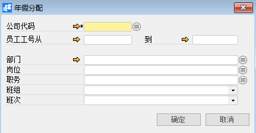
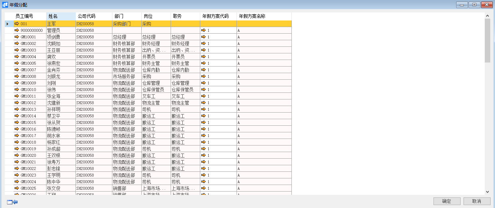

# 年假分配

## 功能解释

运用此功能是将添加在系统里的年假方案分配给员工。

## 文章主旨

本文介绍如何通过BAP Nicer 5完成年假分配查询、新增、修改操作。

## 操作要求

当前登陆用户拥有操作年假分配的权限，权限设置请在帮助文档中搜索查看。

## 查询及新增年假分配

1. 从系统菜单->【人力资源】->【休假管理】->【年假分配】，打开定义界面； 

2. 编辑选择要进行分配年假方案的员工筛选条件；

   

3. 点击【确定】进入分配界面；

4. 依据实际年假规则分配年假方案；

5. 点击【更改】保存分配。

   

## 修改年假分配

1. 从系统菜单->【人力资源】->【休假管理】->【年假分配】，打开定义界面；
2. 点击工具栏的浏览按钮，查找要修改的年假分配；
3. 修改年假分配的内容；
4. 点击【更改】或工具栏的保存按钮 保存，更改年假分配。

## 年假分配查询窗口数据

| **属性**      | **活动描述** |
| ------------- | ------------ |
| 公司代码      | 公司代码     |
| 员工工号从…到 | 员工工号范围 |
| 部门          | 部门信息     |
| 岗位          | 岗位信息     |
| 职务          | 职务信息     |
| 班组          | 班组信息     |
| 班次          | 班次信息     |

## 年假分配页面数据

| **属性**     | **活动描述**     |
| ------------ | ---------------- |
| 员工编号     | 显示员工编号     |
| 姓名         | 显示姓名         |
| 公司代码     | 显示公司代码     |
| 部门         | 显示部门         |
| 岗位         | 显示岗位         |
| 职务         | 显示职务         |
| 年假方案代码 | 选择年假方案代码 |
| 年假方案名称 | 显示年假方案名称 |

