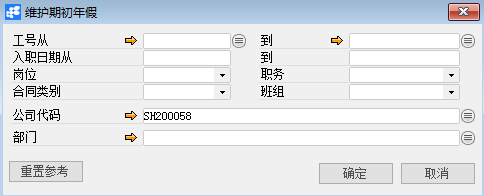
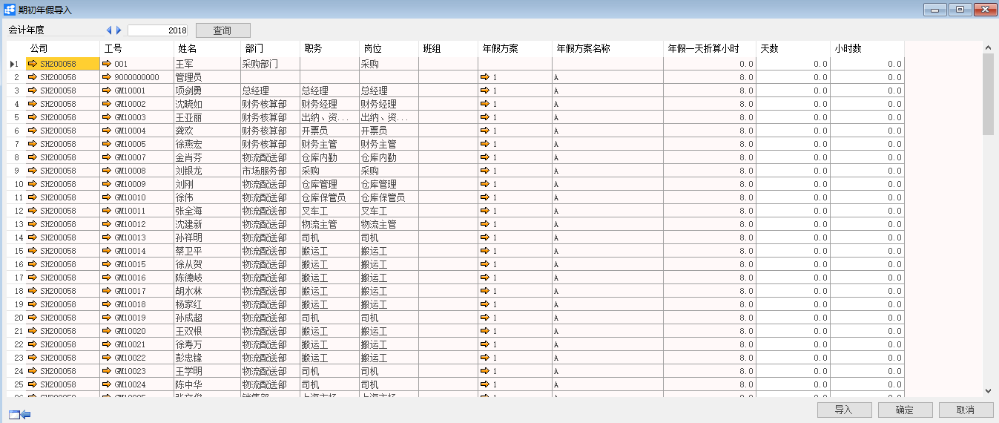

# 维护期初年假

## 功能解释

运用此功能是根据员工实际年假天数维护至BAP中。

## 文章主旨

本文介绍如何通过BAP Nicer 5完成维护期初年假查询、新增、修改操作。

## 操作要求

当前登陆用户拥有操作维护期初年假的权限，权限设置请在帮助文档中搜索查看。

## 查询及新增年初年假

1. 从系统菜单->【人力资源】->【休假管理】->【维护期初年假】，打开定义界面； 

2. 编辑选择要进行期初年假维护的对象员工筛选条件；

   

3. 点击【确定】进入维护期初年假界面并选择对象年限；

   

4. 依据实际年假天数对期初年假进行维护；

5. 点击【更改】保存。

   利用【导入】可快速实现期初年假分配，【导入】依赖于EXCEL数据模板和【期初年假导入】界面的字段列匹配性

## 修改期初年假

1. 从系统菜单->【人力资源】->【休假管理】->【期初年假】，打开定义界面；
2. 点击工具栏的浏览按钮，查找要修改的期初年假；
3. 修改期初年假的内容；
4. 点击【更改】或工具栏的保存按钮保存，更改期初年假。

## 期初年假查询窗口数据

| **属性**      | **活动描述**      |
| ------------- | ----------------- |
| 工号从…到     | 选择工号从…到     |
| 入职日期从…到 | 输入入职日期从…到 |
| 岗位          | 选择岗位          |
| 职务          | 选择职务          |
| 合同类别      | 选择合同类别      |
| 班组          | 选择班组          |
| 公司代码      | 选择公司代码      |
| 部门          | 选择部门          |

## 期初年假报表信息

| **属性**         | **活动描述**                 |
| ---------------- | ---------------------------- |
| 公司年度         | 显示公司年度                 |
| 公司             | 显示员工所属公司             |
| 工号             | 显示员工工号                 |
| 姓名             | 显示员工姓名                 |
| 部门             | 显示员工所属部门             |
| 职务             | 显示员工所属职务             |
| 岗位             | 显示员工所属岗位             |
| 班组             | 显示员工所属班组             |
| 年假方案         | 显示员工所属年假方案         |
| 年假方案名称     | 根据年假方案显示年假方案名称 |
| 年假一天折算小时 | 显示员工年假一天折算小时     |
| 天数             | 显示员工年假天数             |
| 小时间           | 显示员工年假小时数           |