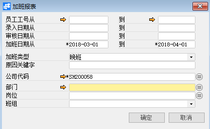
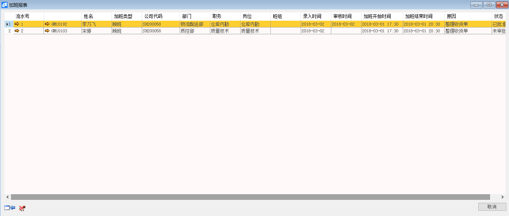

# 加班单报表

## 功能解释

运用此功能可以集中查询员工的加班单信息。

## 文章主旨

本文介绍如何通过BAP Nicer 5完成加班单报表查询操作。

## 操作要求

当前登陆用户拥有操作加班单报表的权限，权限设置请在帮助文档中搜索查看。

## 查询加班单报表

1. 从系统菜单->【人力资源】->【出勤管理】->【加班单报表】，打开定义界面；     

2. 填写查询关键信息；

   

3. 点击【确定】进入结果界面。

   

## 加班单报表查询窗口数据

| **属性**      | **活动描述**         |
| ------------- | -------------------- |
| 员工工号从…到 | 员工工号区间         |
| 录入日期从…到 | 录入日期区间         |
| 审核日期从…到 | 审核日期区间         |
| 加班日期从…到 | 加班日期范围，必选项 |
| 加班类型      | 加班类型查询         |
| 原因关键字    | 加班原因查询关键字   |
| 公司代码      | 选择公司代码         |
| 部门          | 部门                 |
| 岗位          | 岗位                 |
| 班组          | 班组                 |

## 加班单报表信息

| **属性**     | **活动描述**   |
| ------------ | -------------- |
| 流水号       | 加班单流水号   |
| 员工工号     | 员工工号       |
| 姓名         | 员工姓名       |
| 加班类型     | 加班的类型     |
| 公司代码     | 公司代码       |
| 部门         | 所属部门       |
| 职务         | 所属职务       |
| 岗位         | 所属岗位       |
| 班组         | 所属班组       |
| 录入时间     | 加班单录入时间 |
| 审核时间     | 加班单审核时间 |
| 加班开始时间 | 加班开始时间   |
| 加班结束时间 | 加班结束时间   |
| 原因         | 加班原因描述   |
| 状态         | 加班单状态     |