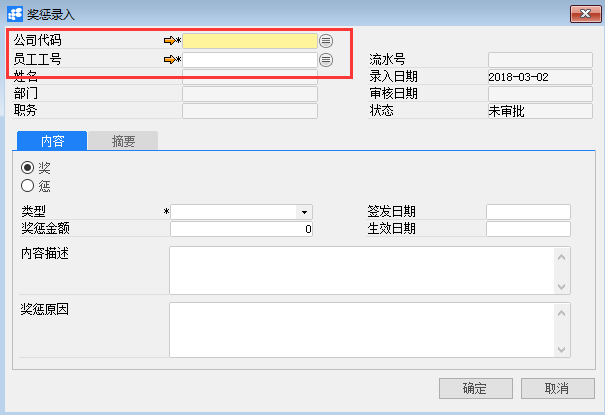
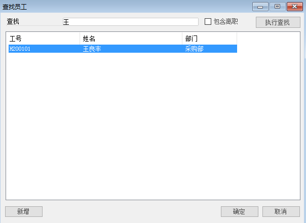
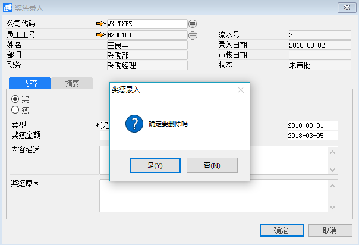

# 奖惩录入

## 功能解释

运用此功能可以录入员工奖励和惩罚信息。

## 文章主旨

本文介绍如何通过BAP Nicer 5完成奖惩录入，新增、修改及删除操作。

## 操作要求

当前登陆用户拥有操作奖惩录入的权限，权限设置请在帮助文档中搜索查看。

## 新增奖惩录入

1. 从系统菜单->【人力资源】->【出勤管理】->【奖惩录入】，打开定义界面； 

2. 点击工具栏新空白按钮 准备新增奖惩录入；

3. 选择公司代码以及员工工号；

   

   

   | 扩展操作介绍                                                 |
   | ------------------------------------------------------------ |
   | 选择员工工号时可以直接在奖惩录入的“员工工号”栏位中输入员工名称关键字或编号关键字，再点击电脑键盘的Enter键执行查找。 |

4. 在【内容】选项卡编辑奖/惩内容；

   

5. 信息确认无误后点击【添加】或工具栏的保存按钮，保存奖惩录入。

   | 提醒                                                         |
   | ------------------------------------------------------------ |
   | 系统未配置自动发起审批时，保存订单信息检查无误后需要点击工具栏的发起审批按钮     ，执行请求审批操作 |

## 修改奖惩录入

1. 从系统菜单->【人力资源】->【出勤管理】->【奖惩录入】，打开奖惩录入界面；

2. 点击工具栏的浏览按钮，查找要修改的奖惩录入；

3. 修改奖惩录入的内容；

4. 点击【更改】或工具栏的保存按钮保存，更改奖惩录入。

注：已审批通过的奖惩录入单不能进行修改操作。

## 删除奖惩录入

1. 从系统菜单->【人力资源】->【出勤管理】->【奖惩录入】，打开奖惩录入界面；

2. 点击工具栏的浏览按钮，查找要删除的奖惩录入；

3. 点击工具栏的按钮，进行删除操作。

注：已审批通过的奖惩录入单不能进行删除操作。

## 属性与活动描述

| **属性** | **活动描述**     |
| -------- | ---------------- |
| 公司代码 | 选择公司代码     |
| 员工工号 | 选择员工工号     |
| 姓名     | 显示员工姓名     |
| 部门     | 显示所属部门     |
| 职务     | 显示职务         |
| 流水号   | 奖惩录入的流水号 |
| 录入日期 | 录入日期         |
| 审核日期 | 审核日期         |
| 状态     | 审核状态         |

## 内容

| **属性** | **活动描述**   |
| -------- | -------------- |
| 奖       | 选择后录入奖励 |
| 惩       | 选择后录入惩罚 |
| 类型     | 奖惩的类型     |
| 奖惩金额 | 奖惩的金额     |
| 签发日期 | 签发的日期     |
| 生效日期 | 生效的日期     |
| 内容描述 | 奖惩内容描述   |
| 奖惩原因 | 奖惩原因       |

## 摘要

| **属性** | **活动描述** |
| -------- | ------------ |
| 录单人   | 奖惩单创建人 |
| 附注     | 备注文本描述 |

