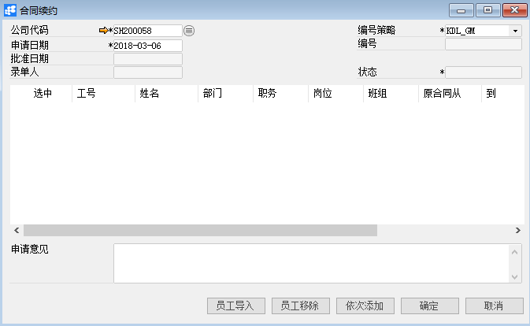
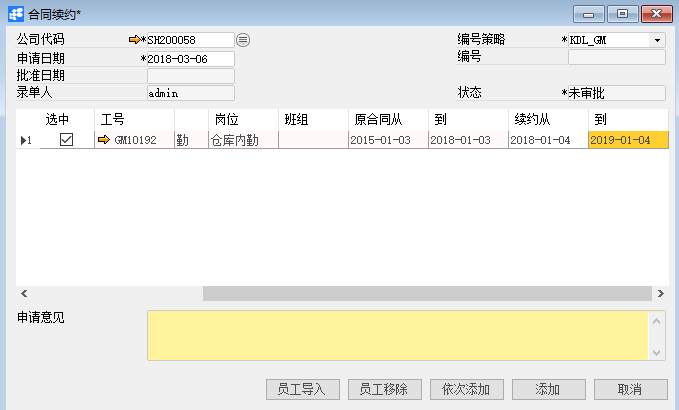
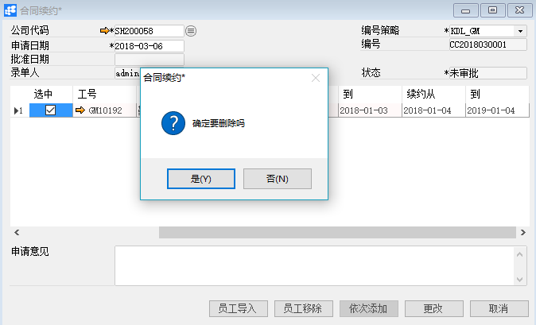

# 合同续约

## 功能解释

运用此功能可以录入员工的合同信息，延长合同有效期。

## 文章主旨

本文介绍如何通过BAP Nicer 5完成合同续约，新增、修改及删除操作。

## 操作要求

当前登陆用户拥有操作合同续约的权限，权限设置请在帮助文档中搜索查看。

## 新增合同续约

1. 从系统菜单->【人力资源】->【合同管理】->【合同续约】，打开定义界面； 

2. 点击工具栏新空白按钮准备新增合同续约；

3. 选择公司代码；

   

   

   | 扩展操作介绍                                                 |
   | ------------------------------------------------------------ |
   | 选择公司代码时可以直接在合同续约的“公司代码”栏位中输入名称关键字或编号关键字，再点击电脑键盘的Enter键执行查找。 |

4. 点击【员工导入】选择相应的员工；

   

5. 编辑续约的信息；

   

6. 信息确认无误后点击【添加】或工具栏的保存按钮，保存合同续约。

   | 提醒                                                         |
   | ------------------------------------------------------------ |
   | 系统未配置自动发起审批时，保存订单信息检查无误后需要点击工具栏的发起审批按钮     ，执行请求审批操作 |

## 修改合同续约

1. 从系统菜单->【人力资源】->【合同管理】->【合同续约】，打开界面；
2. 点击工具栏的浏览按钮 ，查找要修改的合同续约；
3. 修改合同续约的内容；
4. 点击【更改】或工具栏的保存按钮保存，更改合同续约。

注：已审批通过的合同续约不能进行修改操作。

## 删除合同续约

1. 从系统菜单->【人力资源】->【合同管理】->【合同续约】，打开界面；
2. 点击工具栏的浏览按钮 ，查找要删除的合同续约；
3. 点击工具栏的按钮，进行删除操作。

注：已审批通过的合同续约不能进行删除操作。

## 属性与活动描述

| **属性**       | **活动描述**             |
| -------------- | ------------------------ |
| 公司代码       | 选择公司代码             |
| 申请日期       | 输入试用期转正申请日期   |
| 批准日期       | 显示试用期转正单批准日期 |
| 录单人         | 单据创建人               |
| 编号策略       | 凭证编号策略             |
| 编号           | 显示凭证编号             |
| 状态           | 单据状态                 |
| 选中           | 选择可移除该员工         |
| 工号           | 员工工号                 |
| 姓名           | 员工姓名                 |
| 部门           | 员工所属部门             |
| 职务（转正前） | 转正前的职务             |
| 职务（转正后） | 转正后的职务             |
| 岗位（转正前） | 转正前的岗位             |
| 岗位（转正后） | 转正后的岗位             |
| 班组           | 员工所属班组             |
| 本期考核得分   | 本期绩效考核分数         |
| 试用期从…到    | 试用期起止时间           |
| 合同期从…到    | 合同期起止时间           |
| 申请意见       | 申请意见描述文本         |