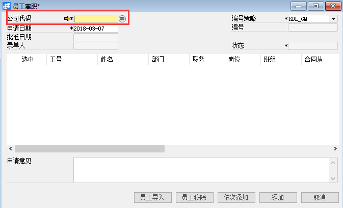
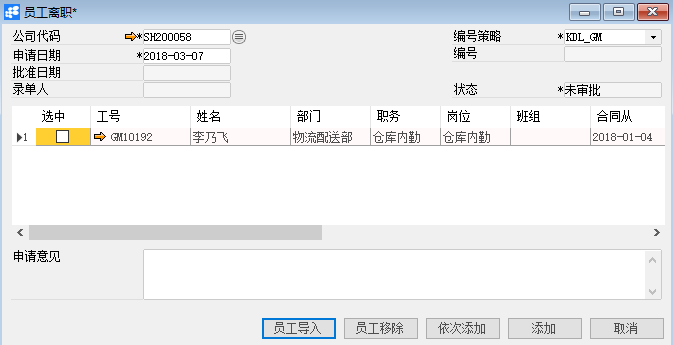
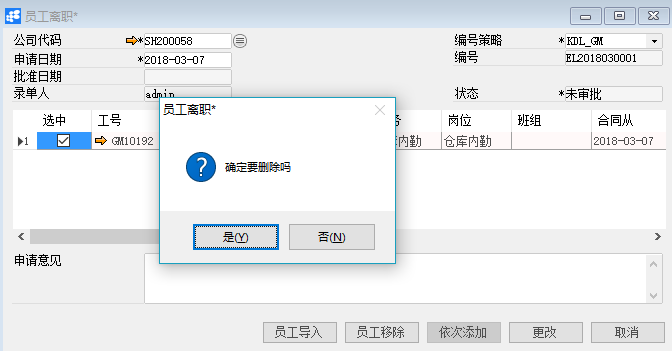

# 员工离职

## 功能解释

运用此功能可以处理员工的离职信息，将员工主文件中的状态修改为离职。

## 文章主旨

本文介绍如何通过BAP Nicer 5完成员工离职，新增、修改及删除操作。

## 操作要求

当前登陆用户拥有操作员工离职的权限，权限设置请在帮助文档中搜索查看。

## 新增员工离职

1. 从系统菜单->【人力资源】->【合同管理】->【员工离职】，打开定义界面； 

2. 点击工具栏新空白按钮 准备新增员工离职；

3. 选择公司代码；

   

   

   | 扩展操作介绍                                                 |
   | ------------------------------------------------------------ |
   | 选择公司代码时可以直接在员工离职的“公司代码”栏位中输入名称关键字或编号关键字，再点击电脑键盘的Enter键执行查找。 |

4. 点击【员工导入】选择相应的员工；

   

5. 编辑员工离职的信息；

   

6. 信息确认无误后点击【添加】或工具栏的保存按钮，保存员工离职。

   | 提醒                                                         |
   | ------------------------------------------------------------ |
   | 系统未配置自动发起审批时，保存订单信息检查无误后需要点击工具栏的发起审批按钮     ，执行请求审批操作 |

## 修改员工离职

1. 从系统菜单->【人力资源】->【合同管理】->【员工离职】，打开界面；
2. 点击工具栏的浏览按钮，查找要修改的员工离职；
3. 修改员工离职的内容；
4. 点击【更改】或工具栏的保存按钮保存，更改员工离职。

注：已审批通过的员工离职不能进行修改操作。

## 删除员工离职

1、 从系统菜单->【人力资源】->【合同管理】->【员工离职】，打开界面；

2、 点击工具栏的浏览按钮                              ，查找要删除的员工离职；

3、 点击工具栏的 按钮，进行删除操作。

注：已审批通过的员工离职不能进行删除操作。

## 属性与活动描述

| **属性**  | **活动描述**                                 |
| --------- | -------------------------------------------- |
| 公司代码  | 选择公司代码                                 |
| 申请日期  | 输入员工离职申请日期                         |
| 批准日期  | 显示员工离职单批准日期                       |
| 录单人    | 单据创建人                                   |
| 编号策略  | 凭证编号策略                                 |
| 编号      | 显示凭证编号                                 |
| 状态      | 单据状态                                     |
| 选中      | 选择可移除该员工                             |
| 工号      | 员工工号                                     |
| 姓名      | 员工姓名                                     |
| 部门      | 员工所属部门                                 |
| 职务      | 员工职务                                     |
| 岗位      | 员工岗位                                     |
| 班组      | 员工班组                                     |
| 合同从…到 | 合同起止时间                                 |
| 离职类型  | 离职类型                                     |
| 离职日期  | 离职日期                                     |
| 离职时间  | 输入准确的离职时间，该时间会影响考勤结算结果 |
| 离职原因  | 描述文本                                     |
| 申请意见  | 填写申请意见                                 |