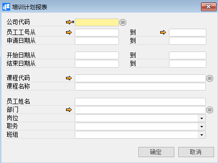
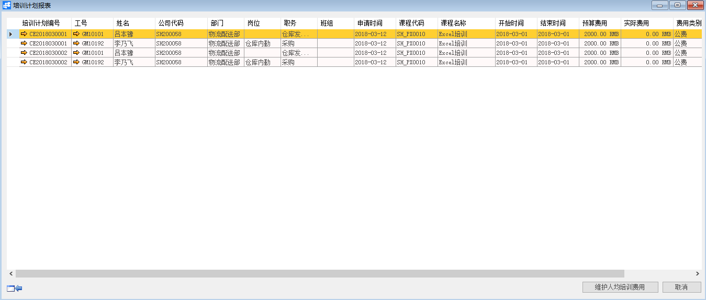
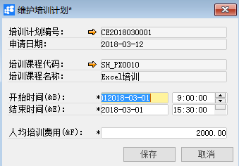

# 培训计划报表

## 功能解释

此窗口以报表的形式集中呈现员工培训计划明细，并可以维护人均培训费用。

## 文章主旨

本文介绍如何通过BAP Nicer 5完成培训计划报表查询操作。

## 操作要求

当前登陆用户拥有操作培训计划报表的权限，权限设置请在帮助文档中搜索查看。

## 培训计划报表

1. 从系统菜单->【人力资源】->【培训管理】->【培训计划报表】，打开定义界面；

2. 填写查询关键信息；

   

3. 点击【确定】进入结果界面。

   

4. 点击下方的【维护人均培训费用】对人均费用进行维护；

   

5. 点击【保存】完成维护。

## 培训计划报表查询窗口数据

| **属性**      | **活动描述**                 |
| ------------- | ---------------------------- |
| 公司代码      | 选择公司代码                 |
| 工号从…到…    | 选择工号查询范围条件         |
| 申请日期从…到 | 选择培训计划申请日期范围条件 |
| 开始日期从…到 | 选择培训计划开始日期范围条件 |
| 结束日期从…到 | 选择培训计划结束日期范围条件 |
| 课程代码      | 选择课程代码作为查询条件     |
| 课程名称      | 选择课程名称作为查询条件     |
| 员工姓名      | 选择员工姓名作为查询条件     |
| 部门          | 选择部门作为查询条件         |
| 岗位          | 选择岗位查询条件             |
| 职务          | 选择职务作为查询条件         |
| 班组          | 选择班组作为查询条件         |

## 维护培训计划报表信息

| **属性**     | **活动描述**       |
| ------------ | ------------------ |
| 培训计划编号 | 培训计划单据编号   |
| 工号         | 员工工号           |
| 姓名         | 员工姓名           |
| 公司代码     | 公司代码           |
| 部门         | 部门名称           |
| 岗位         | 岗位名称           |
| 职务         | 职务名称           |
| 班组         | 班组名称           |
| 申请时间     | 培训申请日期       |
| 课程代码     | 培训课程代码       |
| 课程名称     | 培训课程名称       |
| 开始时间     | 培训开始时间       |
| 结束时间     | 培训结束时间       |
| 预算费用     | 培训预算费用       |
| 实际费用     | 培训实际发生的费用 |
| 费用类别     | 费用类别           |
| 备注         | 文本描述           |

## 维护人均培训费用

| **属性**     | **活动描述**       |
| ------------ | ------------------ |
| 培训计划编号 | 培训计划单据编号   |
| 申请日期     | 培训申请日期       |
| 培训课程代码 | 培训课程代码       |
| 培训课程名称 | 培训课程名称       |
| 开始时间     | 培训开始时间       |
| 结束时间     | 培训结束时间       |
| 人均培训费用 | 培训实际发生的费用 |