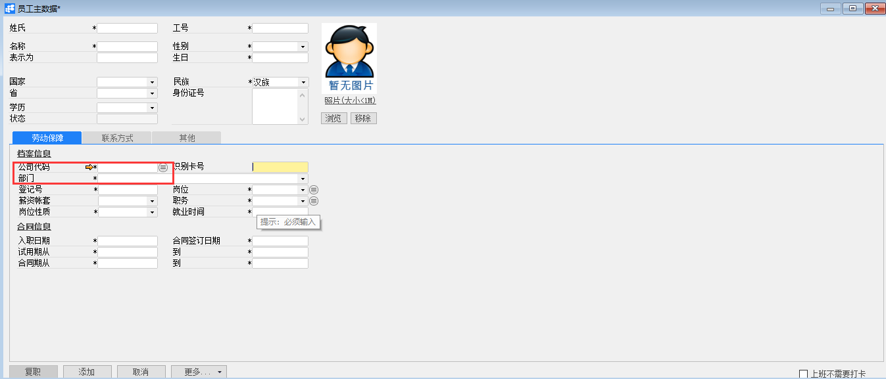
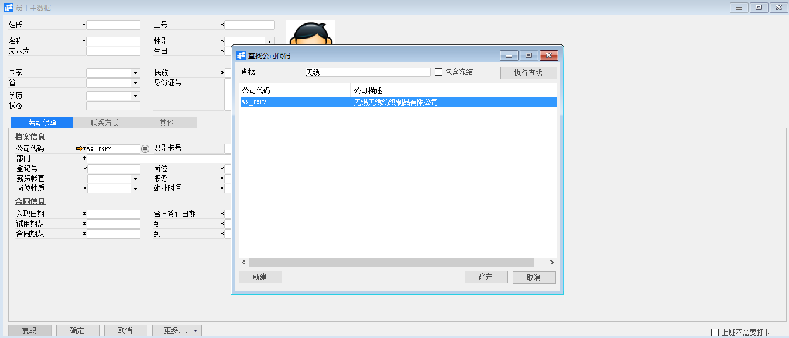
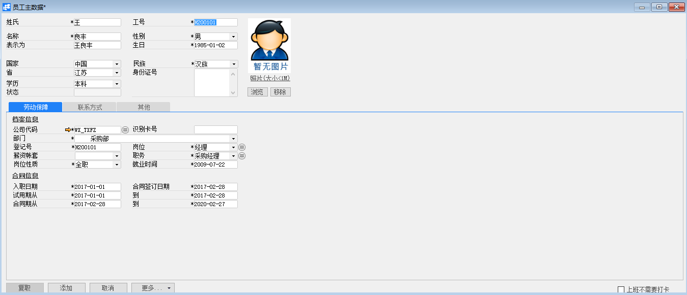
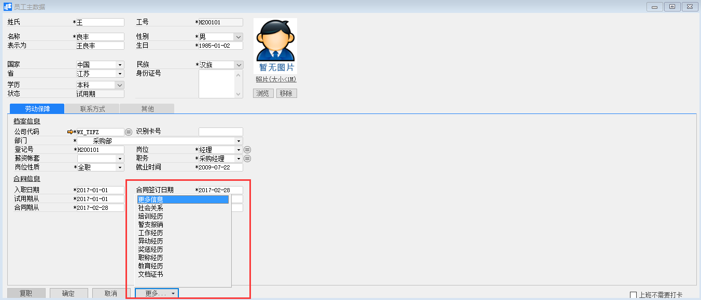
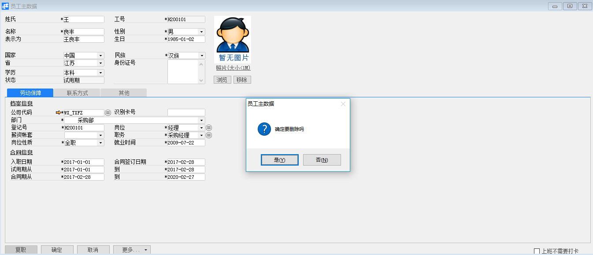

# 员工主数据

## 功能解释

员工主数据是企业在运营过程中经常会对员工进行培训，根据工作的表现进行部门调动，并对其做出奖惩，还可以保留员工工作经历和教育背景的历史记录，以及记录员工档案信息，包括员工姓名、工号、组织、劳动保障、联系方式等。

## 文章主旨

本文介绍如何通过BAP Nicer 5完成员工主数据的新增、修改及删除操作。

## 操作要求

当前登陆用户拥有操作员工主数据业务的权限，权限设置请在帮助文档中搜索查看。

## 新增员工主数据

1. 从系统菜单->【人力资源】->【员工主数据】，打开员工主数据空白界面；

2. 点击工具栏新空白按钮准备新增员工主数据；

3. 选择新增员工主数据的公司代码以及部门；

   

   

   | 扩展操作介绍                                                 |
   | ------------------------------------------------------------ |
   | 选择公司代码时可以直接在员工主数据的“公司代码”栏位中输入公司名称关键字或编号关键字，再点击电脑键盘的Enter键执行查找。 |

4. 依据员工实际情况再完善姓氏、名称、工号、性别、档案、合同等信息：

   

5. 信息确认无误后点击【添加】或工具栏的保存按钮，保存员工主数据。

6. 补充说明：如需要编辑更多信息，请点击更多按钮，进入社会关系、培训经历、更多信息、工作经历、异动经历、暂支报销、奖惩经历、职称经历、教育经历、文档证书中进行编辑。

   

## 修改员工主数据

1. 从系统菜单->【人力资源】->【员工主数据】，打开员工主数据界面；
2. 点击工具栏的浏览按钮 ，查找要修改的员工主数据；
3. 修改员工主数据的内容；
4. 点击【更改】或工具栏的保存按钮保存，更改员工主数据。

## 删除员工主数据

1. 从系统菜单->【人力资源】->【员工主数据】，打开员工主数据界面；

2. 点击工具栏的浏览按钮，查找要删除的员工主数据；

3. 点击工具栏的按钮，进行删除操作。

   

## 属性与活动描述

| **属性** | **活动描述**                                                 |
| -------- | ------------------------------------------------------------ |
| 姓氏     | 输入员工的姓                                                 |
| 名称     | 输入员工的名字，但不包括姓                                   |
| 表示为   | 显示员工姓名                                                 |
| 工号     | 输入员工工号。注意：工号是用来标识员工的唯一序列号，不可以重复 |
| 性别     | 选择员工性别                                                 |
| 生日     | 输入员工生日                                                 |
| 国家     | 选择国家                                                     |
| 省       | 选择省。注意：必须先选择国家才能选择省。                     |
| 学历     | 选择学历                                                     |
| 民族     | 选择民族                                                     |
| 身份证号 | 输入身份证号                                                 |

## 劳动保障

| **属性**     | **活动描述**                             |
| ------------ | ---------------------------------------- |
| 公司代码     | 选择公司代码                             |
| 识别卡号     | 输入识别卡号。注意：识别卡号不可以重复   |
| 部门         | 选择员工所属部门                         |
| 登记号       | 输入员工的登记号。注意：登记号不可以重复 |
| 薪资账套     | 选择薪资账套                             |
| 岗位性质     | 选择岗位性质，如：全职、兼职             |
| 岗位         | 选择岗位                                 |
| 职务         | 选择职务                                 |
| 就业时间     | 输入员工就业时间                         |
| 入职日期     | 输入员工入职日期                         |
| 合同签订日期 | 输入员工合同签订日期                     |
| 试用期从…到  | 输入员工试用期起止范围                   |
| 合同期从…到  | 输入员工合同期起止范围                   |

## 联系方式

| **属性**     | **活动描述**           |
| ------------ | ---------------------- |
| 户籍地址     | 输入员工户籍所在地     |
| 现居住地址   | 输入员工现在的居住地址 |
| 邮政编码     | 输入邮政编码           |
| 联系电话     | 输入联系电话号码       |
| 移动电话     | 输入移动电话号码       |
| 紧急联系方式 | 输入紧急联系方式       |
| 办公室电话   | 输入办公室电话         |

## 其他

| **属性** | **活动描述** |
| -------- | ------------ |
| 备注     | 输入备注描述 |

## 社会关系

| **属性**   | **活动描述**           |
| ---------- | ---------------------- |
| 成员姓名   | 输入成员姓名           |
| 与本人关系 | 输入该成员与员工的关系 |
| 职务       | 选择职务               |
| 工作单位   | 输入工作单位           |
| 联系方式   | 输入联系方式           |
| 备注       | 输入备注描述           |

## 培训经历

| **属性** | **活动描述**       |
| -------- | ------------------ |
| 培训主题 | 输入培训课题描述   |
| 培训师   | 输入培训讲师       |
| 培训费用 | 输入培训费用       |
| 培训性质 | 选择培训行政       |
| 开始日期 | 输入培训开始日期   |
| 结束日期 | 输入培训结束日期   |
| 年度计划 | 选择是否为年度计划 |
| 培训内容 | 输入详细的培训内容 |
| 备注     | 输入备注描述       |

## 更多信息

| **属性**           | **活动描述**                     |
| ------------------ | -------------------------------- |
| 婚姻状况           | 选择婚姻状况                     |
| 政治面貌           | 选择政治面貌                     |
| 身高（厘米）       | 输入身高，以厘米为单位           |
| 体重（公斤）       | 输入体重，以公斤为单位           |
| 视力（度）         | 输入视力，以度为单位             |
| 毕业院校           | 输入毕业院校                     |
| 专业               | 输入所学专业                     |
| 学位               | 选择获取学位                     |
| 护照号码           | 输入护照号码                     |
| 暂住证号码         | 输入暂住证号码                   |
| 暂住日期           | 输入暂住日期，默认为系统当前日期 |
| 暂住证有效期（月） | 输入暂住证有效期，以月为单位     |
| Email              | 输入邮箱地址                     |
| 特长               | 输入特长                         |
| 工会会员           | 选择是否为工会会员               |
| 默认班次           | 选择默认班次                     |
| 技术职称           | 选择技术职称信息                 |
| 工作日历           | 选择工作日历                     |
| 行政级别           | 选择行政级别                     |
| 用工形式           | 选择用工形式                     |
| 班组               | 选择班组                         |
| 劳动手册号码       | 输入劳动手册号码                 |
| 劳动合同编号       | 输入劳动合同编号                 |
| 社保账号           | 输入社保账号                     |
| 商保公司           | 输入商业保险所在公司名称         |
| 开户银行           | 输入开户银行信息                 |
| 社保基数           | 输入社会保险缴纳基数             |
| 商保账号           | 输入商业保险账号                 |
| 银行账号           | 输入银行账号                     |
| 公积金账号         | 输入公积金账号                   |
| 公积金基数         | 输入公积金缴纳基数               |
| 商保基数           | 输入商业保险缴纳基数             |
| 社保所在地         | 输入社保的所在地区               |
| 公积金所在地       | 输入公积金的所在地区             |
| 宗教信仰           | 输入宗教信仰                     |
| 员工组             | 选择员工的分组                   |
| 宗教信仰           | 输入信仰的宗教                   |
| 血型               | 选择血型                         |
| 健康状况           | 选择健康状况                     |
| 病史               | 输入病史记录                     |
| 外语语种           | 选择外语语种                     |
| 外语水平           | 选择外语水平                     |
| 电脑水平           | 选择电脑水平                     |
| 驾照类型           | 选择驾驶执照类型                 |