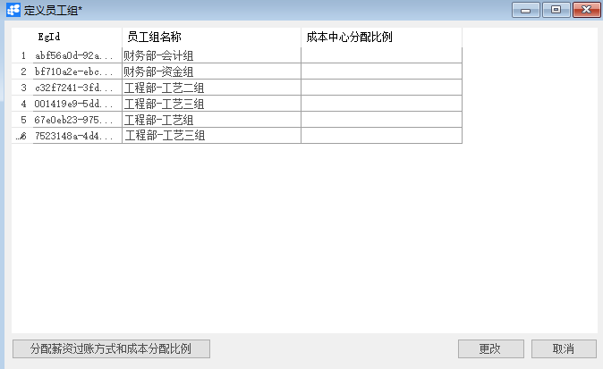
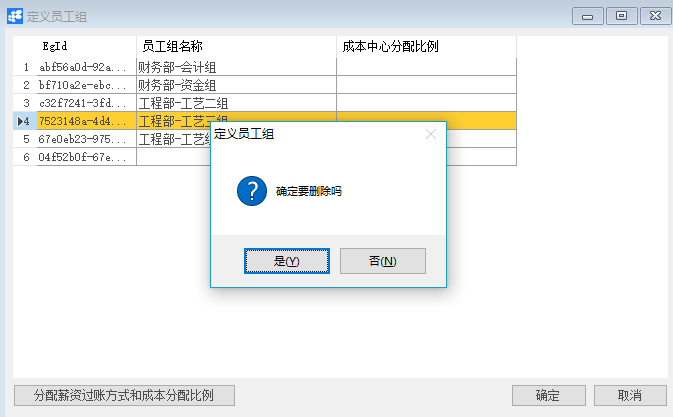

# 定义员工组

## 功能解释

定义员工组可以将员工不同的分组在系统中进行定定义。

## 文章主旨

本文介绍如何通过BAP Nicer 5完成定义员工组的新增、修改及删除操作。

## 操作要求

当前登陆用户拥有操作定义员工组业务的权限，权限设置请在帮助文档中搜索查看。

## 新增定义员工组

1. 从系统菜单->【人力资源】->【定义】->【定义员工组】，打开定义员工组界面；

2. 编辑员工组名称：

   

3. 信息确认无误后点击【添加】或工具栏的保存按钮进行保存；

## 修改定义员工组

1. 从系统菜单->【人力资源】->【定义】->【定义员工组】，打开定义员工组界面；
2. 修改定义员工组的内容；
3. 点击【更改】或工具栏的保存按钮进行更改员工组。

## 删除定义员工组

1. 从系统菜单->【人力资源】->【定义】->【定义员工组】，打开定义员工组界面；

2. 选中要删除的那一行：

   

3. 点击工具栏的按钮，进行删除操作。

## 属性与活动描述

| **属性**         | **活动描述**         |
| ---------------- | -------------------- |
| 员工组名称       | 输入员工组名称       |
| 成本中心分配比例 | 输入成本中心分配比例 |

