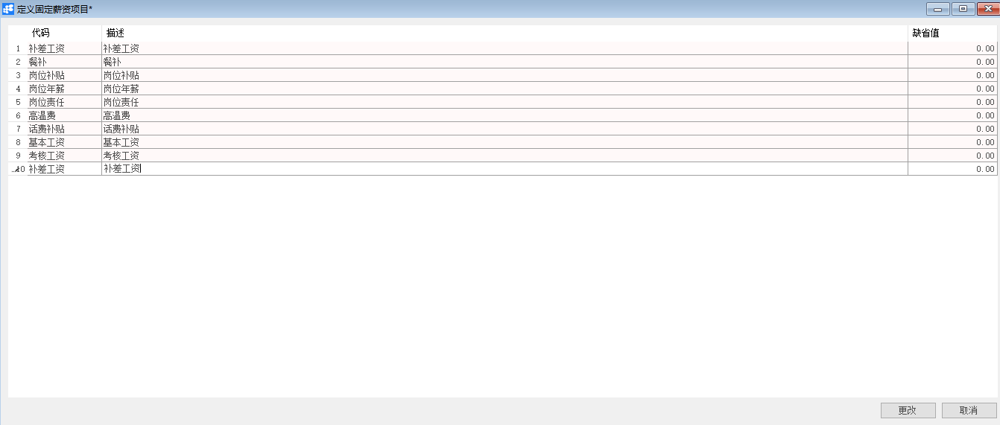
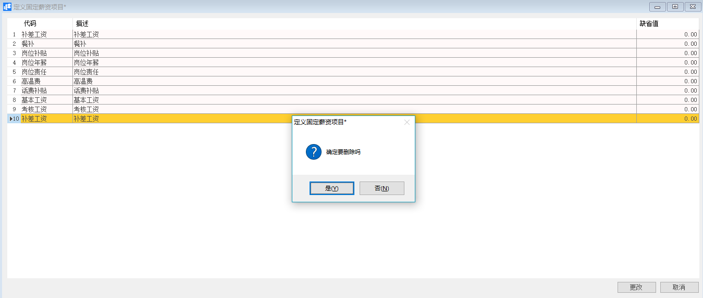

# 定义固定薪资项目

## 功能解释

定义固定薪资项目是定义HR模块中的固定薪资项目，例如：基本工资、福利补贴等固定维护的薪资项目，用于薪资结算。

## 文章主旨

本文介绍如何通过BAP Nicer 5完成定义固定薪资项目，新增、修改及删除操作。

## 操作要求

当前登陆用户拥有操作定义固定薪资项目业务的权限，权限设置请在帮助文档中搜索查看。

## 新增固定薪资项目

1. 从系统菜单->【人力资源】->【定义】->【定义固定薪资项目】，打开定义界面；

2. 完善代码、描述、缺省值信息；

   

3. 确认无误后，点击【更改】或工具栏的保存按钮进行保存。

## 修改固定薪资项目

1. 从系统菜单->【人力资源】->【定义】->【定义固定薪资项目】，打开定义界面；
2. 修改固定薪资项目内需要修改的内容；
3. 点击【更改】或工具栏的保存按钮保存，更改内容。

## 删除固定薪资项目

1. 从系统菜单->【人力资源】->【定义】->【定义固定薪资项目】，打开定义界面；

2. 选中需要删除的那一行，点击工具栏的按钮，进行删除操作。

   

## 属性与活动描述

| **属性** | **活动描述**       |
| -------- | ------------------ |
| 代码     | 输入固定薪资项代码 |
| 描述     | 输入描述文本       |
| 缺省值   | 输入缺省金额       |