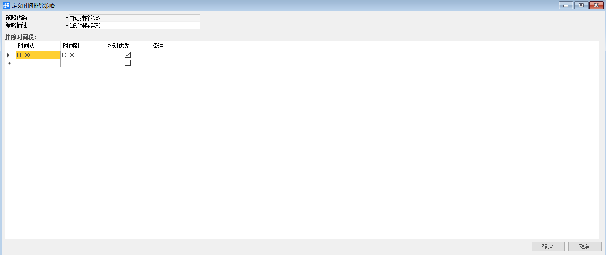
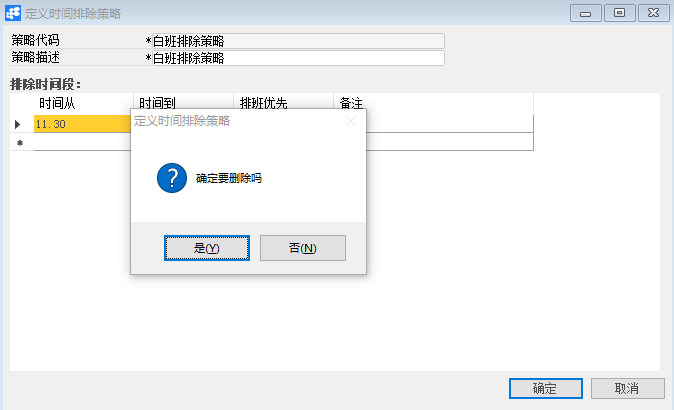

# 定义时间排除策略

## 功能解释

定义时间排除策略可以定义上班期间需排除的时间，为定义班次提供帮助。

## 文章主旨

本文介绍如何通过BAP Nicer 5完成定义时间排除策略，新增、修改及删除操作。

## 操作要求

当前登陆用户拥有操作定义时间排除策略业务的权限，权限设置请在帮助文档中搜索查看。

## 新增时间排除策略

1. 从系统菜单->【人力资源】->【定义】->【定义时间排除策略】，打开定义界面；

2. 编辑策略代码及策略描述信息；

3. 在【时间排除段】下编辑时间信息和备注；

4. 点击【添加】或工具栏的保存按钮进行保存。

   

## 修改时间排除策略

1. 从系统菜单->【人力资源】->【定义】->【定义时间排除策略】，打开定义界面；
2. 点击工具栏的浏览按钮，查找要修改的时间排除策略；
3. 修改时间排除策略内容；
4. 点击【更改】或工具栏的保存按钮进行更改内容。

## 删除时间排除策略

1. 从系统菜单->【人力资源】->【定义】->【定义时间排除策略】，打开定义界面；

2. 点击工具栏的浏览按钮，查找要删除的时间排除策略；

   

3. 点击工具栏的按钮，进行删除操作。

## 属性与活动描述

| **属性**  | **活动描述**     |
| --------- | ---------------- |
| 策略代码  | 输入策略代码     |
| 策略描述  | 输入策略描述     |
| 时间从…到 | 输入起止时间     |
| 排班优先  | 勾选是否排班优先 |
| 备注      | 输入备注描述     |

 