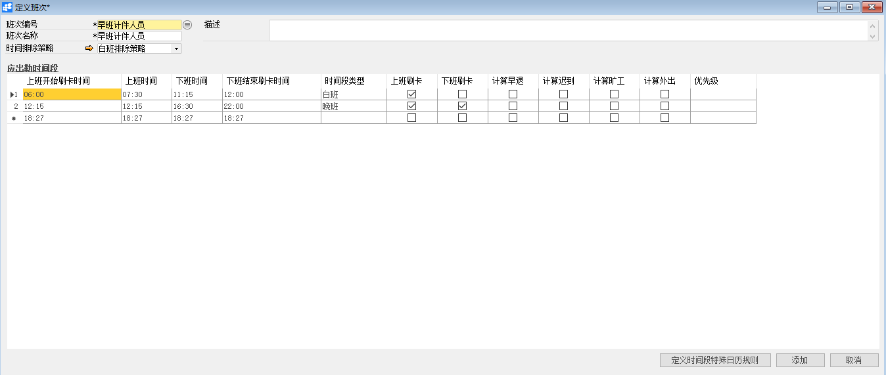
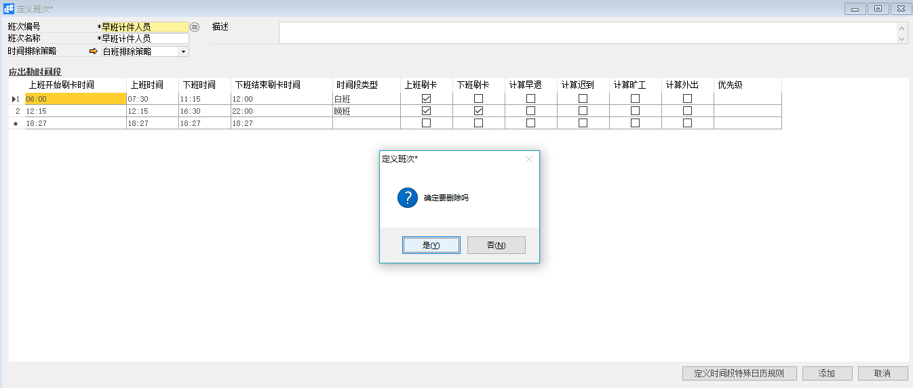

# 定义班次

## 功能解释

定义班次可以定义公司的班次信息。

## 文章主旨

本文介绍如何通过BAP Nicer 5完成定义班次，新增、修改及删除操作。

## 操作要求

当前登陆用户拥有操作定义班次业务的权限，权限设置请在帮助文档中搜索查看。

## 新增定义班次

1. 从系统菜单->【人力资源】->【定义】->【定义班次】，打开定义界面；

2. 点击工具栏新空白按钮准备新增班次；

3. 输入班次编号、班次名称、描述及时间排除策略；

4. 在【应出勤时间段】下编辑上班时间、下班时间等信息；

   

5. 确认无误后，点击【添加】或工具栏的保存按钮进行保存。

## 修改定义班次

1. 从系统菜单->【人力资源】->【定义】->【定义班次】，打开定义界面；
2. 点击工具栏的浏览按钮，查找要修改的班次；
3. 修改班次内容；
4. 点击【更改】或工具栏的保存按钮 保存，更改内容。

## 删除定义班次

1. 从系统菜单->【人力资源】->【定义】->【定义班次】，打开定义界面；

2. 点击工具栏的浏览按钮，查找要删除的班次；

3. 点击工具栏的按钮，进行删除操作。

   

## 属性与活动描述

| **属性**         | **活动描述**         |
| ---------------- | -------------------- |
| 班次编号         | 选择班次编号         |
| 班次名称         | 输入班次名称         |
| 时间排除策略     | 选择时间排除策略     |
| 描述             | 输入描述内容         |
| 上班开始刷卡时间 | 输入上班开始刷卡时间 |
| 上班时间         | 输入上班时间         |
| 下班时间         | 输入下班时间         |
| 下班结束刷卡时间 | 输入下班结束刷卡时间 |
| 时间段类型       | 选择时间段类型       |
| 上班刷卡         | 勾选是否上班刷卡     |
| 下班刷卡         | 勾选是否下班刷卡     |
| 计算早退         | 勾选是否计算早退     |
| 计算迟到         | 勾选是否计算迟到     |
| 计算旷工         | 勾选是否计算旷工     |
| 计算外出         | 勾选是否计算外出     |
| 优先级           | 选择优先级内容       |