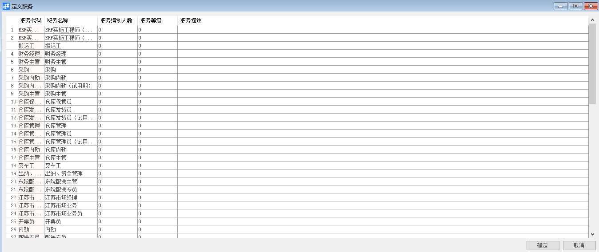
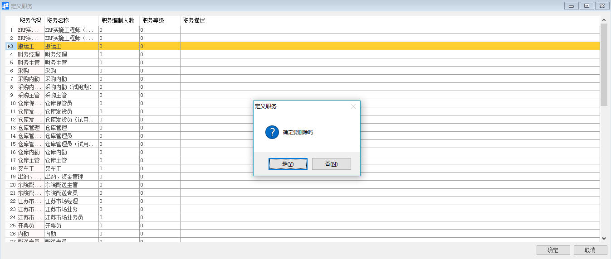

# 定义职务

## 功能解释

定义职务可以定义公司职务信息。

## 文章主旨

本文介绍如何通过BAP Nicer 5完成定义职务，新增、修改及删除操作。

## 操作要求

当前登陆用户拥有操作定义职务业务的权限，权限设置请在帮助文档中搜索查看。

## 新增定义职务

1. 从系统菜单->【人力资源】->【定义】->【定义职务】，打开定义职务界面；

2. 编辑职务代码、职务名称、职务编制人数等信息；

3. 点击【添加】或工具栏的保存按钮 进行保存。

   

## 修改定义职务

1. 从系统菜单->【人力资源】->【定义】->【定义职务】，打开定义职务界面；
2. 修改定义职务内容；
3. 点击【更改】或工具栏的保存按钮进行更改职务内容。

## 删除定义职务

1. 从系统菜单->【人力资源】->【定义】->【定义职务】，打开定义职务界面；

2. 选中要删除的那一行：

   

3. 点击工具栏的按钮，进行删除操作。

## 属性与活动描述

| **属性**     | **活动描述**     |
| ------------ | ---------------- |
| 职务代码     | 输入职务代码     |
| 职务名称     | 输入职务名称     |
| 职务编制人数 | 输入职务编制人数 |
| 职务等级     | 输入职务等级     |
| 职务描述     | 输入职务描述     |

