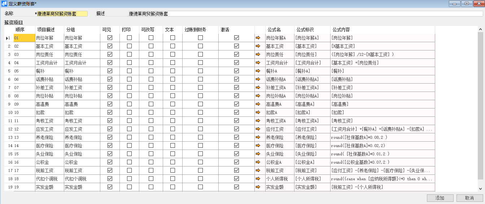
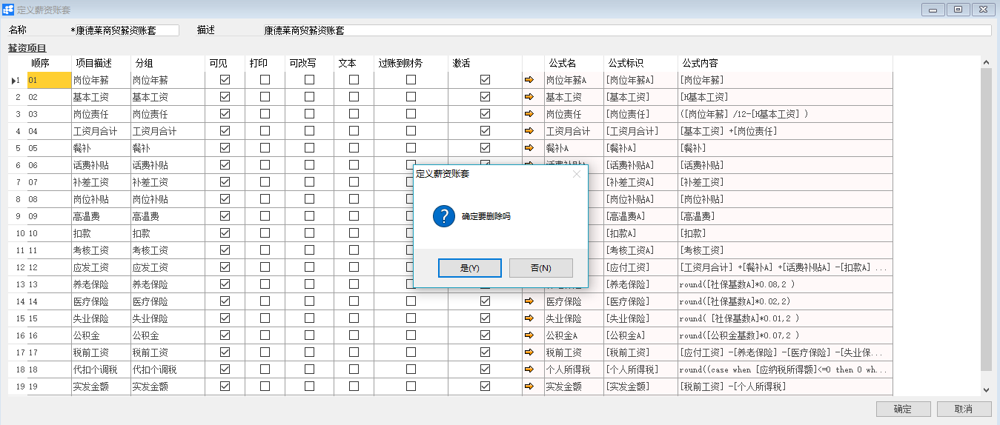

# 定义薪资账套

## 功能解释

定义薪资账套可以定义HR模块中的薪资组成项目，用于薪资结算。

## 文章主旨

本文介绍如何通过BAP Nicer 5完成定义薪资账套，新增、修改及删除操作。

## 操作要求

当前登陆用户拥有操作定义固定薪资账套业务的权限，权限设置请在帮助文档中搜索查看。

## 新增薪资账套

1. 从系统菜单->【人力资源】->【定义】->【定义固定薪资账套】，打开定义界面；

2. 点击工具栏新空白按钮准备新增薪资账套；

3. 输入名称及描述信息；

4. 编辑【薪资项目】模块中的内容，如：顺序、项目描述、分组、公式等信息；

   

5. 确认无误后，点击【添加】或工具栏的保存按钮进行保存。

## 修改薪资账套

1. 从系统菜单->【人力资源】->【定义】->【定义薪资账套】，打开定义界面；
2. 点击工具栏的浏览按钮，查找要修改的薪资账套；
3. 修改薪资账套内需要修改的内容；
4. 点击【更改】或工具栏的保存按钮保存，更改内容。

## 删除薪资账套

1. 从系统菜单->【人力资源】->【定义】->【定义薪资帐套】，打开定义界面；

2. 点击工具栏的浏览按钮，查找要删除的薪资账套；

3. 点击工具栏的按钮，进行删除操作。

   

## 属性与活动描述

| **属性**   | **活动描述**                                                 |
| ---------- | ------------------------------------------------------------ |
| 名称       | 输入薪资账套的名称                                           |
| 描述       | 输入薪资项目描述                                             |
| 顺序       | 输入薪资项目显示顺序，该顺序用于薪资结算结果的查看           |
| 项目描述   | 输入项目描述。注意：描述的首字母不能重复，否则会影响到薪资条打印 |
| 分组       | 输入分组                                                     |
| 可见       | 控制薪资结算中是否可见该项目                                 |
| 打印       | 控制该项目是否允许打印                                       |
| 可改写     | 控制该项目的结果值在薪资结算中是否可改写                     |
| 文本       | 控制是否文本                                                 |
| 过账到财务 | 控制是否过账到财务                                           |
| 激活       | 控制是否激活                                                 |
| 公式名     | 显示公式名称                                                 |
| 公式标识   | 显示公式标识                                                 |
| 公式内容   | 显示公式内容                                                 |