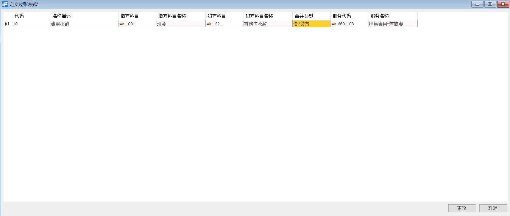
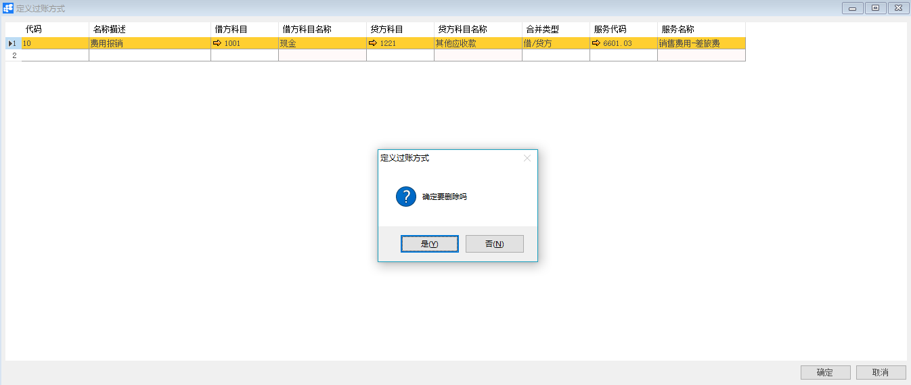

# 定义过账方式

## 功能解释

运用此功能可以定义系统中的过账方式。

## 文章主旨

本文介绍如何通过BAP Nicer 5完成定义过账方式，新增、修改及删除操作。

## 操作要求

当前登陆用户拥有操作定义过账方式的权限，权限设置请在帮助文档中搜索查看。

## 新增过账方式

1. 从系统菜单->【人力资源】->【定义】->【定义过账方式】，打开定义界面； 

2. 编辑代码、名称描述、借方科目、贷方科目等信息；

   

3. 确认无误后，点击【更改】或工具栏的保存按钮进行保存。

## 修改过账方式

1. 从系统菜单->【人力资源】->【定义】->【定义过账方式】，打开定义界面；
2. 修改过账方式内需要修改的内容；
3. 点击【更改】或工具栏的保存按钮保存，更改内容。

## 删除过账方式

1. 从系统菜单->【人力资源】->【定义】->【定义过账方式】，打开定义界面；

2. 选中需要删除的那一行，点击工具栏的按钮，进行删除操作。

   

## 属性与活动描述

| **属性**     | **活动描述**       |
| ------------ | ------------------ |
| 代码         | 输入过账方式的代码 |
| 名称描述     | 输入过账方式的名称 |
| 借方科目     | 选择借方科目       |
| 借方科目名称 | 显示借方科目名称   |
| 贷方科目     | 选择贷方科目       |
| 贷方科目名称 | 显示贷方科目名称   |
| 合并类型     | 选择合并类型       |
| 服务代码     | 选择服务代码       |
| 服务名称     | 显示服务名称       |

