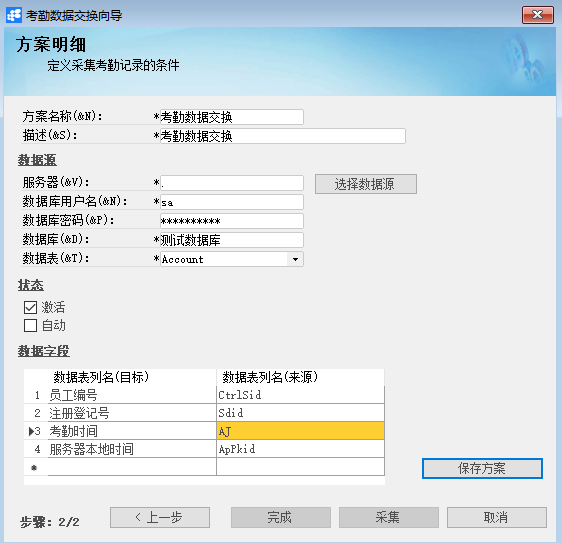

# 采集考勤数据向导

## 功能解释

采集考勤数据向导是用来完成考勤数据的异地交换。

## 文章主旨

本文介绍如何通过BAP Nicer 5完成采集考勤数据向导，新增、删除操作。

## 操作要求

当前登陆用户拥有操作采集考勤数据向导的权限，权限设置请在帮助文档中搜索查看。

## 采集考勤数据向导

1. 从【菜单窗口】->【人力资源】->【考勤管理】->【采集考勤数据向导】，进入界面；
2. 创建或选择采集考勤数据方案；
3. 完善采集考勤数据方案并保存方案；
4. 点击【采集】进行考勤数据采集操作；
5. 采集结束后，点击【完成】完成本次数据采集。

（考勤数据采集可通过手工进行，也可以对采集方案设定采集周期策略，满足周期要求后自动运行采集考勤数据收集功能）

## 删除考勤数据向导

1. 从【菜单窗口】->【人力资源】->【考勤管理】->【采集考勤数据向导】，进入界面；
2. 选择需要删除的采集考勤数据方案；
3. 点击【删除方案】按钮，进行删除。

## 属性与活动描述

| **属性**           | **活动描述**                                           |
| ------------------ | ------------------------------------------------------ |
| 方案名称           | 考勤数据交换方案的名称                                 |
| 描述               | 对方案的描述                                           |
| 服务器             | 数据源服务器名称                                       |
| 数据库用户名       | 源数据库用户名                                         |
| 数据库密码         | 源数据库密码                                           |
| 数据库             | 源数据库                                               |
| 数据表             | 源数据表                                               |
| 选择数据源         | 单击后打开数据源服务器选择项                           |
| 激活               | 是否激活，同时选择激活和自动才能自动采集               |
| 自动               | 选择自动后需选择考勤采集周期性策略，系统将自动采集数据 |
| 数据表列名（目标） | 目标数据表列名                                         |
| 数据表列名（来源） | 来源数据表列名                                         |
| 保存方案           | 保存方案，供下次打开时选用                             |
| 采集               | 单击此按钮后，将采集数据                               |
| 上一步             | 单击后返回上一层界面                                   |
| 完成               | 此按钮在当前见面下为灰色状态                           |
| 取消               | 单击后取消操作                                         |