#  BAP NICER 5 ERP/HR 后勤管理

##  定义印信类别

###  功能解释

定义印信类别可以定义印信的类别信息。

###  文章主旨

本文介绍如何通过BAP Nicer 5完成定义印信类别的新增、查找、修改及删除操作。

###  操作要求

当前登陆用户拥有操作后勤模块的权限，权限设置请在帮助文档中搜索查看。

###  新增印信类别

1. 从系统菜单->【后勤】->【印信管理】->【定义印信类别】，打开定义印信类别界面：

2. 输入印信类别代码、印信类别名称；

   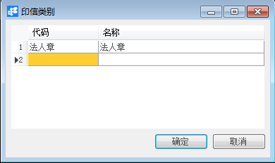

3. 信息确认无误后点击【添加】或工具栏的保存按钮，保存定义印信类别。

###  修改印信类别

1. 从系统菜单->【后勤】->【印信管理】->【定义印信类别】，打开界面；
2. 修改印信类别内容；
3. 点击【更改】或工具栏的保存按钮保存，更改。

###  删除印信类别

1. 从系统菜单->【后勤】->【印信管理】->【定义印信类别】，打开界面；
2. 点击工具栏的按钮，进行删除操作。

###  属性与活动描述

| **属性** | **活动描述** |
| -------- | ------------ |
| 代码     | 输入代码     |
| 名称     | 输入名称     |

##  印信期初登记

###  功能解释

印信期初登记表示期初导入时将所有已存在的印信信息全部录入到系统中。

###  文章主旨

本文介绍如何通过BAP Nicer 5完成印信期初登记的新增、查找、修改及删除操作。

###  操作要求

当前登陆用户拥有操作后勤模块的权限，权限设置请在帮助文档中搜索查看。

###  新增印信期初登记

1. 从系统菜单->【后勤】->【印信管理】->【印信期初登记】，打开印信期初登记空白界面：

2. 点击工具栏新空白按钮 准备新增印信期初登记；

3. 选择新增印信期初登记的公司代码；

   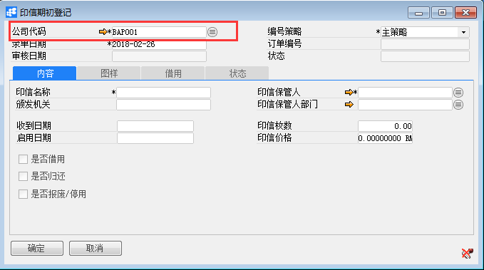

4. 输入印信名称；

   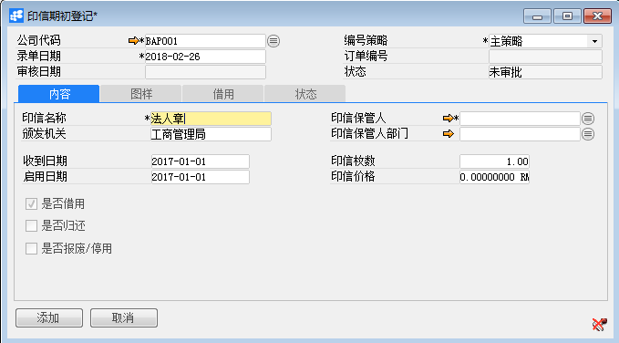

5. 选择印信保管人；

   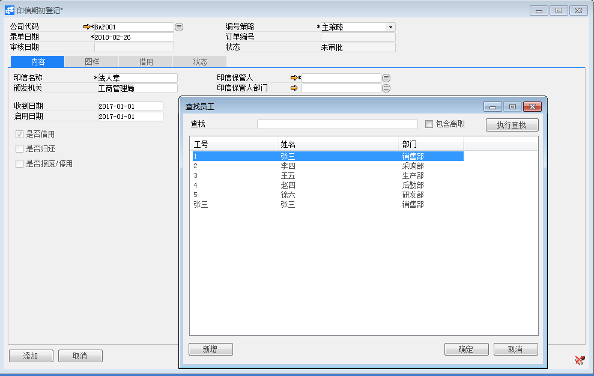

6. 信息确认无误后点击【添加】或工具栏的保存按钮，保存印信期初登记。

   | 提醒                                                         |
   | ------------------------------------------------------------ |
   | 系统未配置自动发起审批时，保存单据信息检查无误后需要点击工具栏的发起审批按钮，执行请求审批操作 。 |

###  修改印信期初登记

1. 从系统菜单->【后勤】->【印信管理】->【印信期初登记】，打开界面；
2. 点击工具栏的浏览按钮，查找要修改的印信期初登记；
3. 修改印信期初登记内容；
4. 点击【更改】或工具栏的保存按钮 保存，更改。

###  删除印信期初登记

1. 从系统菜单->【后勤】->【印信管理】->【印信期初登记】，打开界面；

2. 点击工具栏的浏览按钮，查找要删除的印信期初登记；

3. 点击工具栏的按钮，进行删除操作。

   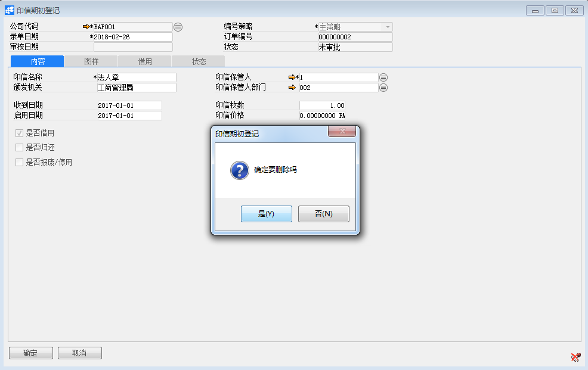

   注：已审批通过的印信期初登记不能进行删除操作。

###  属性与活动描述

####  内容选项卡

| **属性**       | **活动描述**                   |
| -------------- | ------------------------------ |
| 公司代码       | 选择公司代码                   |
| 录单日期       | 输入录单日期                   |
| 审核日期       | 显示审核日期                   |
| 编号策略       | 根据公司代码选择编号策略       |
| 订单编号       | 根据编号策略显示订单编号       |
| 状态           | 显示印信期初登记审核状态       |
| 印信名称       | 输入印信名称                   |
| 颁发机关       | 输入印信颁发机关               |
| 收到日期       | 输入印信收到日期               |
| 启用日期       | 输入印信启用日期               |
| 印信保管人     | 选择印信保管人                 |
| 印信保管人部门 | 选择印信保管人所属部门         |
| 印信枚数       | 输入印信枚数                   |
| 印信价格       | 输入印信价格                   |
| 是否借用       | 显示印信是否已借用，打勾表示是 |
| 是否归还       | 显示印信是否已归还，打勾表示是 |
| 是否报废/停用  | 显示印信是否已停用，打勾表示是 |

####  图样选项卡

| **属性** | **活动描述** |
| -------- | ------------ |
| 图样     | 选择印信图样 |

####  借用选项卡

| **属性**       | **活动描述**                   |
| -------------- | ------------------------------ |
| 借印人         | 显示借印人                     |
| 借印人部门     | 显示借印人部门                 |
| 借印日期       | 显示借印日期                   |
| 计划归还日期   | 显示计划归还日期               |
| 借用事由说明   | 显示借用事由说明               |
| 是否有书面清册 | 显示是否有书面清删，打勾表示有 |

####  状态选项卡

| **属性** | **活动描述**                   |
| -------- | ------------------------------ |
| 创建人   | 显示创建印信期初登记系统用户名 |
| 附注     | 输入印信期初登记附注信息       |

##  印信制作申请

###  功能解释

印信制作申请可以对需求的印信提出制作申请。

###  文章主旨

本文介绍如何通过BAP Nicer 5完成印信制作申请的新增、查找、修改及删除操作。

###  操作要求

当前登陆用户拥有操作后勤模块的权限，权限设置请在帮助文档中搜索查看。

###  新增印信制作申请

1. 从系统菜单->【后勤】->【印信管理】->【印信制作申请】，打开印信制作申请空白界面：

2. 点击工具栏新空白按钮准备新增印信制作申请；

3. 选择新增印信制作申请的公司代码；

   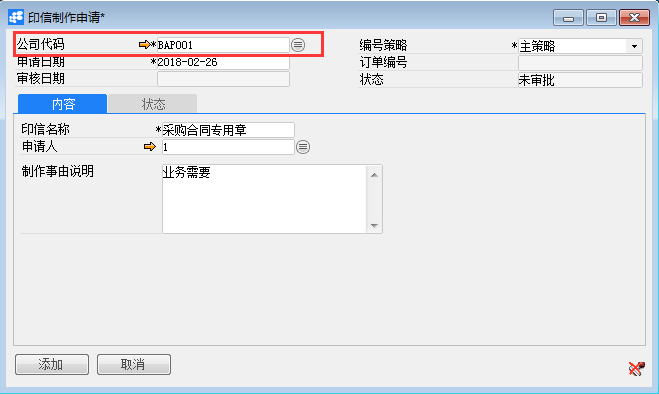

4. 输入印信名称；

   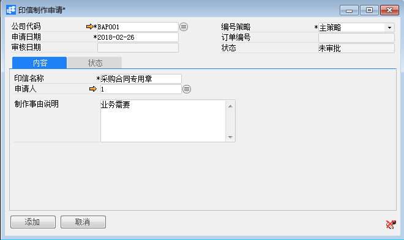

5. 选择印信制作申请人，填写制作事由说明；

   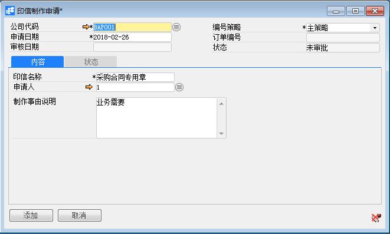

6. 信息确认无误后点击【添加】或工具栏的保存按钮，保存印信制作申请。

| 提醒                                                         |
| ------------------------------------------------------------ |
| 系统未配置自动发起审批时，保存单据信息检查无误后需要点击工具栏的发起审批按钮，执行请求审批操作 |

###  修改印信制作申请

1. 从系统菜单->【后勤】->【印信管理】->【印信制作申请】，打开界面；
2. 点击工具栏的浏览按钮，查找要修改的印信制作申请；
3. 修改印信制作申请内容；
4. 点击【更改】或工具栏的保存按钮 保存，更改。

###  删除印信制作申请

1. 从系统菜单->【后勤】->【印信管理】->【印信制作申请】，打开界面；

2. 点击工具栏的浏览按钮，查找要删除的印信制作申请；

3. 点击工具栏的 按钮，进行删除操作。

   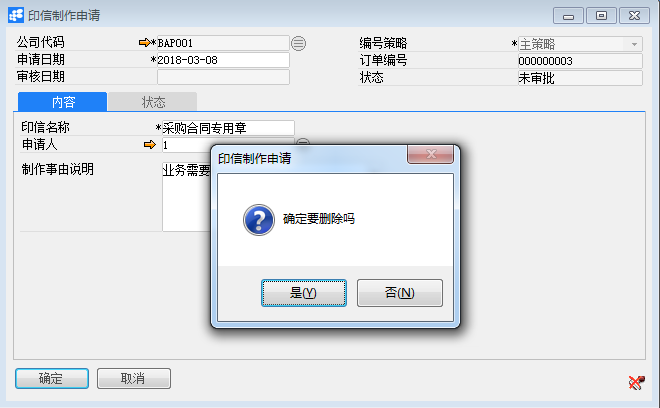

   注：已审批通过的印信制作申请不能进行删除操作。

###  属性与活动描述

####  内容选项卡

| **属性**     | **活动描述**             |
| ------------ | ------------------------ |
| 公司代码     | 选择公司代码             |
| 录单日期     | 输入录单日期             |
| 审核日期     | 显示审核日期             |
| 编号策略     | 根据公司代码选择编号策略 |
| 订单编号     | 根据编号策略显示订单编号 |
| 状态         | 显示印信期初登记审核状态 |
| 印信名称     | 输入印信名称             |
| 申请人       | 选择印信制作申请人       |
| 制作事由说明 | 选择制作事由说明         |

####  状态选项卡

| **属性** | **活动描述**                   |
| -------- | ------------------------------ |
| 创建人   | 显示创建印信制作申请系统用户名 |
| 附注     | 输入印信制作申请附注信息       |

##  印信登记

###  功能解释

可以对制作完成的印信进行登记录入系统，以方便管理。

###  文章主旨

本文介绍如何通过BAP Nicer 5完成印信登记的新增、查找、修改及删除操作。

###  操作要求

当前登陆用户拥有操作后勤模块的权限，权限设置请在帮助文档中搜索查看。

###  新增印信登记

1. 从系统菜单->【后勤】->【印信管理】->【印信登记】，打开印信登记空白界面：

2. 点击工具栏新空白按钮准备新增印信登记；

3. 选择新增印信登记的公司代码；

   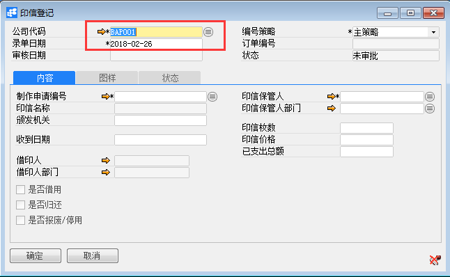

4. 选择制作申请编号；

   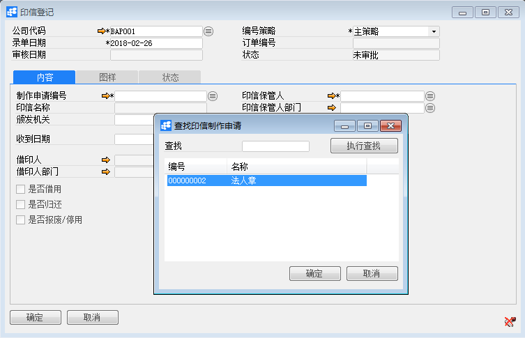

5. 选择印信保管人；

   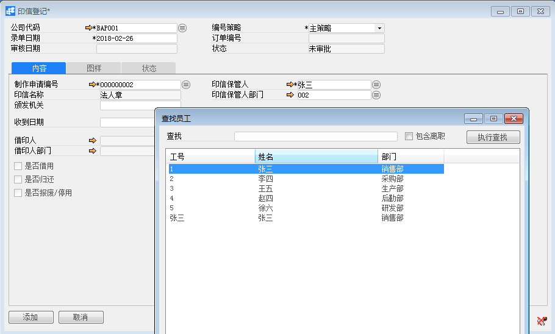

6. 信息确认无误后点击【添加】或工具栏的保存按钮，保存印信登记。

   | 提醒                                                         |
   | ------------------------------------------------------------ |
   | 系统未配置自动发起审批时，保存单据信息检查无误后需要点击工具栏的发起审批按钮，执行请求审批操作 。 |

###  修改印信登记

1. 从系统菜单->【后勤】->【印信管理】->【印信登记】，打开界面；
2. 点击工具栏的浏览按钮，查找要修改的印信登记；
3. 修改印信登记内容；
4. 点击【更改】或工具栏的保存按钮 保存，更改。

###  删除印信期初登记

1. 从系统菜单->【后勤】->【印信管理】->【印信登记】，打开界面；

2. 点击工具栏的浏览按钮，查找要删除的印信登记；

3. 点击工具栏的按钮，进行删除操作。

   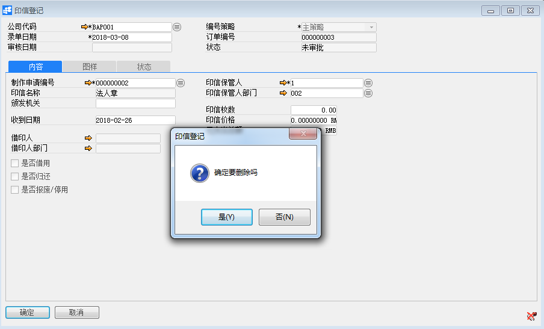

   注：已审批通过的印信登记不能进行删除操作。

###  属性与活动描述

####  印信登记主数据

| **属性** | **活动描述**             |
| -------- | ------------------------ |
| 公司代码 | 选择公司代码             |
| 录单日期 | 输入录单日期             |
| 审核日期 | 显示审核日期             |
| 编号策略 | 根据公司代码选择编号策略 |
| 订单编号 | 根据编号策略显示订单编号 |
| 状态     | 显示印信登记审核状态     |

####  内容选项卡

| **属性**       | **活动描述**                   |
| -------------- | ------------------------------ |
| 制作申请编号   | 选择制作申请编号               |
| 印信名称       | 根据制作申请编号显示印信名称   |
| 颁发机关       | 输入颁发机关                   |
| 收到日期       | 输入收到日期                   |
| 借印人         | 显示借印人                     |
| 借印人部门     | 显示借印人部门                 |
| 印信保管人     | 选择印信保管人                 |
| 印信保管人部门 | 选择印信保管人部门             |
| 印信枚数       | 输入印信枚数                   |
| 印信价格       | 输入印信价格                   |
| 已支出总额     | 输入已支出金额数               |
| 是否借用       | 显示印信是否已借用，打勾表示是 |
| 是否归还       | 显示印信是否已归还，打勾表示是 |
| 是否报废/停用  | 显示印信是否停用，打勾表示是   |

####  状态选项卡

| **属性** | **活动描述**               |
| -------- | -------------------------- |
| 创建人   | 显示创建印信登记系统用户名 |
| 附注     | 输入印信登记附注信息       |

##  印信借用

###  功能解释

印信借用是指是部分印信可于一段时间内借予相关人员使用，并由相关人员履行保管义务，并在规定的期限内归还给印信保管人。

###  文章主旨

本文介绍如何通过BAP Nicer 5完成印信借用的新增、查找、修改及删除操作。

###  操作要求

当前登陆用户拥有操作后勤模块的权限，权限设置请在帮助文档中搜索查看。

###  新增印信借用

1. 从系统菜单->【后勤】->【印信管理】->【印信借用】，打开印信借用空白界面：

2. 点击工具栏新空白按钮准备新增印信借用；

3. 选择印信登记编号、借印人；

   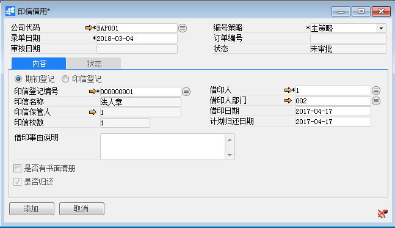

4. 信息确认无误后点击【添加】或工具栏的保存按钮，保存印信借用。

   | 提醒                                                         |
   | ------------------------------------------------------------ |
   | 系统未配置自动发起审批时，保存订单信息检查无误后需要点击工具栏的发起审批按钮，执行请求审批操作 |

   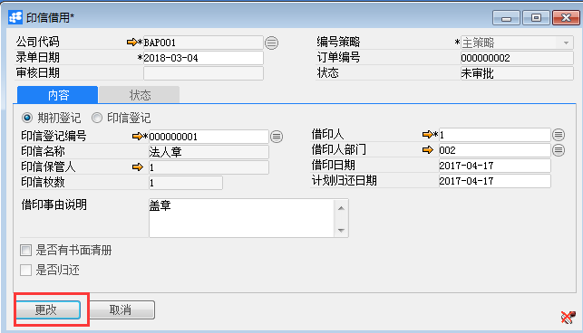

   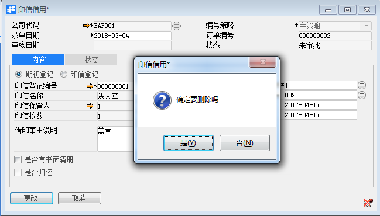

###  修改印信借用

1. 从系统菜单->【后勤】->【印信管理】->【印信借用】，打开界面；
2. 点击工具栏的浏览按钮，查找要修改的印信借用；
3. 修改印信借用内容；
4. 点击【更改】或工具栏的保存按钮 保存，更改。

###  删除印信借用

1. 从系统菜单->【后勤】->【印信管理】->【印信借用】，打开界面；

2. 点击工具栏的浏览按钮，查找要删除的印信借用；

3. 点击工具栏的 按钮，进行删除操作。

   

注：已审批通过的印信借用不能进行删除操作。

###  属性与活动描述

####  印信借用主数据

| **属性** | **活动描述**             |
| -------- | ------------------------ |
| 公司代码 | 选择公司代码             |
| 录单日期 | 输入录单日期             |
| 审核日期 | 显示审核日期             |
| 编号策略 | 根据公司代码选择编号策略 |
| 订单编号 | 根据编号策略显示订单编号 |
| 状态     | 显示印信借用审核状态     |

####  内容选项卡

| **属性**       | **活动描述**                                       |
| -------------- | -------------------------------------------------- |
| 期初登记       | 印信是否来源于印信期初登记                         |
| 印信登记       | 印信是否来源于印信登记                             |
| 印信登记编号   | 选择印信借用编号，根据期初登记或印信登记条件来选择 |
| 印信名称       | 根据印信登记编号显示印信名称                       |
| 借印保管人     | 根据印信登记编号借印保管人                         |
| 借印枚数       | 根据印信登记编号显示印信枚数                       |
| 借印人         | 选择借印人                                         |
| 借印人部门     | 选择借印人部门                                     |
| 借印日期       | 输入借印日期                                       |
| 计划归还日期   | 输入计划归还日期                                   |
| 借印事由说明   | 输入借印原因                                       |
| 是否有书面清册 | 选择印信借用是否有书面清册，打勾表示是             |
| 是否归还       | 显示印信借用出去是否已归还                         |

####  状态选项卡

| **属性** | **活动描述**               |
| -------- | -------------------------- |
| 创建人   | 显示创建印信使用系统用户名 |
| 附注     | 输入印信使用附注信息       |

##  印信归还

###  功能解释

可以对借用的印信的归还进行记录。

###  文章主旨

本文介绍如何通过BAP Nicer 5完成印信归还的新增、查找、修改及删除操作。

###  操作要求

当前登陆用户拥有操作后勤模块的权限，权限设置请在帮助文档中搜索查看。

###  新增印信归还

1. 从系统菜单->【后勤】->【印信管理】->【印信归还】，打开印信归还空白界面：

2. 点击工具栏新空白按钮准备新增印信归还；

3. 选择公司代码；

   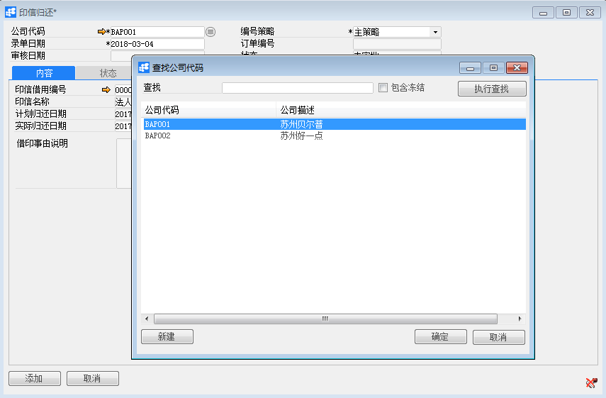

4. 选择印信借用编号；

   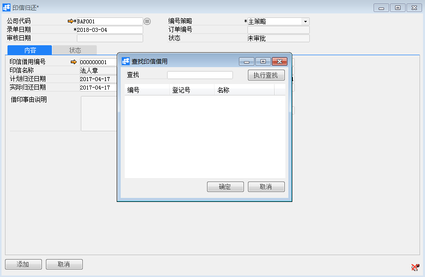

5. 信息确认无误后点击【添加】或工具栏的保存按钮，保存印信归还。

   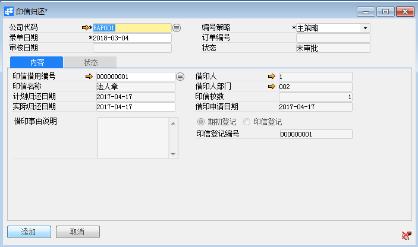

   | 提醒                                                         |
   | ------------------------------------------------------------ |
   | 系统未配置自动发起审批时，保存订单信息检查无误后需要点击工具栏的发起审批按钮，执行请求审批操作 |

###  修改印信归还

1. 从系统菜单->【后勤】->【印信管理】->【印信归还】，打开界面；
2. 点击工具栏的浏览按钮，查找要修改的印信归还；
3. 修改印信归还内容；
4. 点击【更改】或工具栏的保存按钮 保存，更改。

###  删除印信归还

1. 从系统菜单->【后勤】->【印信管理】->【印信归还】，打开界面；

2. 点击工具栏的浏览按钮，查找要删除的印信归还；

3. 点击工具栏的按钮，进行删除操作。

   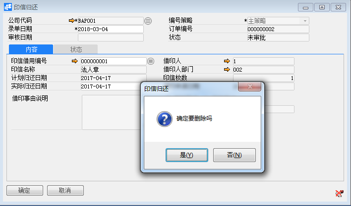

注：已审批通过的印信归还不能进行删除操作。

###  属性与活动描述

####  印信归还主数据

| **属性** | **活动描述**             |
| -------- | ------------------------ |
| 公司代码 | 选择公司代码             |
| 录单日期 | 输入录单日期             |
| 审核日期 | 显示审核日期             |
| 编号策略 | 根据公司代码选择编号策略 |
| 订单编号 | 根据编号策略显示订单编号 |
| 状态     | 显示印信归还审核状态     |

####  内容选项卡

| **属性**     | **活动描述**                                       |
| ------------ | -------------------------------------------------- |
| 印信借用编号 | 选择印信借用编号，根据期初登记或印信登记条件来选择 |
| 印信名称     | 根据印信登记编号显示印信名称                       |
| 借印保管人   | 根据印信登记编号借印保管人                         |
| 借印枚数     | 根据印信登记编号显示印信枚数                       |
| 借印人       | 选择借印人                                         |
| 借印人部门   | 选择借印人部门                                     |
| 借印日期     | 输入借印日期                                       |
| 计划归还日期 | 输入计划归还日期                                   |
| 实际归还日期 | 输入实际归还日期                                   |
| 借印事由说明 | 输入借印原因                                       |

####  状态选项卡

| **属性** | **活动描述**               |
| -------- | -------------------------- |
| 创建人   | 显示创建印信使用系统用户名 |
| 附注     | 输入印信使用附注信息       |

##  印信使用

###  功能解释

印信使用是指其部门需要使用印信时，需至相关的印信借用人处申请用印。

###  文章主旨

本文介绍如何通过BAP Nicer 5完成印信使用的新增、查找、修改及删除操作。

###  操作要求

当前登陆用户拥有操作后勤模块的权限，权限设置请在帮助文档中搜索查看。

###  新增印信使用

1. 从系统菜单->【后勤】->【印信管理】->【印信使用】，打开印信使用空白界面：

2. 点击工具栏新空白按钮准备新增印信使用；

3. 选择公司代码；

   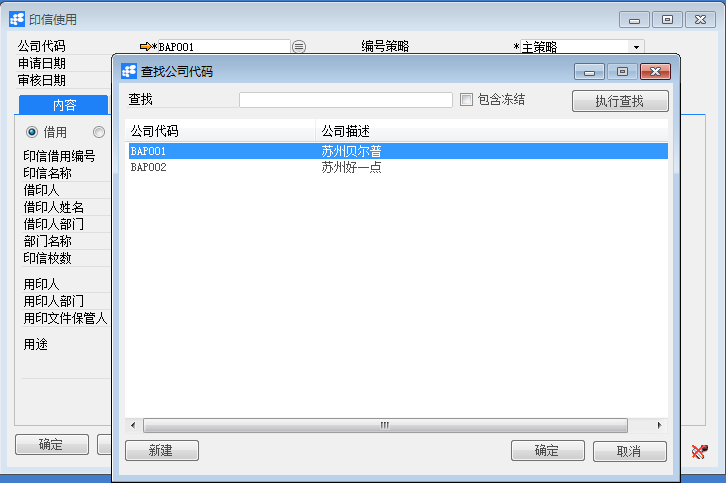

4. 选择印信借用编号；

   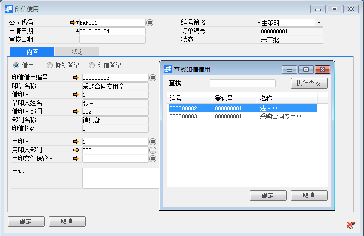

5. 信息确认无误后点击【添加】或工具栏的保存按钮，保存订单：

   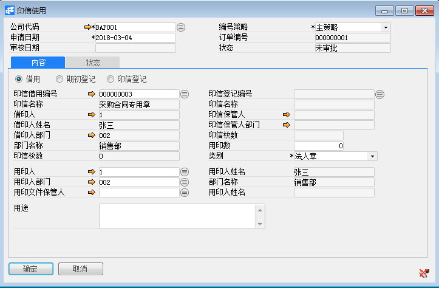

   | 提醒                                                         |
   | ------------------------------------------------------------ |
   | 系统未配置自动发起审批时，保存订单信息检查无误后需要点击工具栏的发起审批按钮，执行请求审批操作 |

###  修改印信期初登记

1. 从系统菜单->【后勤】->【印信管理】->【印信期初登记】，打开界面；
2. 点击工具栏的浏览按钮，查找要修改的印信期初登记；
3. 修改印信期初登记内容；
4. 点击【更改】或工具栏的保存按钮 保存，更改。

###  删除印信使用

1. 从系统菜单->【后勤】->【印信管理】->【印信使用】，打开界面；

2. 点击工具栏的浏览按钮 ，查找要删除的印信使用；

3. 点击工具栏的 按钮，进行删除操作。

   

   注：已审批通过的印信使用不能进行删除操作。

###  属性与活动描述

####  印信使用主数据

| **属性** | **活动描述**             |
| -------- | ------------------------ |
| 公司代码 | 选择公司代码             |
| 录单日期 | 输入录单日期             |
| 审核日期 | 显示审核日期             |
| 编号策略 | 根据公司代码选择编号策略 |
| 订单编号 | 根据编号策略显示订单编号 |
| 状态     | 显示印信使用审核状态     |

####  内容选项卡

| **属性**       | **活动描述**                                   |
| -------------- | ---------------------------------------------- |
| 借用           | 印信是否来源于印信借用                         |
| 期初登记       | 印信是否来源于印信期初登记                     |
| 印信登记       | 印信是否来源于印信登记                         |
| 印信借用编号   | 选择印信借用编号，借用选中才有效               |
| 印信名称       | 根据印信借用编号显示印信名称                   |
| 借印人         | 选择借印人                                     |
| 借印人部门     | 选择借印人部门                                 |
| 印信登记编号   | 选择印信登记编号，期初登记或印信登记选中才有效 |
| 印信保管人     | 选择印信保管人                                 |
| 印信保管人部门 | 选择印信保管人部门                             |
| 印信枚数       | 输入印信枚数                                   |
| 用印数         | 输入用印数量                                   |
| 类别           | 选择类别                                       |
| 用途           | 输入印信用途信息                               |

####  状态选项卡

| **属性** | **活动描述**               |
| -------- | -------------------------- |
| 创建人   | 显示创建印信使用系统用户名 |
| 附注     | 输入印信使用附注信息       |

##  印信移交

###  功能解释

可以对印信的保管人进行变更。

###  文章主旨

本文介绍如何通过BAP Nicer 5完成印信移交的新增、查找、修改及删除操作。

###  操作要求

当前登陆用户拥有操作后勤模块的权限，权限设置请在帮助文档中搜索查看。

###  新增印信移交

1. 从系统菜单->【后勤】->【印信管理】->【印信移交】，打开印信移交空白界面：

2. 点击工具栏新空白按钮准备新增印信移交；

3. 选择公司代码；

   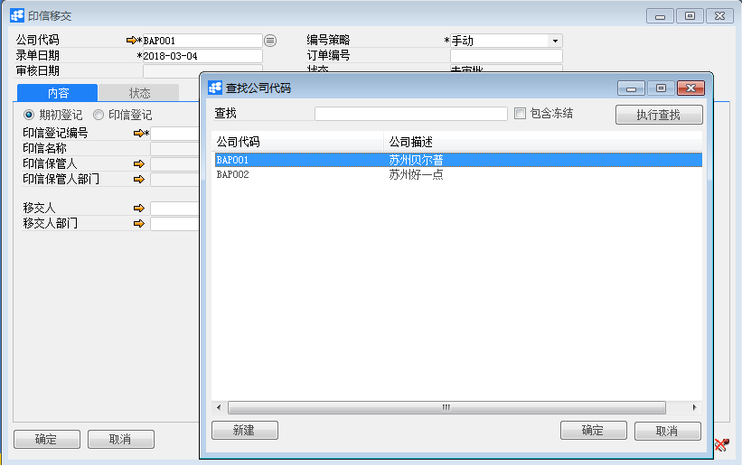

4. 选择印信登记编号：

   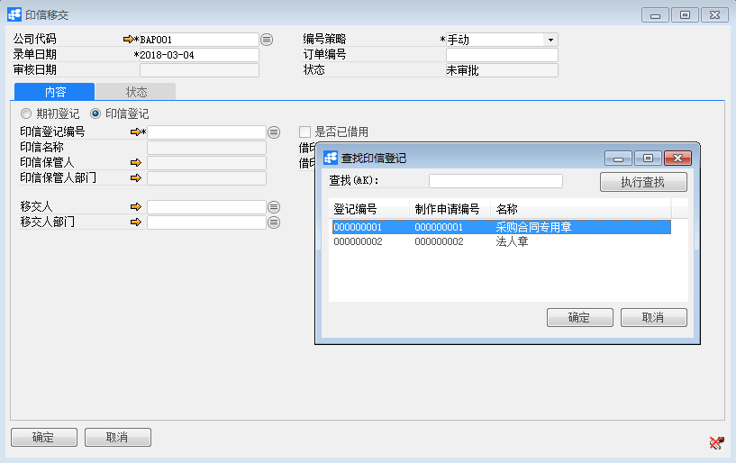

5. 信息确认无误后点击【添加】或工具栏的保存按钮，保存订单。

   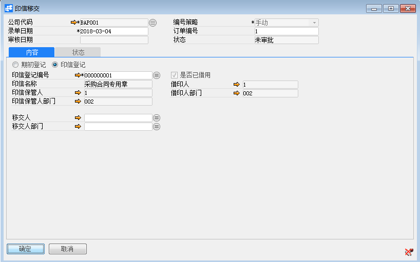

   | 提醒                                                         |
   | ------------------------------------------------------------ |
   | 系统未配置自动发起审批时，保存订单信息检查无误后需要点击工具栏的发起审批按钮，执行请求审批操作 |

###  修改印信移交

1. 从系统菜单->【后勤】->【印信管理】->【印信移交】，打开界面；
2. 点击工具栏的浏览按钮，查找要修改的印信移交；
3. 修改印信移交内容；
4. 点击【更改】或工具栏的保存按钮 保存，更改。

###  删除印信移交

1. 从系统菜单->【后勤】->【印信管理】->【印信移交】，打开界面；

2. 点击工具栏的浏览按钮，查找要删除的印信移交；

3. 点击工具栏的按钮，进行删除操作。

   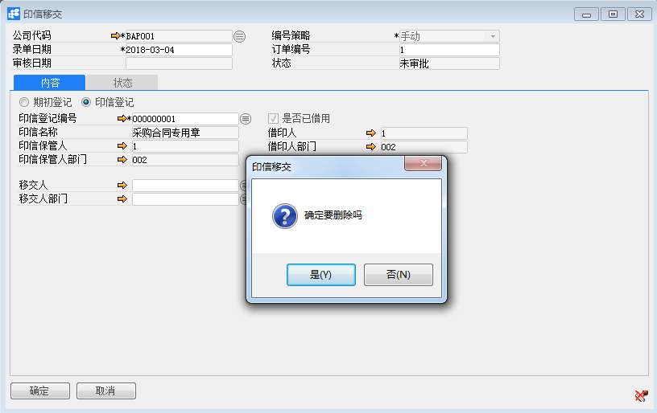

注：已审批通过的印信移交不能进行删除操作。

###  属性与活动描述

####  印信移交主数据

| **属性** | **活动描述**             |
| -------- | ------------------------ |
| 公司代码 | 选择公司代码             |
| 录单日期 | 输入录单日期             |
| 审核日期 | 显示审核日期             |
| 编号策略 | 根据公司代码选择编号策略 |
| 订单编号 | 根据编号策略显示订单编号 |
| 状态     | 显示印移交还审核状态     |

####  内容选项卡

| **属性**       | **活动描述**                       |
| -------------- | ---------------------------------- |
| 印信借用编号   | 选择印信借用编号                   |
| 期初登记       | 印信登记数据是否来源于期初登记     |
| 印信登记       | 印信登记数据是否来源于印信登记     |
| 印信登记编号   | 选择印信登记                       |
| 印信名称       | 根据印信登记编号显示印信名称       |
| 印信保管人     | 根据印信登记编号显示印信保管人     |
| 印信保管人部门 | 根据印信登记编号显示印信保管人部门 |
| 是否已借用     | 根据印信登记编号显示印信是否已借用 |
| 借印人         | 根据印信登记编号显示借印人         |
| 借印人部门     | 根据印信登记编号显示借印人部门     |
| 移交人         | 根据印信登记编号显示移交人         |
| 移交人部门     | 根据印信登记编号显示移交人部门     |

####  状态选项卡

| **属性** | **活动描述**               |
| -------- | -------------------------- |
| 创建人   | 显示创建印信移交系统用户名 |
| 附注     | 输入印信移交附注信息       |

##  印信报废/遗失/停用

###  功能解释

可以对印信报废/遗失/停用进行处理。

###  文章主旨

本文介绍如何通过BAP Nicer 5完成印信报废/遗失/停用的新增、查找、修改及删除操作。

###  操作要求

当前登陆用户拥有操作后勤模块的权限，权限设置请在帮助文档中搜索查看。

###  新增印信报废/遗失/停用

1. 从系统菜单->【后勤】->【印信管理】->【印信报废/遗失/停用】，打开印信报废/遗失/停用空白界面：

2. 点击工具栏新空白按钮准备新增印信报废/遗失/停用；

3. 选择印信登记编号；

   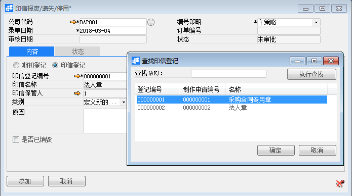

4. 选择类别；

   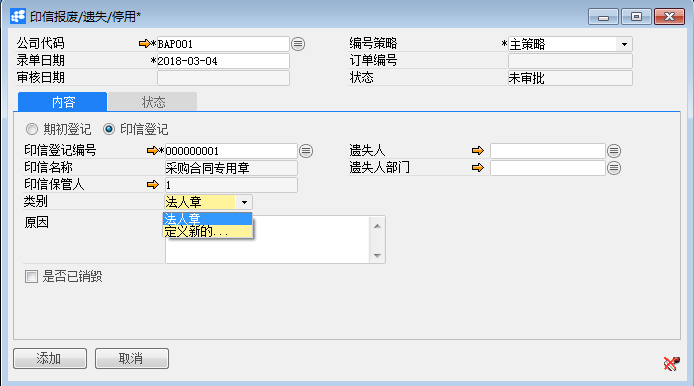

5. 填写原因；

   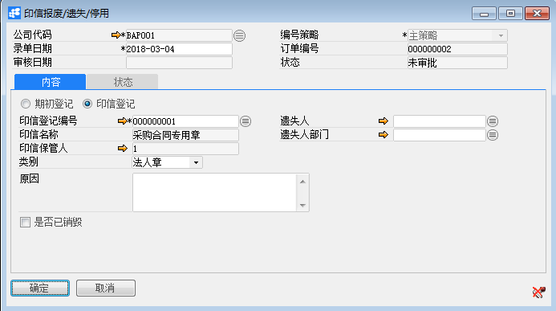

6. 信息确认无误后点击【添加】或工具栏的保存按钮，保存订单。

   | 提醒                                                         |
   | ------------------------------------------------------------ |
   | 系统未配置自动发起审批时，保存订单信息检查无误后需要点击工具栏的发起审批按钮，执行请求审批操作 |

###  修改印信报废/遗失/停用

1. 从系统菜单->【后勤】->【印信管理】->【印信报废/遗失/停用】，打开界面；
2. 点击工具栏的浏览按钮，查找要修改的印信报废/遗失/停用；
3. 修改印信报废/遗失/停用内容；
4. 点击【更改】或工具栏的保存按钮 保存，更改。

###  删除印信报废/遗失/停用

1. 从系统菜单->【后勤】->【印信管理】->【印信报废/遗失/停用】，打开界面；

2. 点击工具栏的浏览按钮，查找要删除的印信报废/遗失/停用；

3. 点击工具栏的按钮，进行删除操作。

   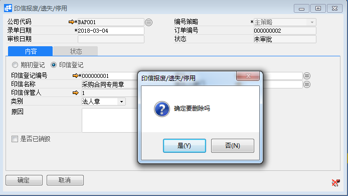

注：已审批通过的印信报废/遗失/停用不能进行删除操作。

###  属性与活动描述

####  印信报废/遗失/停用主数据

| **属性** | **活动描述**             |
| -------- | ------------------------ |
| 公司代码 | 选择公司代码             |
| 录单日期 | 输入录单日期             |
| 审核日期 | 显示审核日期             |
| 编号策略 | 根据公司代码选择编号策略 |
| 订单编号 | 根据编号策略显示订单编号 |
| 状态     | 显示印移交还审核状态     |

####  内容选项卡

| **属性**     | **活动描述**                   |
| ------------ | ------------------------------ |
| 期初登记     | 印信登记数据是否来源于期初登记 |
| 印信登记     | 印信登记数据是否来源于印信登记 |
| 印信登记编号 | 选择印信登记                   |
| 印信名称     | 根据印信登记编号显示印信名称   |
| 印信保管人   | 根据印信登记编号显示印信保管人 |
| 遗失人       | 选择遗失人                     |
| 遗失人部门   | 选择遗失人部门                 |
| 类别         | 选择类别                       |
| 原因         | 输入遗失原因                   |
| 是否已销毁   | 确定印信是否已销毁             |

####  状态选项卡

| **属性** | **活动描述**               |
| -------- | -------------------------- |
| 创建人   | 显示创建印信停用系统用户名 |
| 附注     | 输入印信停用附注信息       |

##  易耗品领用

###  功能解释

可以对易耗品的领用提出申请。

###  文章主旨

本文介绍如何通过BAP Nicer 5完成易耗品领用的新增、查找、修改及删除操作。

###  操作要求

当前登陆用户拥有操作后勤模块的权限，权限设置请在帮助文档中搜索查看。

###  新增易耗品领用

1. 从系统菜单->【后勤】->【易耗品领用】，打开易耗品领用空白界面：

2. 点击工具栏新空白按钮准备新增易耗品领用；

3. 选择部门；

   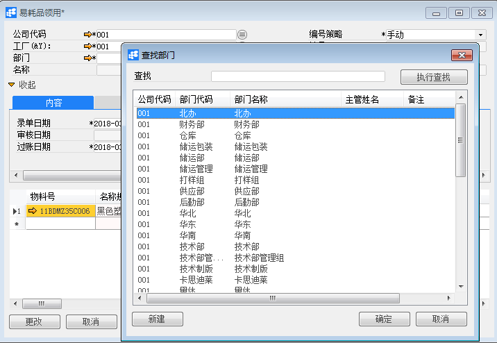

4. 选择物料号；

   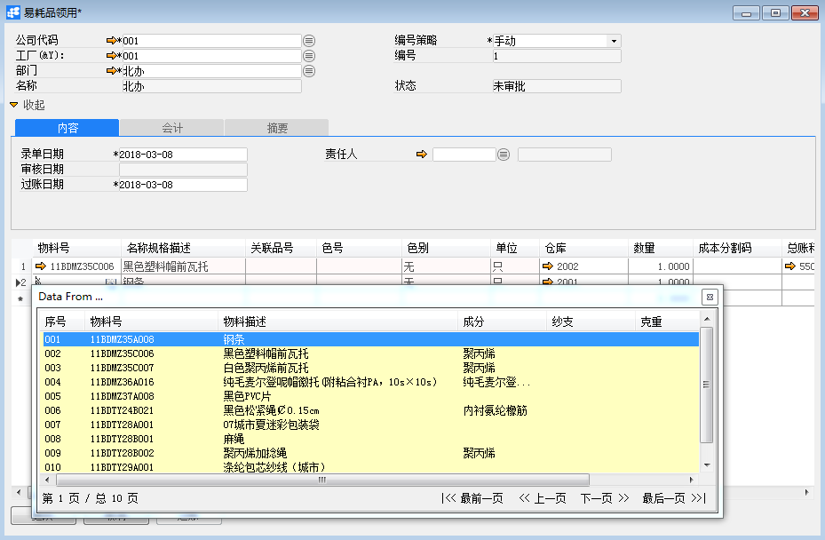

5. 填写数量；

   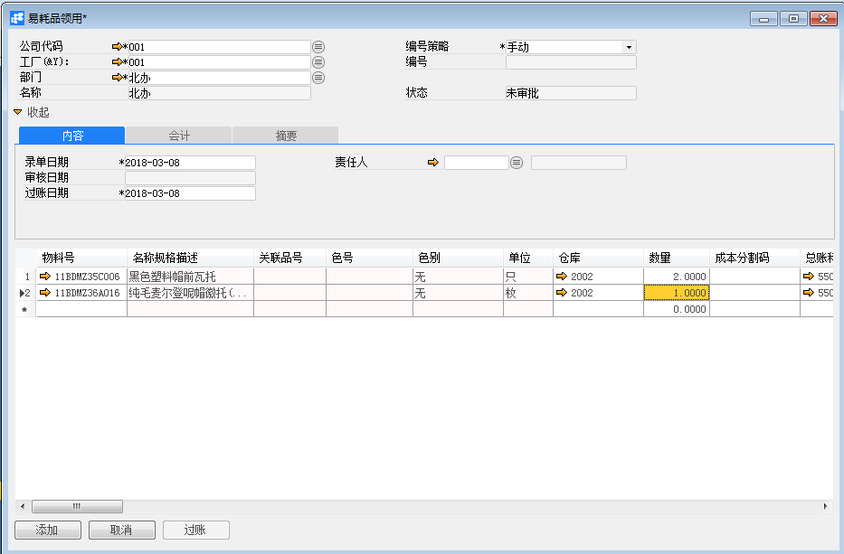

6. 信息确认无误后点击【添加】或工具栏的保存按钮，保存订单。

   | 提醒                                                         |
   | ------------------------------------------------------------ |
   | 系统未配置自动发起审批时，保存订单信息检查无误后需要点击工具栏的发起审批按钮，执行请求审批操作 |

7. 点击过账按钮；

   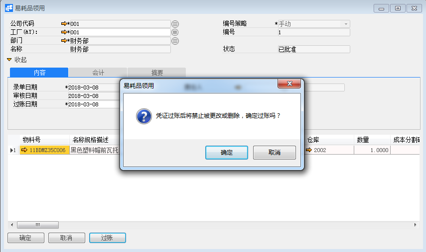

###  修改易耗品领用

1. 从系统菜单->【后勤】->【易耗品领用】，打开界面；
2. 点击工具栏的浏览按钮，查找要修改的易耗品领用；
3. 修改易耗品领用的内容；
4. 点击【更改】或工具栏的保存按钮保存，更改。

###  删除易耗品领用

1. 从系统菜单->【后勤】->【易耗品领用】，打开界面；

2. 点击工具栏的浏览按钮，查找要删除的易耗品领用；

3. 点击工具栏的按钮，进行删除操作。

   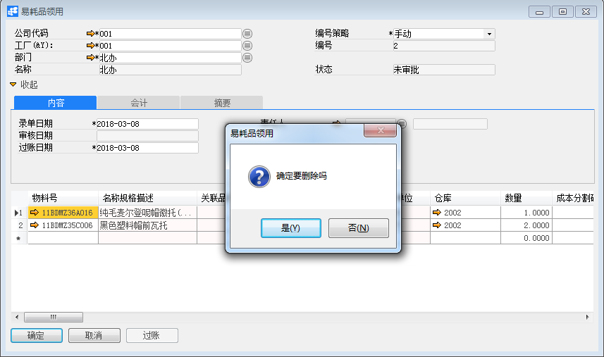

注：已审批通过的易耗品领用不能进行删除操作。

###  属性与活动描述

| **属性** | **活动描述**         |
| -------- | -------------------- |
| 公司代码 | 选择公司代码         |
| 部门     | 选择部门             |
| 名称     | 显示部门名称         |
| 责任人   | 选择易耗品领用责任人 |
| 编号策略 | 选择单据的编号策略   |
| 编号     | 显示凭证的编号       |
| 录单日期 | 输入录单日期         |
| 审核日期 | 显示审核日期         |
| 过账日期 | 输入凭证的过账日期   |
| 状态     | 显示凭证的状态       |
| 过账     | 点击将单据过账       |

####  内容

| **属性**     | **活动描述**                       |
| ------------ | ---------------------------------- |
| 物料号       | 选择领用的物料号                   |
| 名称规格描述 | 显示物料描述                       |
| 关联品号     | 显示物料的关联品号                 |
| 色号         | 显示物料的色号                     |
| 色别         | 显示物料的色别                     |
| 单位         | 显示物料的库存单位                 |
| 仓库         | 输入物料的领用仓库                 |
| 数量         | 输入物料的领用数量                 |
| 总账科目     | 选择易耗品领用财务账处理的费用科目 |
| 科目描述     | 显示科目描述                       |
| 项目         | 选择易耗品领用关联的项目           |
| 行状态       | 显示行状态                         |
| 长度         | 输入物料长度，是物料维度之一       |
| 宽度         | 输入物料宽度，是物料维度之一       |
| 高度         | 输入物料高度，是物料维度之一       |
| 重量         | 输入物料重量，是物料维度之一       |
| 特殊库存     | 输入特殊库存，是物料维度之一       |
| 特殊库存标识 | 输入特殊库存标识，是物料维度之一   |
| 体积         | 显示物料的体积                     |
| 体积单位     | 显示物料的体积单位                 |
| 特殊库存数   | 输入物料的特殊库存数               |
| 每库存数     | 显示物料的每库存数量               |
| 成本中心     | 成本对象之一，输入成本中心编号     |
| 内部订单     | 成本对象之一，输入内部订单编号     |
| 生产订单     | 成本对象之一，输入生产订单编号     |
| 销售订单     | 暂无配置                           |
| 销售订单行   | 暂无配置                           |
| WBS          | 成本对象之一，输入项目结构中的WBS  |
| 网络         | 成本对象之一，输入项目结构中的网络 |
| 维修订单     | 成本对象之一，输入维修订单编号     |
| 流程         | 暂无配置                           |
| 获利分析段   | 暂无配置                           |
| 资产         | 暂无配置                           |

####  会计

| **属性** | **活动描述**                                 |
| -------- | -------------------------------------------- |
| 凭证号   | 显示易耗品领用单据过账后产生的凭证号         |
| 控制     | 显示易耗品领用单据过账后产生的C0凭证号       |
| 凭证备注 | 显示易耗品领用单据过账后产生的凭证的凭证备注 |

####  摘要

| **属性** | **活动描述**     |
| -------- | ---------------- |
| 录单人   | 显示凭证的录单人 |
| 备注     | 输入备注信息     |

##  易耗品返回

###  功能解释

可以对返还的易耗品进行登记。

###  文章主旨

本文介绍如何通过BAP Nicer 5完成易耗品返回的新增、查找、修改及删除操作。

###  操作要求

当前登陆用户拥有操作后勤模块的权限，权限设置请在帮助文档中搜索查看。

###  新增易耗品返回

1. 从系统菜单->【后勤】->【易耗品返回】，打开易耗品返回空白界面：
2. 点击工具栏新空白按钮准备新增易耗品返回；

3. 选择部门；

   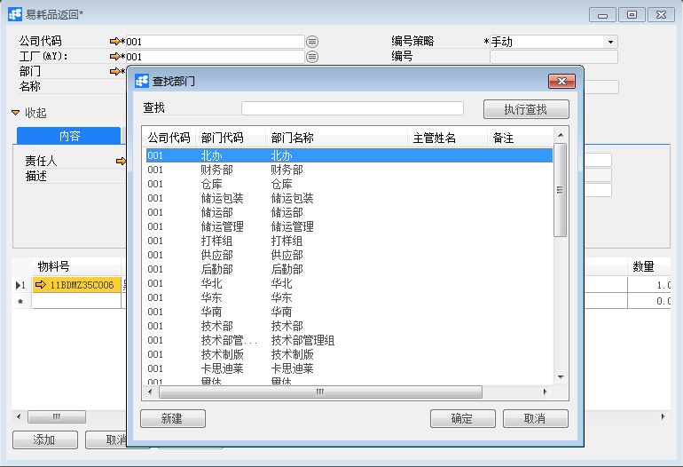

4.     选择物料号；

       

5.     填写数量；

       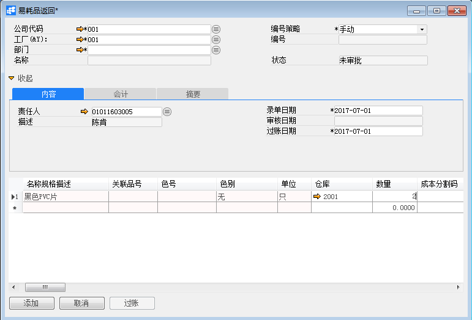

6.     信息确认无误后点击【添加】或工具栏的保存按钮，保存订单。

       | 提醒                                                         |
       | ------------------------------------------------------------ |
       | 系统未配置自动发起审批时，保存订单信息检查无误后需要点击工具栏的发起审批按钮，执行请求审批操作 |

###  修改易耗品返回

1. 从系统菜单->【后勤】->【易耗品返回】，打开界面；
2. 点击工具栏的浏览按钮，查找要修改的易耗品返回；
3. 修改易耗品返回的内容；
4. 点击【更改】或工具栏的保存按钮保存，更改。

###  删除易耗品返回

1. 从系统菜单->【后勤】->【易耗品返回】，打开界面；

2. 点击工具栏的浏览按钮，查找要删除的易耗品返回；

3. 点击工具栏的按钮，进行删除操作。

   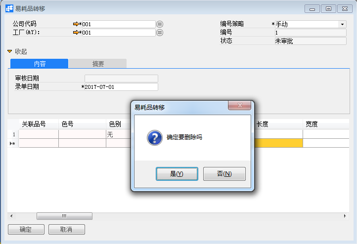

注：已审批通过的易耗品返回不能进行删除操作。

###  属性与活动描述

| **属性** | **活动描述**       |
| -------- | ------------------ |
| 公司代码 | 选择公司代码       |
| 部门     | 选择部门           |
| 名称     | 显示部门名称       |
| 责任人   | 选择责任人         |
| 编号策略 | 选择单据的编略     |
| 编号     | 显示凭证的编号     |
| 录单日期 | 输入录单日期       |
| 审核日期 | 显示审核日期       |
| 过账日期 | 输入凭证的过账日期 |
| 状态     | 显示凭证的状态     |
| 过账     | 点击将单据过账     |

####  内容

| **属性**     | **活动描述**                       |
| ------------ | ---------------------------------- |
| 物料号       | 选择返回的物料号                   |
| 名称规格描述 | 显示物料描述                       |
| 关联品号     | 显示物料的关联品号                 |
| 色号         | 显示物料的色号                     |
| 色别         | 显示物料的色别                     |
| 单位         | 显示物料的库存单位                 |
| 仓库         | 输入物料的返回仓库                 |
| 数量         | 输入物料的返回数量                 |
| 总账科目     | 选择易耗品返回财务账处理的总账科目 |
| 科目描述     | 显示科目描述                       |
| 项目         | 选择易耗品返回关联的项目           |
| 行状态       | 显示行状态                         |
| 长度         | 输入物料长度，是物料维度之一       |
| 宽度         | 输入物料宽度，是物料维度之一       |
| 高度         | 输入物料高度，是物料维度之一       |
| 重量         | 输入物料重量，是物料维度之一       |
| 特殊库存     | 输入特殊库存，是物料维度之一       |
| 特殊库存标识 | 输入特殊库存标识，是物料维度之一   |
| 体积         | 显示物料的体积                     |
| 体积单位     | 显示物料的体积单位                 |
| 特殊库存数   | 输入物料的特殊库存数               |
| 每库存数     | 显示物料的每库存数量               |
| 成本中心     | 成本对象之一，输入成本中心编号     |
| 内部订单     | 成本对象之一，输入内部订单编号     |
| 生产订单     | 成本对象之一，输入生产订单编号     |
| 销售订单     | 暂无配置                           |
| 销售订单行   | 暂无配置                           |
| WBS          | 成本对象之一，输入项目结构中的WBS  |
| 网络         | 成本对象之一，输入项目结构中的网络 |
| 维修订单     | 成本对象之一，输入维修订单编号     |
| 流程         | 暂无配置                           |
| 获利分析段   | 暂无配置                           |
| 资产         | 暂无配置                           |

####  会计

| **属性** | **活动描述**                                 |
| -------- | -------------------------------------------- |
| 凭证号   | 显示易耗品返回单据过账后产生的凭证号         |
| 控制     | 显示易耗品返回单据过账后产生的C0凭证号       |
| 凭证备注 | 显示易耗品返回单据过账后产生的凭证的凭证备注 |

####  摘要

| **属性** | **活动描述**     |
| -------- | ---------------- |
| 录单人   | 显示凭证的录单人 |
| 备注     | 输入备注信息     |

##  易耗品转移

###  功能解释

可以对易耗品所在的部门或仓库进行转移。

###  文章主旨

本文介绍如何通过BAP Nicer 5完成易耗品转移的新增、查找、修改及删除操作。

###  操作要求

当前登陆用户拥有操作后勤模块的权限，权限设置请在帮助文档中搜索查看。

###  新增易耗品转移

1. 从系统菜单->【后勤】->【易耗品转移】，打开易耗品转移空白界面：

2. 点击工具栏新空白按钮准备新增易耗品转移；

3. 选择公司代码；

   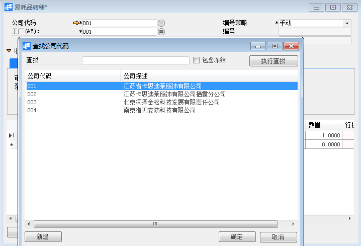

4. 选择物料号；

   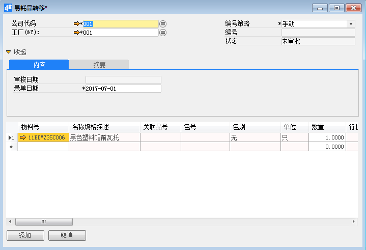

5. 填写数量；

   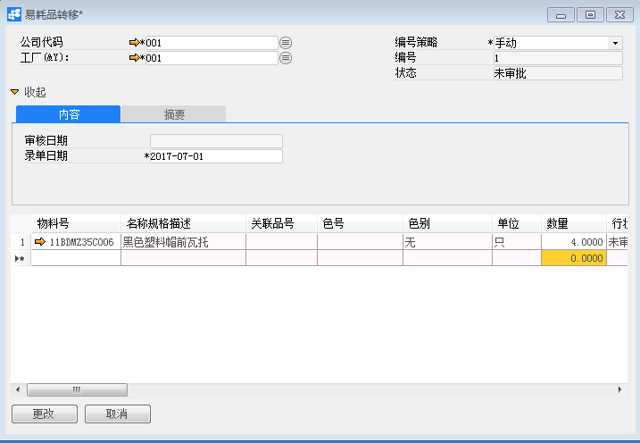

6. 信息确认无误后点击【添加】或工具栏的保存按钮，保存订单。

   | 提醒                                                         |
   | ------------------------------------------------------------ |
   | 系统未配置自动发起审批时，保存订单信息检查无误后需要点击工具栏的发起审批按钮，执行请求审批操作 |

###  修改易耗品转移

1. 从系统菜单->【后勤】->【易耗品转移】，打开界面；
2. 点击工具栏的浏览按钮，查找要修改的易耗品转移；
3. 修改易耗品转移的内容；
4. 点击【更改】或工具栏的保存按钮保存，更改。

###  删除易耗品转移

1. 从系统菜单->【后勤】->【易耗品转移】，打开界面；

2. 点击工具栏的浏览按钮，查找要删除的易耗品转移；

3. 点击工具栏的按钮，进行删除操作。

   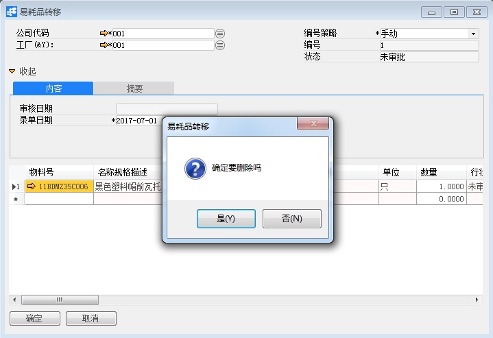

注：已审批通过的易耗品转移不能进行删除操作。

###  属性与活动描述

| **属性** | **活动描述**       |
| -------- | ------------------ |
| 公司代码 | 选择公司代码       |
| 部门     | 选择部门           |
| 名称     | 显示部门名称       |
| 编号策略 | 选择单据的编号策略 |
| 编号     | 显示凭证的编号     |
| 录单日期 | 输入录单日期       |
| 审核日期 | 显示审核日期       |
| 状态     | 显示凭证的状态     |

####  内容

| **属性**     | **活动描述**                       |
| ------------ | ---------------------------------- |
| 物料号       | 选择领用的物料号                   |
| 名称规格描述 | 显示物料描述                       |
| 关联品号     | 显示物料的关联品号                 |
| 色号         | 显示物料的色号                     |
| 色别         | 显示物料的色别                     |
| 单位         | 显示物料的库存单位                 |
| 仓库         | 输入物料的领用仓库                 |
| 数量         | 输入物料的领用数量                 |
| 总账科目     | 选择易耗品领用财务账处理的费用科目 |
| 科目描述     | 显示科目描述                       |
| 项目         | 选择易耗品领用关联的项目           |
| 行状态       | 显示行状态                         |
| 长度         | 输入物料长度，是物料维度之一       |
| 宽度         | 输入物料宽度，是物料维度之一       |
| 高度         | 输入物料高度，是物料维度之一       |
| 重量         | 输入物料重量，是物料维度之一       |
| 特殊库存     | 输入特殊库存，是物料维度之一       |
| 特殊库存标识 | 输入特殊库存标识，是物料维度之一   |
| 体积         | 显示物料的体积                     |
| 体积单位     | 显示物料的体积单位                 |
| 特殊库存数   | 输入物料的特殊库存数               |
| 每库存数     | 显示物料的每库存数量               |
| 成本中心     | 成本对象之一，输入成本中心编号     |
| 内部订单     | 成本对象之一，输入内部订单编号     |
| 生产订单     | 成本对象之一，输入生产订单编号     |
| 销售订单     | 暂无配置                           |
| 销售订单行   | 暂无配置                           |
| WBS          | 成本对象之一，输入项目结构中的WBS  |
| 网络         | 成本对象之一，输入项目结构中的网络 |
| 维修订单     | 成本对象之一，输入维修订单编号     |
| 流程         | 暂无配置                           |
| 获利分析段   | 暂无配置                           |
| 资产         | 暂无配置                           |

####  摘要

| **属性** | **活动描述**     |
| -------- | ---------------- |
| 录单人   | 显示凭证的录单人 |
| 备注     | 输入备注信息     |

##  车辆申请单

###  功能解释

可以对交通工具、车辆使用进行登记管理。

###  文章主旨

本文介绍如何通过BAP Nicer 5完成车辆申请单的新增、查找、修改及删除操作。

###  操作要求

当前登陆用户拥有操作后勤模块的权限，权限设置请在帮助文档中搜索查看。

###  新增车辆申请单

1. 从系统菜单->【后勤】->【车辆申请单】，打开车辆申请单空白界面：

2. 点击工具栏新空白按钮 准备新增车辆申请单；

3. 选择部门；

   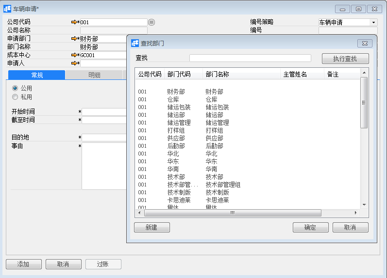

4. 选择申请人；

   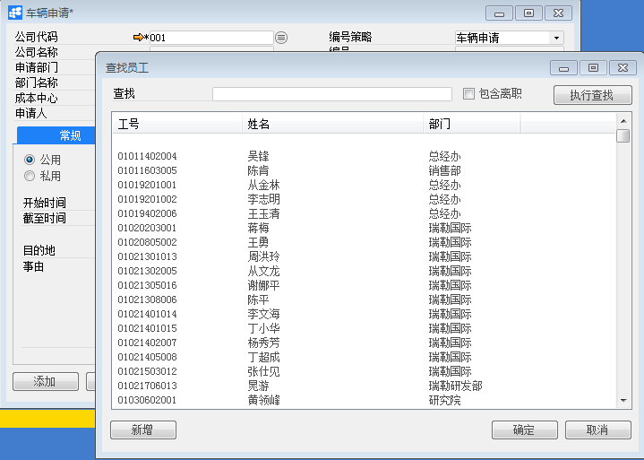

5. 填写开始时间、截止时间、目的地、事由;

   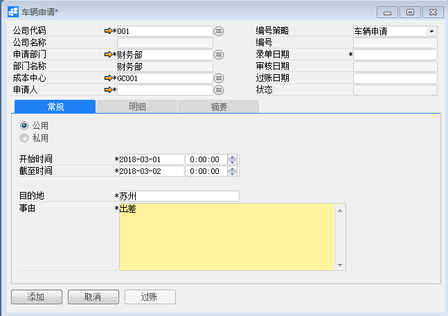

6. 信息确认无误后点击【添加】或工具栏的保存按钮，保存订单。

   | 提醒                                                         |
   | ------------------------------------------------------------ |
   | 系统未配置自动发起审批时，保存订单信息检查无误后需要点击工具栏的发起审批按钮，执行请求审批操作 |

###  修改车辆申请单

1. 从系统菜单->【后勤】->【车辆申请单】，打开界面；
2. 点击工具栏的浏览按钮，查找要修改的车辆申请单；
3. 修改车辆申请单的内容；
4. 点击【更改】或工具栏的保存按钮保存，更改。

###  删除车辆申请单

1. 从系统菜单->【后勤】->【车辆申请单】，打开界面；

2. 点击工具栏的浏览按钮，查找要删除的车辆申请单；

3. 点击工具栏的按钮，进行删除操作。

   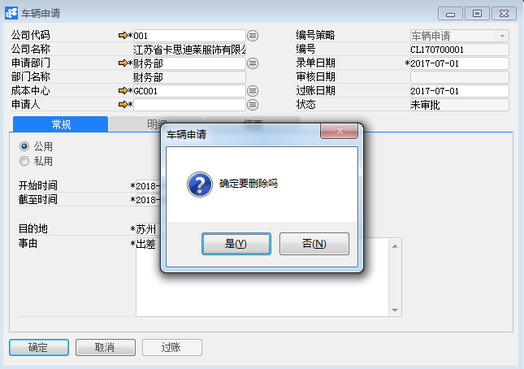

注：已审批通过的车辆申请单不能进行删除操作。

###  属性与活动描述

| **属性** | **活动描述**       |
| -------- | ------------------ |
| 公司代码 | 选择公司代码       |
| 公司名称 | 显示公司名称       |
| 申请部门 | 选择申请部门       |
| 部门名称 | 显示申请部门名称   |
| 成本中心 | 选择对应的成本中心 |
| 申请人   | 选择申请人         |
| 编号策略 | 选择单据的编号策略 |
| 编号     | 显示凭证的编号     |
| 录单日期 | 输入录单日期       |
| 审核日期 | 显示审核日期       |
| 过账日期 | 输入凭证的过账日期 |
| 状态     | 显示凭证的状态     |
| 过账     | 点击将单据过账     |

####  常规

| **属性** | **活动描述**       |
| -------- | ------------------ |
| 公用     | 选择用车性质为公用 |
| 私用     | 选择用车性质为私用 |
| 开始时间 | 输入开始用车时间   |
| 截至时间 | 输入截至用车时间   |
| 目的地   | 输入目的地         |
| 事由     | 输入用车事由       |

####  明细

| **属性**   | **活动描述**             |
| ---------- | ------------------------ |
| 车牌号     | 输入车牌号               |
| 驾驶员     | 选择车辆驾驶员           |
| 统计指标   | 选择统计指标             |
| 实际里程数 | 输入车辆使用的实际公里数 |

####  摘要

| **属性** | **活动描述**     |
| -------- | ---------------- |
| 录单人   | 显示凭证的录单人 |
| 备注     | 输入备注信息     |

##  费用申请

###  功能解释

费用申请是指员工、往来单位对企业进行资金借用申请或预支现金的功能。

###  文章主旨

本文介绍如何通过BAP Nicer 5完成费用申请的新增、查找、修改及删除操作。

###  操作要求

当前登陆用户拥有操作后勤模块的权限，权限设置请在帮助文档中搜索查看。

###  新增费用申请

1. 从系统菜单->【后勤】->【费用申请】，打开费用申请空白界面：

2. 点击工具栏新空白按钮准备新增费用申请；

3. 选择申请部门；

   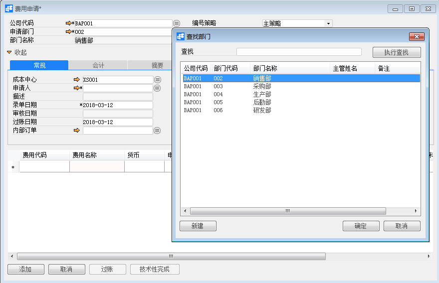

4. 选择申请人；

   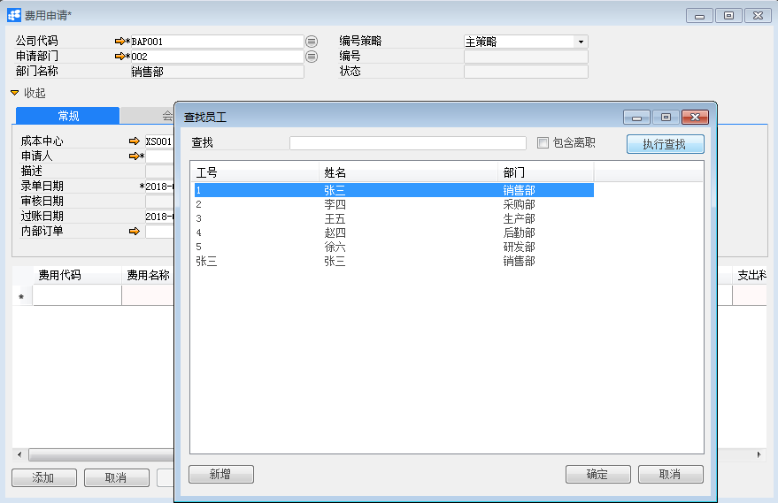

5. 选择费用代码，填写申请金额，用途等：

   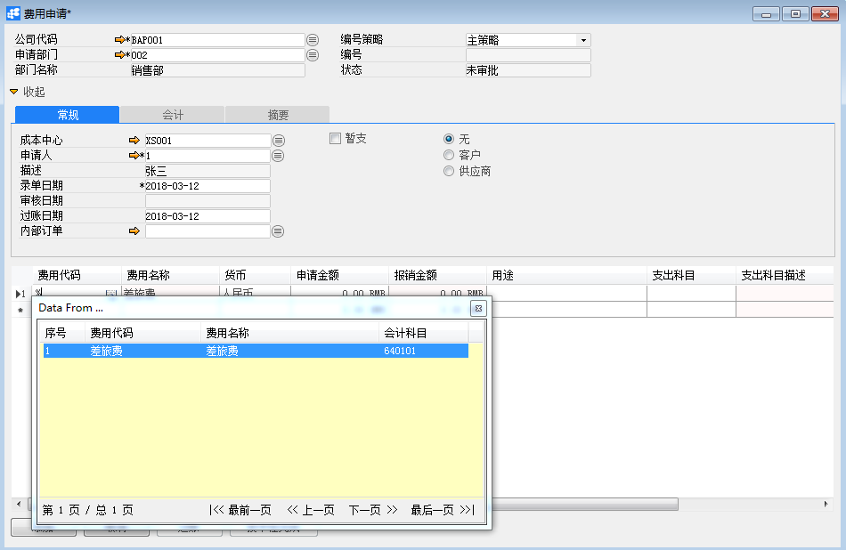

6. 信息确认无误后点击【添加】或工具栏的保存按钮，保存订单。

| 提醒                                                         |
| ------------------------------------------------------------ |
| 系统未配置自动发起审批时，保存订单信息检查无误后需要点击工具栏的发起审批按钮，执行请求审批操作 |

###  修改费用申请

1. 从系统菜单->【后勤】->【费用申请】，打开界面；
2. 点击工具栏的浏览按钮，查找要修改的费用申请；
3. 修改费用申请内容；
4. 点击【更改】或工具栏的保存按钮保存，更改。

###  删除费用申请

1. 从系统菜单->【后勤】->【费用申请】，打开界面；

2. 点击工具栏的浏览按钮，查找要删除的费用申请；

3. 点击工具栏的按钮，进行删除操作。

   

###  属性与活动描述

| **属性** | **活动描述**       |
| -------- | ------------------ |
| 公司代码 | 选择公司代码       |
| 部门     | 选择部门           |
| 部门名称 | 显示部门名称       |
| 成本中心 | 选择成本中心代码   |
| 申请人   | 选择费用申请人     |
| 内部订单 | 选择内部订单       |
| 编号策略 | 选择单据的编号策略 |
| 编号     | 显示凭证的编号     |
| 录单日期 | 输入录单日期       |
| 审核日期 | 显示审核日期       |
| 过账日期 | 输入凭证的过账日期 |
| 状态     | 显示凭证的状态     |
| 暂支     | 选择是否为暂支申请 |
| 过账     | 点击将单据过账     |

####  常规

| **属性**     | **活动描述**                         |
| ------------ | ------------------------------------ |
| 费用代码     | 选择费用申请代码                     |
| 费用名称     | 显示费用名称                         |
| 货币         | 选择货币                             |
| 申请金额     | 输入申请金额                         |
| 报销金额     | 现在已报销归还金额                   |
| 余额         | 显示未报销归还金额                   |
| 用途         | 输入申请用途                         |
| 支出科目     | 输入费用申请支出科目，仅暂支申请有效 |
| 支出科目描述 | 显示支出科目描述                     |
| 报销单       | 显示费用报销归还暂支单号             |
| 报销人姓名   | 显示报销人姓名                       |
| 归还时间     | 输入申请金额归还时间                 |
| 项目         | 显示申请关联的项目                   |

####  会计

| **属性** | **活动描述**                               |
| -------- | ------------------------------------------ |
| 凭证号   | 显示费用申请单据过账后产生的凭证号         |
| 控制     | 显示费用申请单据过账后产生的C0凭证号       |
| 凭证备注 | 显示费用申请单据过账后产生的凭证的凭证备注 |

####  摘要

| **属性** | **活动描述**     |
| -------- | ---------------- |
| 录单人   | 显示单据的录单人 |
| 备注     | 输入备注信息     |

##  费用报销

###  功能解释

费用报销是对员工或往来单位的费用申请进行报销的功能。

如果是暂支类的费用申请，则费用报销可以基于费用申请进行报销。

###  文章主旨

本文介绍如何通过BAP Nicer 5完成费用报销的新增、查找、修改及删除操作。

###  操作要求

当前登陆用户拥有操作后勤模块的权限，权限设置请在帮助文档中搜索查看。

###  新增费用报销

1. 从系统菜单->【后勤】->【费用报销】，打开费用报销空白界面：

2. 点击工具栏新空白按钮准备新增费用报销；

3. 选择部门；

   

4. 选择报销人；

   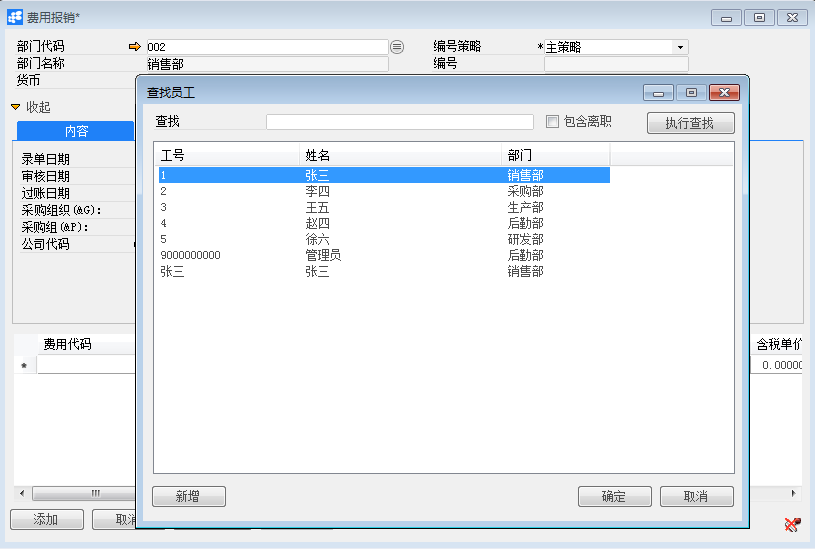

5. 选择费用代码、金额；

   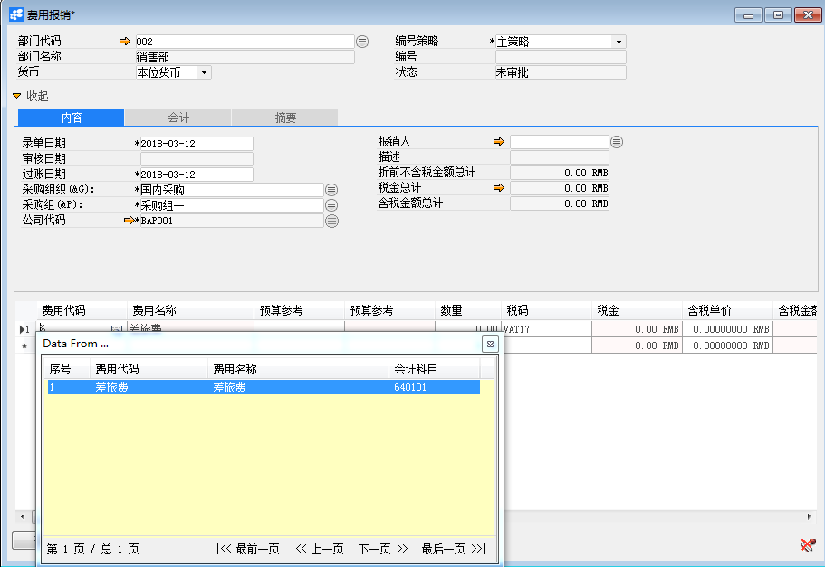

6. 信息确认无误后点击【添加】或工具栏的保存按钮，保存订单。

   | 提醒                                                         |
   | ------------------------------------------------------------ |
   | 系统未配置自动发起审批时，保存订单信息检查无误后需要点击工具栏的发起审批按钮，执行请求审批操作 |

###  修改费用报销

1. 从系统菜单->【后勤】->【费用报销】，打开界面；
2. 点击工具栏的浏览按钮，查找要修改的费用报销；
3. 修改费用报销的内容；
4. 点击【更改】或工具栏的保存按钮保存，更改。

###  删除费用报销

1. 从系统菜单->【后勤】->【费用报销】，打开界面；

2. 点击工具栏的浏览按钮，查找要删除的费用报销；

3. 点击工具栏的按钮，进行删除操作。

   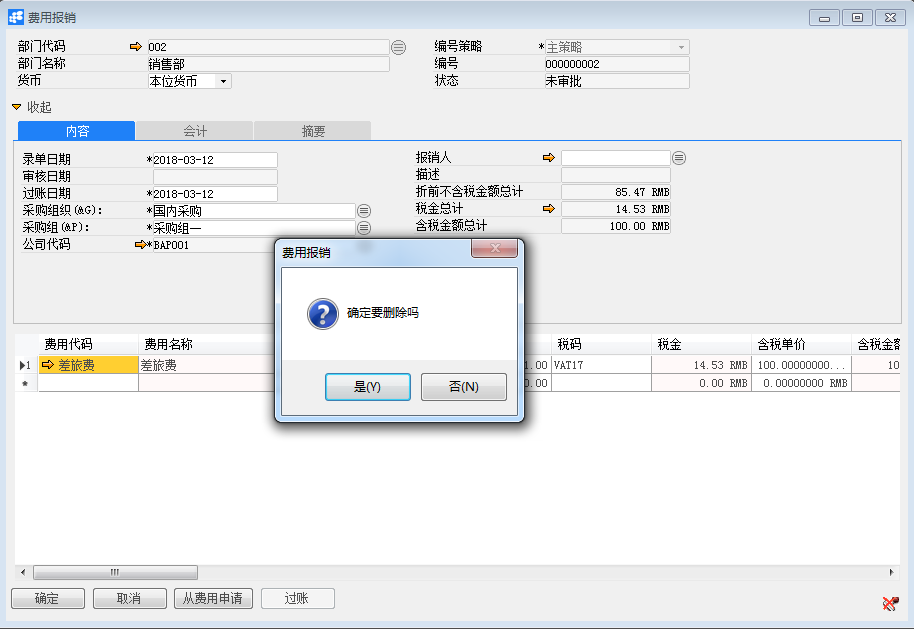

###  属性与活动描述

| **属性**         | **活动描述**         |
| ---------------- | -------------------- |
| 公司代码         | 选择公司代码         |
| 部门代码         | 选择部门             |
| 部门名称         | 显示部门名称         |
| 报销人           | 现在费用报销人       |
| 货币             | 选择货币             |
| 编号策略         | 选择单据的编号策略   |
| 编号             | 显示凭证的编号       |
| 录单日期         | 输入录单日期         |
| 审核日期         | 显示审核日期         |
| 过账日期         | 输入凭证的过账日期   |
| 状态             | 显示凭证的状态       |
| 采购组织         | 显示采购组织         |
| 采购组           | 选择采购组           |
| 折扣、金额总计等 | 暂无配置使用         |
| 过账             | 点击将单据过账       |
| 撤审             | 点击将已批准单据撤审 |
| 从费用申请       | 点击选择费用申请单   |

####  常规

| **属性**     | **活动描述**                             |
| ------------ | ---------------------------------------- |
| 费用代码     | 选择费用代码                             |
| 费用名称     | 显示费用名称                             |
| 预算参考     | 选择预算参考                             |
| 预算参考     | 显示预算参考                             |
| 数量         | 输入数量                                 |
| 不含税单价   | 输入不含税单价                           |
| 税码         | 选择税码                                 |
| 税金         | 显示税金                                 |
| 含税单价     | 输入含税单价                             |
| 含税金额     | 显示含税金额                             |
| 项目         | 输入关联项目                             |
| 备注1、2     | 输入备注信息                             |
| 分配         | 显示报销金额，点击超链接进行费用科目分配 |
| 支出科目     | 输入或显示费用科目                       |
| 支出科目描述 | 显示科目描述                             |
| 全部归还     | 勾选表示全部归还暂支，部分归还不勾选     |
| 原凭证号     | 来源暂支申请单号，可链接查看明细         |
| 来源单号     | 来源费用申请单号，不为暂支申请           |
| 备注摘要     | 输入备注信息                             |
| 成本中心     | 成本对象之一，输入成本中心编号           |
| 内部订单     | 成本对象之一，输入内部订单编号           |
| 生产订单     | 成本对象之一，输入生产订单编号           |
| 销售订单     | 暂无配置                                 |
| 销售订单行   | 暂无配置                                 |
| WBS          | 成本对象之一，输入项目结构中的WBS        |
| 网络         | 成本对象之一，输入项目结构中的网络。     |
| 维修订单     | 成本对象之一，输入维修订单编号。         |
| 流程         | 暂无配置                                 |
| 获利分析段   | 暂无配置                                 |
| 资产         | 暂无配置                                 |

####  会计

| **属性**           | **活动描述**                               |
| ------------------ | ------------------------------------------ |
| 凭证号             | 显示费用申请单据过账后产生的凭证号         |
| 控制               | 显示费用申请单据过账后产生的C0凭证号       |
| 凭证备注           | 显示费用申请单据过账后产生的凭证的凭证备注 |
| 付款冻结、冻结备注 | 暂无配置                                   |

####  摘要

| **属性** | **活动描述**     |
| -------- | ---------------- |
| 录单人   | 显示单据的录单人 |
| 备注     | 输入备注信息     |

##  纠错单

###  功能解释

在企业管理中，持续改进是一个永恒话题和工作，纠正预防措施制度是值得推崇的有效手段和方法，企业管理中出现问题不可怕，可怕的是一再出现同样的问题。所以纠正预防的目的是知识库管理方式下的改进办法，将问题及其解决方法记录下来，让事件的相关人员参与进来，通过对问题的分析，改进及处理。让相关人员有所提升，同时后期可以依此召开专题会议分析和处理。

系统提供了从问题（建议）提出、多方回复、纠正措施记录、处理结果记录等一系列的事务记录方法。

###  文章主旨

本文介绍如何通过BAP Nicer 5完成纠错单的新增、查找、修改及删除操作。

###  操作要求

当前登陆用户拥有操作后勤模块的权限，权限设置请在帮助文档中搜索查看。

###  新增纠错单

1. 从系统菜单->【后勤】->【纠错单】，打开纠错单空白界面：

2. 点击工具栏新空白按钮准备新增纠错单；

3. 选择类别；

   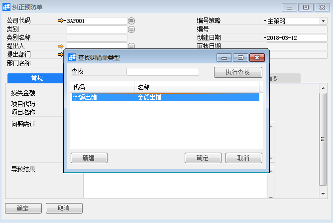

4. 选择提出人；

   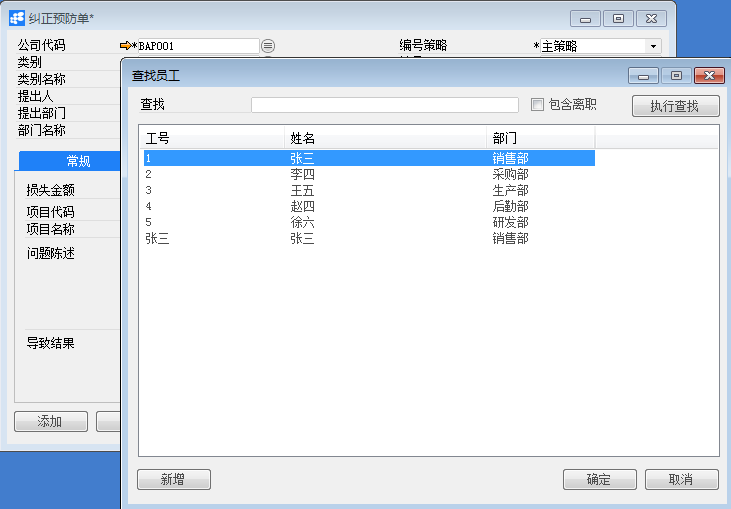

5. 填写损失金额、项目代码、问题陈述、导致结果；

   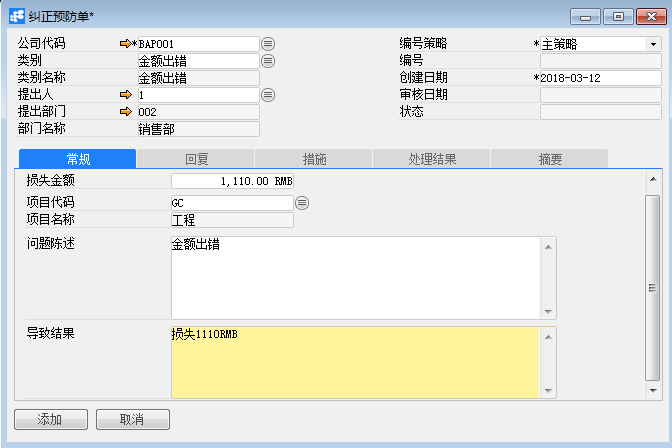

6. 信息确认无误后点击【添加】或工具栏的保存按钮，保存订单。

| 提醒                                                         |
| ------------------------------------------------------------ |
| 系统未配置自动发起审批时，保存订单信息检查无误后需要点击工具栏的发起审批按钮 ，执行请求审批操作 |

###  修改纠错单

1. 从系统菜单->【后勤】->【纠错单】，打开界面；
2. 点击工具栏的浏览按钮，查找要修改的纠错单；
3. 修改纠错单的内容；
4. 点击【更改】或工具栏的保存按钮保存，更改。

###  删除纠错单

1. 从系统菜单->【后勤】->【纠错单】，打开界面；

2. 点击工具栏的浏览按钮 ，查找要删除的纠错单；

3. 点击工具栏的按钮，进行删除操作。

   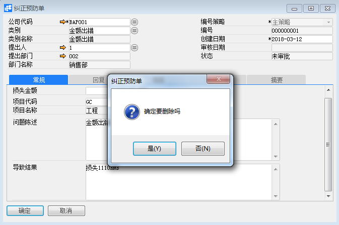

注：已审批通过的纠错单不能进行删除操作。

###  属性与活动描述

| **属性** | **活动描述**           |
| -------- | ---------------------- |
| 公司代码 | 选择公司代码           |
| 类别     | 选择纠正预防单类别代码 |
| 类别名称 | 显示纠正预防单类别名称 |
| 提出人   | 选择纠正预防单提出人   |
| 提出部门 | 选择纠正预防单提出部门 |
| 部门名称 | 显示部门名称           |
| 编号策略 | 选择单据的编号策略     |
| 编号     | 显示凭证的编号         |
| 创建日期 | 输入单据创建日期       |
| 审核日期 | 显示审核日期           |
| 状态     | 显示凭证的状态         |

####  常规

| **属性** | **活动描述**           |
| -------- | ---------------------- |
| 损失金额 | 输入因问题损失的金额   |
| 项目代码 | 输入问题涉及的项目代码 |
| 项目名称 | 显示项目名称           |
| 问题陈述 | 输入问题陈述           |
| 导致结果 | 输入问题导致的结果     |

####  回复

| **属性** | **活动描述**       |
| -------- | ------------------ |
| 定义新的 | 点击进行回复       |
| 回复任意 | 显示回复人员       |
| 回复日期 | 显示或输入回复日期 |
| 回复内容 | 显示或输入回复内容 |
| 保存     | 点击保存回复信息   |

####  措施、处理结果

| **属性**   | **活动描述**               |
| ---------- | -------------------------- |
| 纠正措施   | 输入对问题的纠正措施       |
| 部门、公司 | 选择该问题由部门或公司处理 |
| 对象代码   | 选择成本对象代码           |
| 对象名称   | 显示成本对象名称           |
| 承担金额   | 输入成本对象承担的金额     |
| 处理意见   | 输入处理意见               |

####  摘要

| **属性** | **活动描述**     |
| -------- | ---------------- |
| 录单人   | 显示单据的创建人 |
| 备注     | 输入备注信息     |