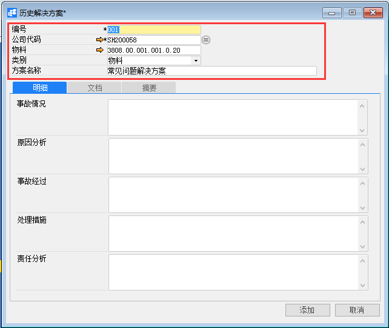
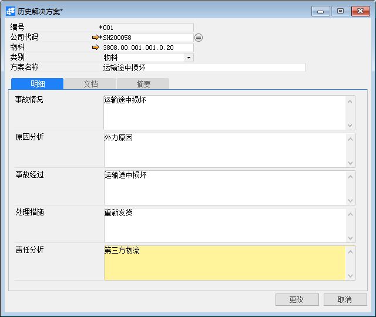
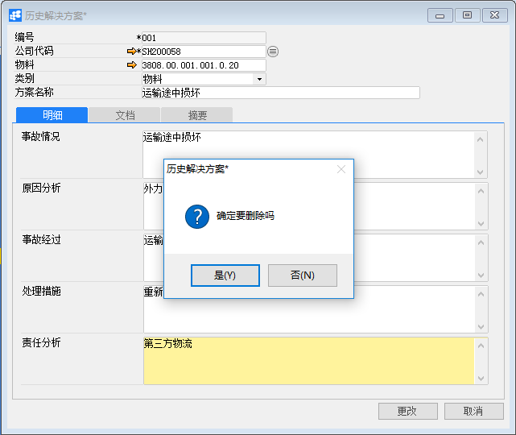

# 定义历史解决方案

## 功能解释

BAP历史解决方案记录出售的物料在客户方出现的事故原因，及处理问题的解决方法，为下次遇到同样问题而能立即做出处理方法，提供了快速有效的服务。

## 文章主旨

本文介绍如何通过BAP Nicer 5完成定义历史解决方案的新增、查找、修改及删除操作。

## 操作要求

当前登陆用户拥有操作定义历史解决方案业务的权限，权限设置请在帮助文档中搜索查看。

## 新增定义历史解决方案

1. 从系统菜单->【服务】->【定义】->【定义历史解决方案】，打开定义历史解决方案空白界面；

2. 点击工具栏新空白按钮准备新增定义历史解决方案；

3. 输入编号和公司代码（这两项必须输入），输入物料、类别和方案名称基本信息；

   

4. 在【明细】选项卡中，可选择的输入事故情况、原因分析、事故经过、处理措施和责任分析；

   

5. 信息确认无误后点击【添加】或工具栏的保存按钮，保存定义定义历史解决方案。

## 修改定义历史解决方案

1. 从菜单栏【模块】->【服务】->【定义】->【定义历史解决方案】,打开历史解决方案窗口；

2. 点击工具栏的查询按钮，查找需要修改的历史解决方案，修改必要的数据；

   

3. 点击【更改】按钮，状态栏显示“更改已保存！”信息，表示修改历史解决方案成功。

## 删除定义历史解决方案

1. 从菜单栏【模块】->【服务】->【定义】->【定义历史解决方案】,打开历史解决方案窗口；

2. 点击工具栏的查询按钮，选择要删除的历史解决方案；

   

3. 点击工具栏的删除按钮，系统会提示删除确认。系统会提示确定要删除吗？点击【是】按钮，状态栏显示记录已删除，删除历史解决方案成功。

## 历史解决方案主数据

| **属性** | **活动描述**         |
| -------- | -------------------- |
| 编号     | 输入历史解决方案编号 |
| 公司代码 | 选择公司代码         |
| 类别     | 选择历史解决方案类别 |
| 方案名称 | 输入历史解决方案名称 |

## 明细选项卡

| **属性** | **活动描述**           |
| -------- | ---------------------- |
| 事故情况 | 输入物料事故情况       |
| 原因分析 | 输入事故的原因         |
| 事故经过 | 输入事故的详细经过     |
| 处理措施 | 输入处理事故的解决方法 |
| 责任分析 | 输入导致事故的责任分析 |

## 文档选项卡

| **属性**   | **活动描述**                                   |
| ---------- | ---------------------------------------------- |
| 从磁盘选择 | 要附加文件，单击“从磁盘选择…”按扭，选择文件    |
| 移除       | 要删除的附加文件，选择显示文件，单击“移除”按扭 |
| 打开       | 要打开附加文件，选择显示文件，单击“打开”按扭   |

## 摘要选项卡

| 属性     | 活动描述                                 |
| -------- | ---------------------------------------- |
| 创建人   | 只读字段，显示系统登录用户名             |
| 创建日期 | 只读字段，显示创建历史解决方案时系统日期 |
| 变更人   | 只读字段，显示更改历史解决方案系统用户   |
| 变更日期 | 只读字段，显示更改历史解决方案系统日期   |