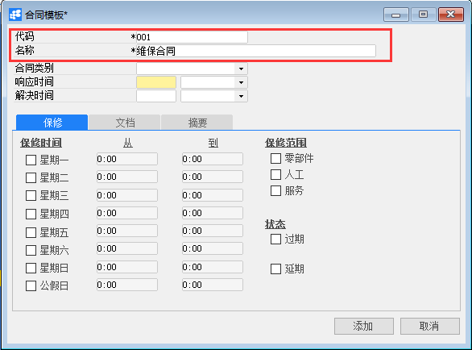
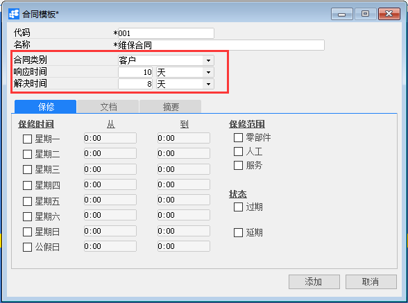
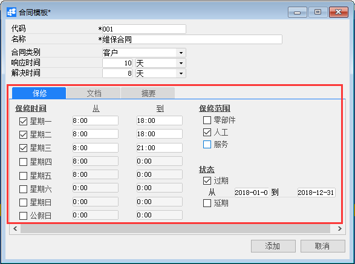
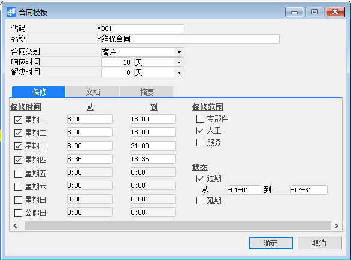
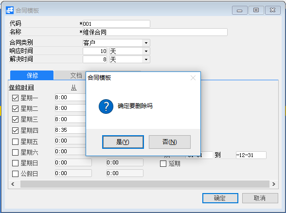

# 定义合同模板

## 功能解释

定义合同模板是在系统中定义服务合同的合同模板，包括：代码、名称、合同类别、相应时间、解决时间、保修时间、保修范围、状态等。

## 文章主旨

本文介绍如何通过BAP Nicer 5完成定义合同模板的新增、查找、修改及删除操作。

## 操作要求

当前登陆用户拥有操作定义合同模板业务的权限，权限设置请在帮助文档中搜索查看。

## 新增合同模板

1. 从系统菜单->【服务】->【定义】->【定义合同模板】，打开定义合同模板空白界面；

2. 点击工具栏新空白按钮准备新增定义合同模板；

3. 填写新增定义合同模板的代码以及名称；

   

4. 选择合同类别，填写响应时间以及解决时间;

   

   | 扩展操作介绍                                                 |
   | ------------------------------------------------------------ |
   | 选择合同类别时可以直接下拉选择，响应时间单位、解决时间单位同。 |

5. 勾选保修时间，并填写从至时间，勾选保修范围、状态;

   

6. 信息确认无误后点击【添加】或工具栏的保存按钮，保存定义合同模板。

## 修改合同模板

1. 从菜单栏【模块】->【服务】->【定义】->【定义合同模板】,打开合同模板窗口；

2. 修改必要的数据；

   

3. 点击【更改】按钮，状态栏显示“更改已保存！”信息，表示修改合同模板成功。

## 删除合同模板

1. 从菜单栏【模块】->【服务】->【定义】->【定义合同模板】,打开定义合同模板窗口；

2. 点击工具栏的查询按钮，选择要删除的合同模板；

3. 点击工具栏的删除按钮，系统会提示删除确认。系统会提示确定要删除吗？点击【是】按钮，状态栏显示记录已删除，删除合同模板成功。

   

## 合同模板主数据

| **属性** | **活动描述**                                                 |
| -------- | ------------------------------------------------------------ |
| 代码     | 输入合同模代码                                               |
| 名称     | 输入合同模板名称                                             |
| 合同类别 | 合同类别分为三种：〖客户〗—向客户出售所有物料〖物料组〗—向客户出售物料组中的某些物料〖物料〗—向客户出售某一特定物料 |
| 响应时间 | 指定响应允许的最长时间                                       |
| 解决时间 | 指定解决允许的最长时间                                       |

## 保修选项卡

| **属性** | **活动描述**                               |
| -------- | ------------------------------------------ |
| 星期一   | 星期一是否为客户提供服务工作日，打勾表示是 |
| 从…到…   | 输入工作开始时间与结束时间                 |
| 星期二   | 星期二是否为客户提供服务工作日，打勾表示是 |
| 从…到…   | 输入工作开始时间与结束时间                 |
| 星期三   | 星期三是否为客户提供服务工作日，打勾表示是 |
| 从…到…   | 输入工作开始时间与结束时间                 |
| 星期四   | 星期四是否为客户提供服务工作日，打勾表示是 |
| 从…到…   | 输入工作开始时间与结束时间                 |
| 星期五   | 星期五是否为客户提供服务工作日，打勾表示是 |
| 从…到…   | 输入工作开始时间与结束时间                 |
| 星期六   | 星期六是否为客户提供服务工作日，打勾表示是 |
| 从…到…   | 输入工作开始时间与结束时间                 |
| 星期日   | 星期日是否为客户提供服务工作日，打勾表示是 |
| 从…到…   | 输入工作开始时间与结束时间                 |
| 公假日   | 公假日是否为客户提供服务工作日，打勾表示是 |
| 从…到…   | 输入工作开始时间与结束时间                 |
| 零部件   | 是否为客户提供零部件保修服务，打勾表示是   |
| 人工费   | 是否为客户提供人工费服务，打勾表示是       |
| 服务费   | 是否为客户提供服务费服务，打勾表示是       |
| 延期     | 是否延期，打勾表示是                       |
| 提醒     | 提醒日期与时间                             |

## 文档选项卡

| **属性**   | **活动描述**                                   |
| ---------- | ---------------------------------------------- |
| 从磁盘选择 | 要附加文件，单击“从磁盘选择…”按扭，选择文件    |
| 移除       | 要删除的附加文件，选择显示文件，单击“移除”按扭 |
| 打开       | 要打开附加文件，选择显示文件，单击“打开”按扭   |

## 摘要选项卡

| **属性** | **活动描述**                 |
| -------- | ---------------------------- |
| 创建人   | 只读字段，显示系统登录用户名 |
| 备注     | 输入合同模板的必要备注       |