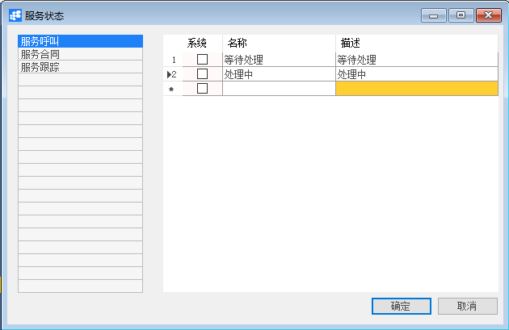
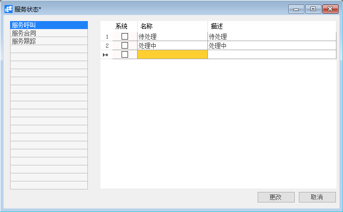
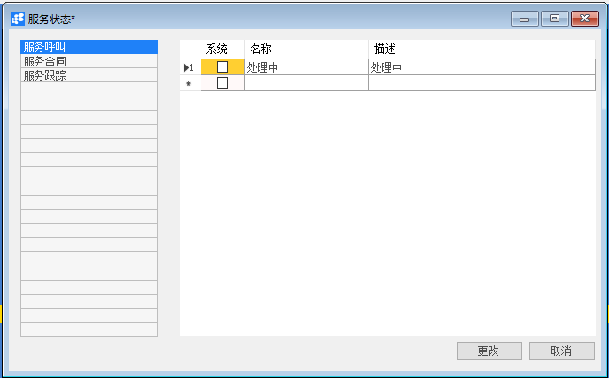

# 定义服务状态

## 功能解释

BAP服务状态是记录对客户服务的进展状况，例如对服务合同、服务呼叫及服务跟踪卡的服务状态阶段记录。

## 文章主旨

本文介绍如何通过BAP Nicer 5完成定义服务状态的新增、查找、修改及删除操作。

## 操作要求

当前登陆用户拥有操作定义服务状态业务的权限，权限设置请在帮助文档中搜索查看。

## 新增定义服务状态

1. 从系统菜单->【服务】->【定义】->【定义服务状态】，打开定义服务状态空白界面；

2. 点击工具栏新空白按钮准备新增定义服务状态；

3. 选择服务状态类型，填写名称、描述；

   

4. 信息确认无误后点击【添加】或工具栏的保存按钮，保存定义定义服务状态。

## 修改定义服务状态

1. 从菜单栏【模块】->【服务】->【定义】->【定义服务状态】,打开服务状态窗口；

2. 点击左边列表服务呼叫，在右边列表中修改必要内容；

   

3. 点击【更改】按钮，状态栏显示“更改已保存！”信息，表示修改服务状态成功。

## 删除定义服务状态

1. 从菜单栏【模块】->【服务】->【定义】->【定义服务状态】,打开服务状态窗口；

2. 点击左边列表服务呼叫，在右边列表中选择要删除的行；

   

3. 点击工具栏的删除按钮，系统会提示删除确认。系统会提示确定要删除吗？点击【是】按钮，状态栏显示记录已删除，删除服务状态成功。

