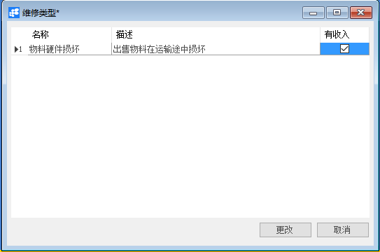

# 定义维修类型

## 功能解释

维修类别是为维修服务而定的类型，用户可以根据公司需求自定义维修类别。

## 文章主旨

本文介绍如何通过BAP Nicer 5完成定义维修类型的新增、查找、修改及删除操作。

## 操作要求

当前登陆用户拥有操作定义维修类型业务的权限，权限设置请在帮助文档中搜索查看。

## 新增采购订单

1. 从系统菜单->【服务】->【定义】->【定义维修类型】，打开定义维修类型空白界面：

2. 点击工具栏新空白按钮准备新增定义维修类型；

3. 填写新增定义维修类型的名称及描述，选择是否有收入;

   

4. 信息确认无误后点击【添加】或工具栏的保存按钮，保存定义维修类型。

