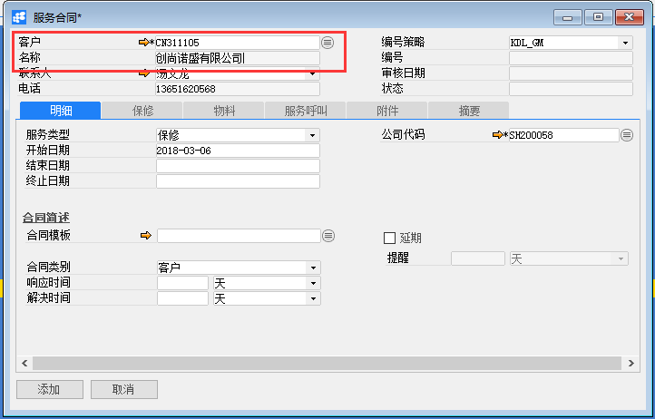
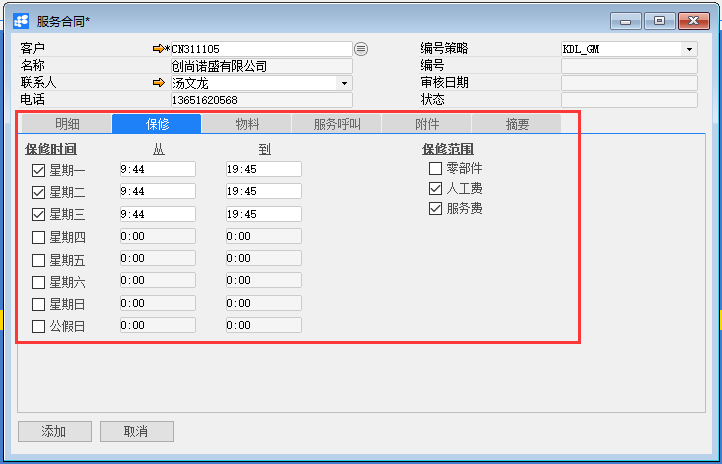
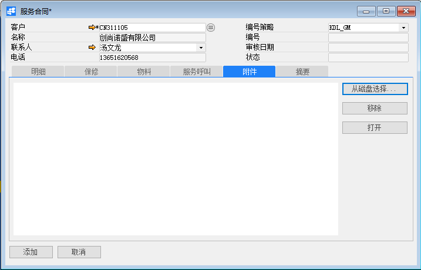
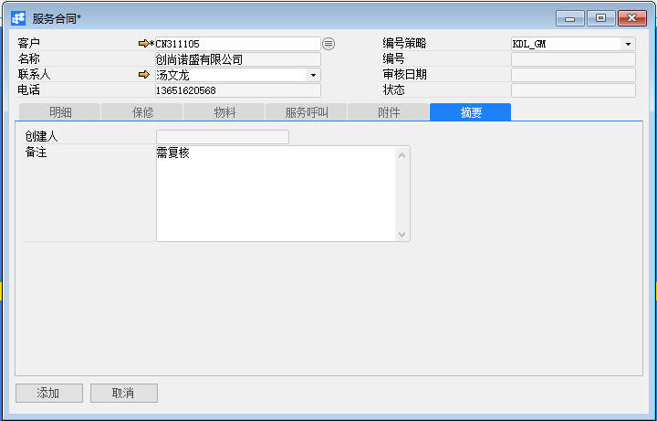
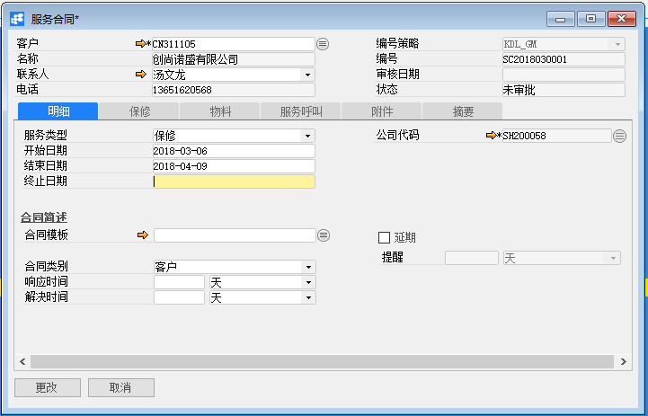
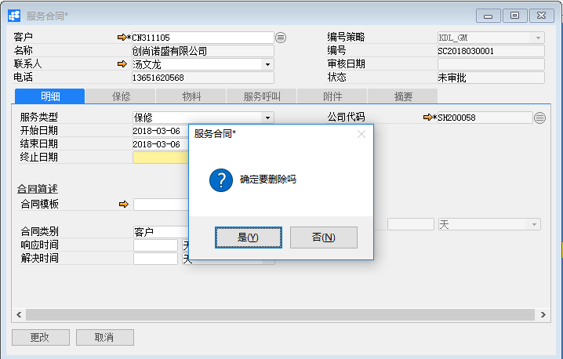

# 服务合同

## 功能解释

BAP服务合同是指公司与客户之间的业务合同，不包括人力资源劳动合同，为客户提供维护和维修服务。

## 文章主旨

本文介绍如何通过BAP Nicer 5完成服务合同的新增、修改及删除操作。

## 操作要求

当前登陆用户拥有操作服务合同业务的权限，权限设置请在帮助文档中搜索查看。

## 新增服务合同

1. 从菜单栏【模块】->【服务】->【服务合同】,打开服务合同窗口；

2. 选择客户（必须输入）、点击【明细】选项卡的输入必要信息，例如结束日期，合同模板等；

   

3. 点击【保修】选项卡，输入保修信息，如果合同模板不为空，并且合同模板中已定义保修信息，则自动根据合同模板加载出保修信息；

   

4. 点击【物料】、【服务呼叫】选项卡，不需要输入是只读数据，是服务跟踪卡和服务呼叫信息记录，可通过这查看客户的服务项目信息；

5. 点击【附件】选项卡，可选择性的添加相关文件，包含【从磁盘选择…】、【打开】和【移除】功能，可接受的文件类型包含Word文件、Excel文件、文本文件、Adobe PDF文件、演示文档和电子文档等；

   

6. 点击【摘要】选项卡，输入服务合同的必要备注信息；

   

7. 点击【添加】按钮，状态栏显示“新记录已保存！”信息，表示创建服务合同成功；

8. 点击工具栏按钮，发起审批。

## 修改服务合同

1. 从系统菜单->【服务】->【服务合同】，打开服务合同界面；

2. 点击工具栏的浏览按钮，查找要修改的服务合同；

3. 修改服务合同的内容；

   

4. 点击【更改】或工具栏的保存按钮保存，更改服务合同。

## 删除服务合同

1. 从系统菜单->【人力资源】->【服务合同】，打开服务合同界面；

2. 点击工具栏的浏览按钮，查找要删除的服务合同；

   

3. 点击工具栏的按钮，进行删除操作。

## 服务合同主数据

| **属性** | **活动描述**                                                 |
| ---------- | ------------------------------------------------------------ |
| 客户     | 选择服务合同对象客户                                         |
| 名称     | 只读字段，根据客户代码显示名称                               |
| 联系人   | 只读字段，根据客户代码显示联系人                             |
| 电话     | 只读字段，根据联系人显示联系人电话                           |
| 编号策略 | 根据公司代码，加载编号策略                                   |
| 编号     | 根据编号策略，加载编号，只有编号策略手动时，编号才可输入     |
| 审核日期 | 只读字段，显示审核日期                                       |
| 状态     | 显示状态：1、未批 — 准尚未批准合同，则用户没有资格接收服务 2、驳回 — 尚未批准合同，则用户没有资格接收服务 3、已批准 — 用户根据合同，客户有资格接收服务 |
| 客户     | 选择服务合同对象客户                                         |
| 名称     | 只读字段，根据客户代码显示名称                               |
| 联系人   | 只读字段，根据客户代码显示联系人                             |

## 明细选项卡

| **属性** | **活动描述**                                                 |
| -------- | ------------------------------------------------------------ |
| 服务类型 | 选择服务类型（保修或定期）                                   |
| 开始日期 | 输入服务合同生效日期                                         |
| 结束日期 | 输入服务合同到期日期                                         |
| 终止日期 | 输入服务合同终止日期                                         |
| 公司代码 | 选择公司代码                                                 |
| 合同模板 | 选择现有合同模板                                             |
| 合同类别 | 合同类别分为三种：   1、客户 — 向客户出售所有物料    2、物料组— 向客户出售物料组中的某些物料    3、物料— 向客户出售某一特定物料 |
| 响应时间 | 指定响应服务呼叫允许的最长时间                               |
| 解决时间 | 指定解决服务呼叫允许的最长时间                               |
| 延期     | 是否延期，打勾表示是                                         |
| 提醒     | 提醒日期与时间                                               |

## 保修选项卡

| **属性** | **活动描述**                               |
| -------- | ------------------------------------------ |
| 星期一   | 星期一是否为客户提供服务工作日，打勾表示是 |
| 从…到…   | 输入工作开始时间与结束时间                 |
| 星期二   | 星期二是否为客户提供服务工作日，打勾表示是 |
| 从…到…   | 输入工作开始时间与结束时间                 |
| 星期三   | 星期三是否为客户提供服务工作日，打勾表示是 |
| 从…到…   | 输入工作开始时间与结束时间                 |
| 星期四   | 星期四是否为客户提供服务工作日，打勾表示是 |
| 从…到…   | 输入工作开始时间与结束时间                 |
| 星期五   | 星期五是否为客户提供服务工作日，打勾表示是 |
| 从…到…   | 输入工作开始时间与结束时间                 |
| 星期六   | 星期六是否为客户提供服务工作日，打勾表示是 |
| 从…到…   | 输入工作开始时间与结束时间                 |
| 星期日   | 星期日是否为客户提供服务工作日，打勾表示是 |
| 从…到…   | 输入工作开始时间与结束时间                 |
| 公假日   | 公假日是否为客户提供服务工作日，打勾表示是 |
| 从…到…   | 输入工作开始时间与结束时间                 |
| 零部件   | 是否为客户提供零部件保修服务，打勾表示是   |
| 人工费   | 是否为客户提供人工费服务，打勾表示是       |
| 服务费   | 是否为客户提供服务费服务，打勾表示是       |

## 物料选项卡

1. 合同类别---物料组

   | **属性** | **活动描述**               |
   | -------- | -------------------------- |
   | 物料组   | 输入%模糊查找物料组        |
   | 开始日期 | 服务合同开始生效日期       |
   | 结束日期 | 服务合同到期日期           |
   | 终止日期 | 每个物料组服务合同终止日期 |

2. 合同类别---物料

   | **属性**       | **活动描述**                           |
   | -------------- | -------------------------------------- |
   | 跟踪卡编号     | 输入%模糊查找跟踪卡                    |
   | 物料编号       | 只读字段，根据跟踪卡编号自动加载物料号 |
   | 名称及规格描述 | 只读字段，根据物料号显示名称           |
   | 关联品号       | 只读字段，根据物料号显示关联品号       |
   | 色号           | 只读字段，根据物料号显示色号           |
   | 色别           | 只读字段，根据物料号显示色别           |
   | 单位           | 只读字段，根据物料号显示单位           |
   | 序列号         | 只读字段，根据跟踪卡编号显示序列号     |
   | 物料组         | 只读字段，根据物料号显示物料组         |
   | 开始日期       | 服务合同开始生效日期                   |
   | 结束日期       | 服务合同到期日期                       |
   | 终止日期       | 每个物料服务合同终止日期               |

## 服务呼叫选项卡

| **属性** | **活动描述**                               |
| -------- | ------------------------------------------ |
| 呼叫编号 | 只读字段，显示服务合同被服务呼叫在所有次数 |
| 创建日期 | 只读字段，显示服务呼叫时开始日期           |
| 主题     | 只读字段，显示服务呼叫主题信息             |
| 物料号   | 只读字段，显示服务呼叫的物料号             |
| 物料名称 | 只读字段，根据物料号显示名称               |
| 关联品号 | 只读字段，根据物料号显示关联品号           |
| 色号     | 只读字段，根据物料号显示色号               |
| 色别     | 只读字段，根据物料号显示色别               |
| 单位     | 只读字段，根据物料号显示单位               |
| 客户代码 | 只读字段，根据呼叫编号显示客户代码         |

## 附件选项卡

| **属性**   | **活动描述**                                   |
| ---------- | ---------------------------------------------- |
| 从磁盘选择 | 要附加文件，单击“从磁盘选择…”按扭，选择文件    |
| 移除       | 要删除的附加文件，选择显示文件，单击“移除”按扭 |
| 打开       | 要打开附加文件，选择显示文件，单击“打开”按扭   |

## 摘要选项卡

| **属性** | **活动描述**                 |
| -------- | ---------------------------- |
| 创建人   | 只读字段，显示系统登录用户名 |
| 备注     | 输入服务合同的必要备注       |